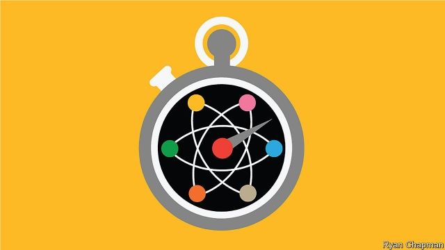

###### Quantum computing

# Google claims to have demonstrated “quantum supremacy” 

 

> print-edition iconPrint edition | Leaders | Sep 28th 2019 

“NATURE ISN’T classical, dammit, and if you want to make a simulation of nature you’d better make it quantum mechanical, and by golly, it’s a wonderful problem because it doesn’t look easy.” With those words, in 1981, Richard Feynman, an American physicist, introduced the idea that, by harnessing quantum mechanics, it might be possible to build a new kind of computer, capable of tackling problems that would cause a run-of-the-mill machine to choke. Feynman was right: it has not been easy. Over the past four decades quantum computers have slowly evolved from squiggles on theoreticians’ blackboards to small machines in university laboratories to research projects run by some of the world’s biggest companies. 

Now one of those machines, built by researchers at Google, has at last shown what all the fuss is about. It appears to have performed, in just over three minutes, a task that, the researchers estimate, the world’s most powerful classical supercomputer would take around 10,000 years to complete. Google’s machine is a special-purpose device that was designed to solve a contrived problem with few practical uses. But this display of so-called “quantum supremacy” is nonetheless a milestone (see article). 

What might quantum computing actually be used for? That question is obscured by the piles of money and hyperbole that surround it. Along with 5G and AI, it is one of the technologies that presidents, of both countries and companies, love to cite. China and America have pledged to invest billions of dollars in it. There is excited talk of a race, and of the riches and power that await the first to seize the “Holy Grail of computing”. 

Despite the breathlessness, quantum computers are not magical. A rich body of theoretical work proves that they will be potent, but limited. For all the talk of supremacy, quantum computers are not superior in every regard to their classical cousins. Indeed for many tasks they will offer little improvement. Yet for some problems—but only some—clever programmers or mathematicians can create algorithms that exploit the machines’ quantum capabilities. In those special cases, quantum computers offer huge gains, crunching tasks that would otherwise take years or millennia down to minutes or seconds. 

Several of these algorithms have been developed. They offer a glimpse of where quantum computers might excel. In encryption, for example, a quantum machine could quickly untangle the complex maths that underlies much of the scrambling that protects information online. A world with powerful quantum computers, in other words, is one in which much of today’s cyber-security unravels. Tech firms and governments are investigating new foundations for encryption that are not known to be susceptible to quantum computers. But deploying them will be the work of decades. 

As Feynman pointed out, classical computers struggle to simulate the quantum-mechanical processes that underpin physics and chemistry. Quantum computers could do so with aplomb, a useful trick for developing everything from pharmaceuticals to petrochemicals. Their ability to solve optimisation problems could help financial firms improve their trading algorithms. Artificial-intelligence researchers hope that quantum computers could offer a boost to their algorithms, too. 

For now, though, all that lies in the future. Google’s machine is best thought of as a Sputnik moment. By itself, Sputnik did nothing but orbit Earth while beeping. But it proved a concept, and grabbed the world’s attention. Google’s accomplishment is one in the eye for quantum-computing sceptics. It strongly suggests the promise of quantum technology can be realised in practice as well as theory. And it will draw even more money and attention to a red-hot field. A great deal of engineering work remains before quantum computers can be used for real-world tasks. But that day has suddenly got closer. ■ 

