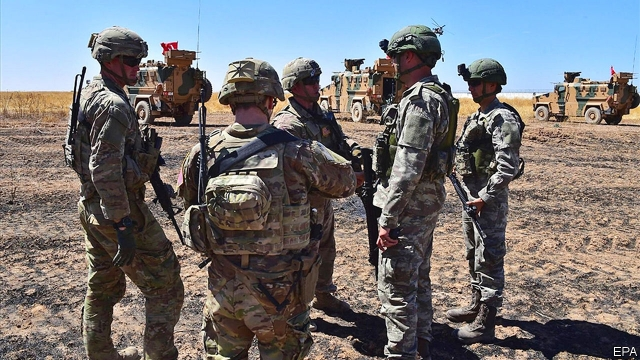

###### A cry for attention

# A new study slams America for neglecting Syria’s civil war 

 

> print-edition iconPrint edition | Middle East and Africa | Sep 28th 2019 

AT THE END of last year President Donald Trump explained that he was done with Syria. He boasted of defeating the jihadists of Islamic State (IS), “my only reason for being there”. Though he later reversed his decision to withdraw all 2,000 American troops from Syria, the conflict remains low on his list of priorities. On September 24th, the Syria Study Group, a 12-member panel appointed by Congress, published a report explaining why Syria was not done with Mr Trump. 

Bashar al-Assad, Syria’s dictator, has all but defeated a rebel insurgency, with Russian and Iranian help. But his control beyond Damascus is “tenuous”, and “crime and warlordism are rampant”, says the panel. His ongoing push into Idlib province, a jihadist stronghold, will cause a flood of refugees, compounding what is already one of the worst refugee crises since the second world war. 

Even IS is merely down, not out. The report warns that ramshackle prisons holding some 10,000 jihadists could provide the wellspring of a new insurgency. Idlib itself has the largest concentration of foreign fighters since Afghanistan in the 1990s. The Syrian Democratic Forces, a largely Kurdish militia that serves as America’s principal local ally against IS, has been “heavy-handed” in the Arab areas it controls. In turn, disaffected Arabs might become easy fodder for jihadist recruiters. 

Amid this chaos, Russia and Iran have prospered. Russia has used its influence in Syria to position itself as a “power centre” in the Middle East. Iran has entrenched itself in Syria, courting local tribes, building schools and buying land around Damascus. This worries Israel, which has bombed Iranian positions in Syria. Mara Karlin, an expert at the Brookings Institution and a study-group member, warns of the possibility of a “spectacular Levantine spillover”. 

America, by contrast, has been AWOL. Its aid for north-eastern Syria, where it has troops, has dried up. Mr Trump’s erratic policies and obvious lack of interest in the conflict have also caused American allies to hedge their bets. Jordan and Israel have deepened ties with Russia. The United Arab Emirates has reopened its embassy in Damascus. 

America’s mission in Syria is often lumped together with the “forever wars” in Iraq and Afghanistan. This is unfair, says the report: “The Syria case offers a different—and far less costly—model.” The panel urges America to maintain its small footprint in Syria in order to support the areas liberated from IS, keep the jihadists at bay and increase pressure on Mr Assad and his backers to reach a political settlement. 

America has leverage over Mr Assad: two-thirds of Syria’s hydrocarbons lie outside the regime’s control, mostly in areas where America is the dominant force. But using that leverage requires American leaders to pay more attention to Syria. The study group offers a stark reason why they should: it is Syria—not Iran, or Yemen, or Palestine—that is the “leading source of instability in the Middle East”. 

