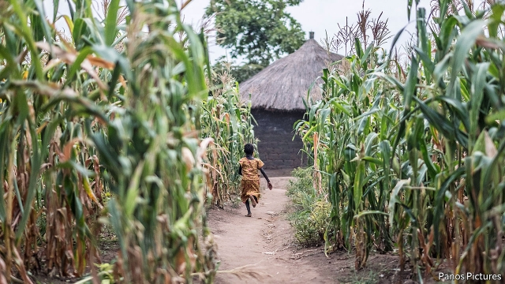
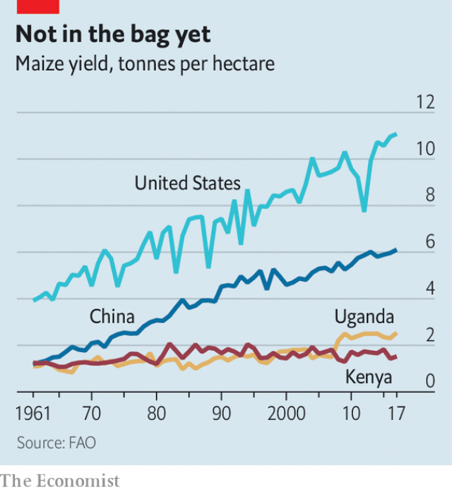

###### The underground revolution

# Better seeds could help African farmers grow far more 

 

> print-edition iconPrint edition | Middle East and Africa | Sep 28th 2019 

AN AIR OF Malthusian gloom hangs over smallhold farmers in Sironko, in eastern Uganda. In the old days, they say, their parents reaped plentiful harvests from fields fed with manure. Now the soil needs to be coaxed into life with chemical fertilisers they cannot afford. As the population grows, farmers squeeze onto shrinking plots of land. The weather has become erratic: the growing season might begin with a week of downpours followed by drought. The rain and the sun no longer balance, complains one farmer, Zaituni Mudondo, banging a maize cob on the ground. 

So there is something unusual about Ruth Akello, who lives just down the road. Her house is sturdier than the rest, with a solar panel outside. She is also building another home in a nearby town. Asked about maize—Uganda’s most ubiquitous crop, which accounts for about 20% of people’s overall calorie intake—she pulls out a record book and phones her husband to check the numbers. The couple have grown 100 bags this year (about ten tonnes) and sold almost all of it. Her neighbours use old-fashioned methods of farming, she explains. “But me, I use the modern way.” 

One crucial difference between Ms Akello and her neighbours is the seed she uses. Whereas most smallholders keep some of the previous year’s crop to plant, as they have done for generations, she buys improved hybrid seeds. Her plot hints at the huge difference that modern seeds can make to the lives of Africa’s hundreds of millions of farmers. It also raises a question: why don’t more people plant them? 

 

The green revolution began with seeds. By the early 1960s scientists had created dwarf varieties of rice and wheat, which put more of their energy into edible bits and did not topple over when fed with fertiliser. Agricultural productivity duly took off in Asia and Latin America, making everybody richer. Douglas Gollin, an economist at Oxford University, and others estimated last year that a 10% increase in the share of land planted with high-yielding crops by the year 2000 is associated with 10-15% growth in GDP per head. Maize, which is easier to hybridise than many crops, has steadily become more productive in countries such as America and China (see chart). 

Sub-Saharan Africa is decades behind. Some of its poorest countries, such as Chad and the Democratic Republic of Congo, scarcely have seed markets. Uganda has several seed producers and a president, Yoweri Museveni, who exhorts the wananchi (“common people”) to adopt modern farming practices. But it has a long way to go. Surveys five years ago revealed that only 21% of maize farmers and 15% of all crop farmers in the country used hybrid seeds. 

Uganda’s wealthier neighbour, Kenya, ought to be doing much better. Hybrid maize seeds have been widely available there since the 1970s, and about three-quarters of farmers use them, according to the Tegemeo Institute in Nairobi, which conducts surveys. Kenya is also a leader in research. On a 200-hectare farm south-east of Nairobi, CIMMYT, an international institute, tests new strains in deliberately tough conditions. Thanks to a technique known as doubled haploid breeding, it can churn out new varieties quickly. 

Yet Kenya is no Eden either. As its population has grown, crop farmers have moved onto parched soils that used to be seen as fit only for cattle ranching. Climate change may also be having an impact: three out of the past five years have been poor for maize. Farmers are now being assailed by fall armyworm, a hungry caterpillar. Gradual improvements in farming methods have not been enough to overcome these challenges. Like Uganda, Kenya awaits a proper green revolution. 

In Kenya and many African countries supposedly high-yielding seeds do not always work. Emilia Tjernstrom of the University of Wisconsin in America has tested seeds bought from local dealers. On average only 76% of the seeds germinated and in some samples none did. Fake hybrid seed is widespread, says Mary Wangeci, an agricultural supplier in Machakos, near Nairobi. Clued-up farmers are gradually learning to scan the bar codes on seed packets with their phones to see if the product is genuine. Unfortunately, the neediest farmers are not so savvy. 

And the commercial seeds on the market do not always produce bountiful harvests. Because scientists are always working on maize, new hybrids are generally better than old ones. Plants also need to be appropriate for local conditions, which vary more in Africa than in other parts of the world. But Kenya’s bestselling maize seed, known as 614, was released in 1986. And although it grows well in the rainy highlands, it fares poorly in the hotter, drier parts of the country. 

Maize 614 is produced by a state-controlled outfit, the Kenya Seed Company, which dominates the market. It is cheaper than seeds produced by rival companies, partly because the government holds down its price. Launching a competitor is difficult for other reasons. Getting approval is expensive and takes five years—“if you’re really sharp, four years”, says Saleem Esmael, who runs the Western Seed Company. The stringent trials that the government insists upon are supposed to protect small farmers, but the result is old, inferior seeds on the market. Stephen Mugo of CIMMYT compares the system to a bicycle with 100 padlocks—safe, but not useful. 

Uganda has a less cumbersome approval process and a more open seed market. But its government still finds ways to meddle unhelpfully. In 2013 Mr Museveni launched “Operation Wealth Creation”, which involved troops distributing seeds, fruit trees and cows. By 2017 private companies were selling half of their maize seed to the government. It typically takes three seasons, or 18 months, to ramp up production; reputable growers could not keep up with the sudden surge in demand. Seeds reached farmers late, or grew badly. The government then cut its purchases just as suddenly as it had started them. Companies were left with warehouses of seed they could not sell. 

Under tight security at CIMMYT’s research station in Kiboko, which includes a man who shoots inquisitive monkeys with a catapult, some unusual maize plants are growing. Created by multinational companies, these are genetically modified to resist fall armyworm. So far, the trial has been a success: the modified plants have hardly been touched, while nearby control plants are shredded. But farmers are unlikely to be able to plant the new maize soon, since both Kenya and Uganda ban genetically modified crops. Few sights are more frustrating.■ 

