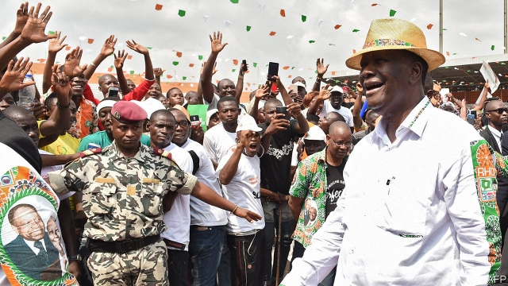

###### A delicate peace

# Ivory Coast’s economy is booming, but its politics look wobbly 

 

> print-edition iconPrint edition | Middle East and Africa | Sep 28th 2019 

FEW WEST AFRICAN countries excite investors quite as much as Ivory Coast. Its economy, which is forecast to expand by more than 7% this year and next, is among the fastest growing in Africa. Its efforts to cut red tape and make it easier to start a company or get loans have won praise from private firms and multilateral institutions, such as the IMF and World Bank—which has bumped it up by 25 places on its “ease of doing business” index since 2015. On September 23rd Standard Chartered, a bank, ranked it top of its list of 20 countries that have the most potential to trade. 

Much of the credit for this economic boom goes to Alassane Ouattara, a former economist who has been president since 2011. During his term the government has sold stakes in state-owned companies and invested in new roads and other infrastructure. But economic reform has not been matched by political change, prompting worries ahead of a presidential election next year that the country may slip back into conflict. A disputed election in 2010 led to a dreadful year-long civil war. 

The first concern is over Mr Ouattara, who may blot his copybook by trying to run for a third term. This would seem to be in breach of the two-term limit that was written into a new constitution in 2016. But Mr Ouattara said in an interview with a French magazine last year that his first terms do not count and that he could stand for another two, starting next year. Such a move would infuriate the opposition and almost certainly lead to violent unrest, says Achille Comoe of Planet Peace, an Ivorian NGO. 

One trick may be to change the constitution to bar people over the age of 75 from running. Although this would bar Mr Ouattara, it would also disqualify his main political rivals, Henri Konan Bédié and Laurent Gbagbo, both former presidents. Mr Ouattara abolished the age limit in 2016, perhaps already then with a view to running again. (Even if he does not run, he may still try to tilt the contest in favour of his ruling RHDP party.) 

Few ordinary folk would be unhappy to see Mr Gbagbo disqualified: it was his refusal to concede defeat after he lost the election in 2010 that sparked the civil war that led to the deaths of about 3,000 people. His political career ought surely to have ended in 2011, when Mr Ouattara’s forces winkled him out of his bunker in Abidjan, the country’s commercial capital, or when he was arrested later that year to face charges of war crimes before the International Criminal Court (ICC). Yet he still influences Ivorian politics. His acquittal by the ICC earlier this year raised fears that he might return to run again, reigniting conflict. 

That risk was averted for the time being on September 16th, when the ICC’S chief prosecutor appealed against his acquittal. But the long shadow cast by the war still makes many Ivorians nervous, particularly when they look at the state of the army. Although rebels and loyalists were integrated, the army is deeply divided and prone to mutiny. In 2017 some 8,400 disgruntled soldiers—about a third of the total—took over the country’s second city, Bouaké, demanding $8,000 and a house each. 

Ivorians strongly endorse the two-term limit for presidents and more than a quarter think their representatives are corrupt. The economy may be booming, but democracy is in a slump. “Politics is still the easiest way to make money,” shrugs André Braud-Mensah, a businessman. ■ 

