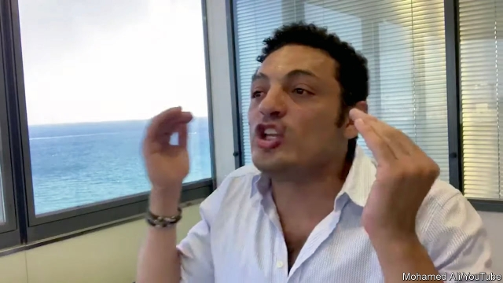

###### Sisi’s pain in Spain

# Muhammad Ali, a former actor living abroad, is riling up Egyptians 

 

> print-edition iconPrint edition | Middle East and Africa | Sep 26th 2019 

THE EGYPTIAN police seemed caught off-guard by the protests on September 20th. That was understandable, given that almost no one had dared protest in years, and it was a Friday night, the start of the football season, when arch-rivals Zamalek and Al Ahly were playing each other. The authorities did not expect Egyptians to heed the call of Muhammad Ali, a disgruntled Egyptian businessman and former actor (pictured) who urged his followers on YouTube to take to the streets. But in Cairo and other cities, hundreds of people did. 

In a country of 100m citizens, a few hundred people venting their frustrations with the army-backed regime led by Abdel-Fattah al-Sisi would not have filled a subway station. This was not a repeat of 2011, when millions of Egyptians turned out to topple Hosni Mubarak, the former strongman. But it was an act of both desperation and bravery. Mr Sisi tolerates no dissent. A lone man in Cairo who dared publicly oppose a sham constitutional referendum in March was jailed for months. Small as they were, the protests are significant, both for what caused them and what they say about Egypt’s moribund politics. 

For weeks Mr Ali has captivated the country with a series of videos posted on YouTube. Speaking in gravelly, colloquial Arabic, he drags on a cigarette and insults Mr Sisi as a “midget” and a “disgrace”. Claiming to have made a small fortune as a contractor working on projects overseen by the army and thus to have knowledge of these matters, he accuses the president of wasting millions of dollars on a luxury hotel, presidential palaces and other lavish projects. He now lives in what he calls self-imposed exile in Spain. 

Though Mr Ali has offered no hard evidence, his claims resonate with Egyptians, who quip that his videos are better than anything on Netflix. The army has expanded its economic empire since Mr Sisi took power in a coup in 2013. Generals have cornered the cement market, opened private schools and stepped in to produce baby formula after a nationwide shortage. Meanwhile, despite solid macroeconomic numbers, ordinary people struggle to survive. The official poverty rate has climbed five points since 2015, to 33%. Wages have not kept pace with inflation, and an IMF-backed reform programme has brought higher taxes and lower subsidies. “[Mr Sisi] lives in palaces while we eat from the trash,” complained one woman in a widely shared video from the night of the protests. 

Mr Sisi admits to building new palaces, but says they are not for him—a curious defence for a man who plans to rule until at least 2030. He blames the unrest on the Muslim Brotherhood, a banned Islamist group on which the regime blames everything from potato shortages to protests. This convinces nobody, though even Mr Ali’s fans wonder about his sudden rise and why a man who once worked with the army abruptly turned on it. Some muse, also implausibly, that he is backed by a rogue faction within the regime eager to cast off an increasingly unpopular president. 

Mr Ali has called for more protests on September 27th. Investors are not happy. Fixed-income traders have been drawn to Egypt’s high interest rates and veneer of authoritarian stability. Since the protests, bond prices and currency futures have both weakened. The stockmarket has fallen sharply. But it is hard to say if the protests will continue, especially now that the police are prepared. Hundreds of people have been arrested. A lawyer who represents other detainees was plucked from the courthouse steps and tossed into a van by police. Egypt’s shrivelled opposition has not endorsed the call for protests, in part because Mr Ali is such an enigma. 

There is real frustration with Mr Sisi, among both the public and the elite. What keeps him in power is not just brutality. It is the hollowing-out of Egypt’s political and civil life, a process that began more than half a century ago, when the army and the Brotherhood began a ruinous rivalry. Mr Sisi has made things worse by crushing even the mildest of critics. A chain-smoking actor in Spain has momentarily, unexpectedly, tapped into public anger. But there is no one in Egypt to harness it. ■ 

