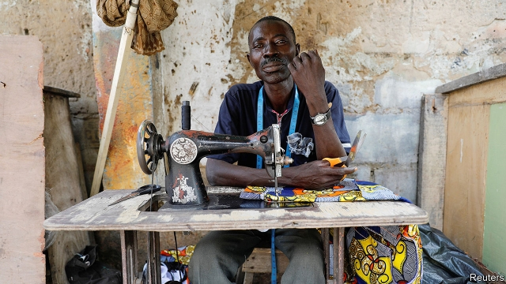

###### Natty Nigerians

# Why an “Uber for tailors” is gaining ground in Lagos 

 

> print-edition iconPrint edition | Middle East and Africa | Sep 28th 2019 

“RICH AND poor, everyone has a tailor here,” says Olajire Omikunle, a couturier for Nigeria’s powerful. So great is the appeal of a well-cut outfit in Lagos, Nigeria’s commercial centre, that roadside stitchers rove the streets armed with their sewing machines and clicking their large scissors to drum up customers. 

David Peterside, a local entrepreneur, hopes to capitalise on this sartorial obsession with a new app that is being dubbed an “Uber for tailors”. Fashion Map allows natty Nigerians to find a suitmaker at the press of a button. It may be a perfect fit for Africa’s most populous country. Nigeria has a fast-growing base of smartphone users and “over 100,000 registered tailors”, says Otunba Wasiu Taiwo of the Nigeria Union of Tailors. “We are still counting.” 

In down-at-heel areas, like Oshodi, entire streets are filled with them, often just an elbow’s distance from one another. They sew traditional caftan suits made of stiff Chinese-made wax print fabrics for 5,000 naira ($14). Poorer customers often take out loans to buy one. Well-heeled Nigerians can head to Mr Omikunle’s store, Magnum Stitches, in the upmarket area of Lekki. He makes agbada robes and sokoto trousers of soft Swiss-made cotton for 250,000 naira. But many customers have tales of tailor despair, from bespoke clothes that are paid for but never delivered, to sleeves falling off at the seams. 

“Finding a tailor you trust is hard,” says Mr Omikunle. Fashion Map hopes to help by allowing its 3,000 customers to rate the 1,500 tailors using the app. The idea, says Mr Peterside, is “to build trust between two strangers, someone who makes good clothes and someone who wants good clothes”. 

Quality wrinkles aside, the future of Nigerian tailoring looks good. Because people love made-to-measure clothes it is hard for local e-commerce giants, such as Jumia and Konga, to penetrate the market with their ready-made garb. Demand is being fuelled by an economic recovery: the IMF reckons GDP will expand by 2.3% this year, its fastest pace since Nigeria slumped into recession in 2016. Euromonitor, a research group, forecasts that the country’s $1.2bn apparel industry will grow by 25% a year over the next four years. 

The boom may tempt some tailors to cut corners with their cloth, making it even more important for Nigerians to take their measure. “When you find a good tailor in Africa, you better keep it as if it was gold,” Mr Omikunle says. 

