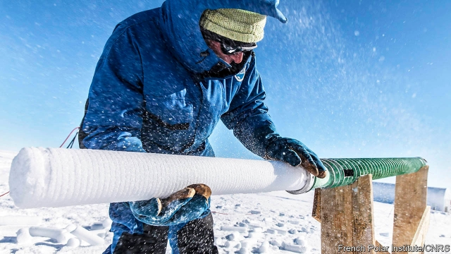
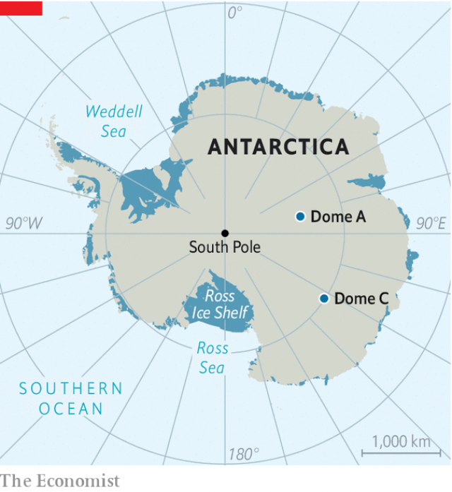

###### Palaeoclimatology

# A quest to drill the oldest ice core in Antarctica is beginning 

 

> print-edition iconPrint edition | Science and technology | Sep 28th 2019 

THE MID-PLEISTOCENE transition was a significant event in the history of Earth’s climate. It marks the point, between 1.2m and 900,000 years ago, when the ice-age cycle of freezing glacial periods alternating with warm interglacial ones (which began about 2.6m years before the present day) flipped from being 40,000 years long to 100,000 years. Climatologists would like to know why. 

The answer is important because, on past performance, the cycle should be about to turn cold again. Studies of post-transition cycles, though, suggest that one important regulator of what is happening is carbon dioxide, a greenhouse gas that people have been pumping into the atmosphere in unnatural quantities for a century or more. Understanding CO2’s influence on climates gone by may help predict the details of its role in the future. Teams from Australia, China and Europe are therefore engaged in a friendly competition to gather samples of air that are as much as 1.5m years old. These they hope to find trapped in the lower layers of what will be the deepest ice cores drilled from the continent of Antarctica. 

Mere depth, however, is not necessarily enough to achieve the desired goal. The horizontal flow of the topmost layers of an ice sheet can mix up those lower down, making them difficult to date. And older ice, closer to the bedrock, may be melted by heat rising from Earth’s interior. Researchers from all three teams have therefore spent the past few years seeking the optimum place to drill. They have dragged ice-penetrating radars far and wide across Antarctica’s surface to map the layers beneath, and sunk exploratory boreholes to try to gauge how warm it is likely to be in the deepest sections of the ice. 

 

The Europeans, led by Carlo Barbante, a climate scientist at the Ca’ Foscari University of Venice, seem to be the first to have struck metaphorical gold. In April Dr Barbante and his colleagues announced that they had identified a spot in an area called Dome C (see map) that probably includes ice undisturbed by melting or folding. This site is some 40km north-east of Concordia station, a base run jointly by France and Italy. The process of extracting a core nearly 3km long from this site is scheduled to start in 2021. The actual drilling will take six months, but because those months are restricted to two per year during the Antarctic summer, the whole project will last several years. Dr Barbante expects preliminary data to be available by 2025. 

Tas van Ommen of the Australian Antarctic Division, a government agency, is also planning to drill near Concordia. He and his colleagues expect to start in 2022 at a location 5-10km from Dr Barbante’s site. On September 23rd they unveiled the new drilling equipment with which they hope to extract their core. 

The third project, organised by the Polar Research Institute of China, is in Dome A, closer to Antarctica’s centre than Dome C. Dome A has low snowfall and thick, stationary ice. These are propitious for the preservation of ancient ice layers, but the dome is located over buried mountains, which are likely to complicate the pattern of geothermal heating from below. 

Local difficulties aside, these three projects should together push understanding of the mechanisms of glacial and interglacial periods back through the barrier of the Mid-Pleistocene and closer to the point in time when the ice ages began. With luck, after that is done, the past will illuminate the future and the nature of the climate to come will be clearer.■ 

