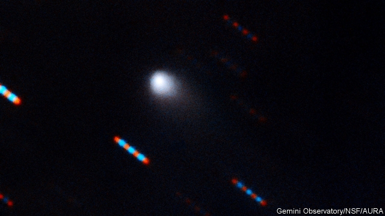

###### Astronomy

# An amateur astronomer spots a second interstellar visitor 

 

> print-edition iconPrint edition | Science and technology | Sep 28th 2019 

TWO YEARS AGO the solar system was visited by ‘Oumuamua, an asteroid from interstellar space. It was the first such body observed, but now a second alien object (pictured alongside) is in astronomers’ sights. 2I/Borisov is a comet, rather than an asteroid. The distinction is that, warmed by sunlight, 2I/Borisov has developed a temporary atmosphere called a coma. This difference also affects the way it is named. Unlike asteroids, comets are called after their discoverers. The new visitor was first reported by Gennady Borisov, a Russian amateur observer, on August 30th, and was officially named on September 24th. Its closest approach to the sun will be on December 7th, after which it will disappear back into the cosmic tracts whence it came. 

