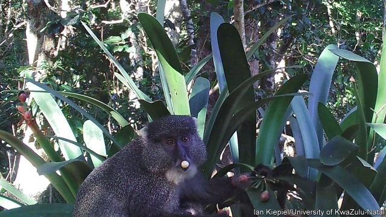

###### Reproductive ecology

# Lilies tweek their fruit and seeds to ensure their propagation 

 

> print-edition iconPrint edition | Science and technology | Sep 28th 2019 

AFRICAN BUSH lilies are demanding plants. To thrive, they need dappled shade—for they are sensitive to full sunlight—and well-drained soil. They are therefore patchily distributed, growing only in microclimates where these conditions pertain. That means their seeds are likely to do best if they germinate near the plant that bore them. Too near, though, and they will compete with that parent for resources. Somehow, a way needs to be arranged for seeds to be carried the optimum distance from their parental plants. And Ian Kiepiel and Steven Johnson at the University of KwaZulu-Natal, in South Africa, think they know how it happens. 

Plants are masters at manipulating animals into assisting their reproduction. One way this happens is that the seeds of many species are just the right size and shape to endure passage through the alimentary canals of the animals that swallow them. When they eventually end up as part of a dung pile, they are thus far from home. The bush lily’s predicament, however, suggested to Mr Kiepiel and Dr Johnson that it was not in the plant’s best interest for animals to swallow its seeds in the first place. 

Closer examination of those seeds supported that notion. They lacked the protective layers seen in seeds of the sort that are swallowed. They were also laced with lycorine, a toxin that, depending on the dose, causes vomiting, paralysis or death. This led Mr Kiepiel to wonder whether the fruit themselves were edible. To this end he experimented on himself and found that they were. Though not particularly pleasant to his taste, lily-fruit flesh had a vague sweetness to it which he suspected might be attractive to other mammals. He did find also, however, that the seeds tasted ghastly. A mere nibble of one was enough to release an awful astringent flavour that lingered on his palate for hours, regardless of any attempt to wash out his mouth. 

In light of this experience, he and Dr Johnson set up movement-sensitive cameras at three bush-lily colonies. As they report in Biotropica, over the course of a hundred days these cameras took photographs and videos of samango monkeys coming to the plants and devouring their fruit. 

Often, when feeding, such monkeys fill their cheek pouches with fruit, which they then consume later, within the safety of a tree. In this case, though, the cameras recorded the monkeys gorging themselves on the fruit while next to the lilies, and only rarely storing fruit in their pouches. Why is not clear. But significantly, the cameras showed that the monkeys were, straight away, spitting out the seeds of every fruit they fed on. 

This habit of spitting out seeds suggested that the monkeys might be distributing them just far enough from their source to keep competition between parents and offspring at a minimum. To check this, the researchers visited two of the sites, collected as many spat-out seeds as they could find, and measured those seeds’ distances from their probable sources—nearby plants that had been fed on. Those distances averaged 63cm at one of the sites and 66cm at the other. This is exactly far enough to avoid competition while remaining within the microclimate. In the case of African bush lilies, then, it seems that evolution has optimised their reproduction by embedding noxious seeds inside tasty fruit, and letting the monkeys do the rest.■ 

