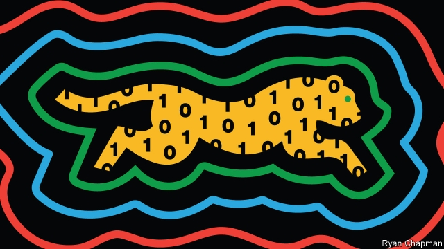

###### Schrödinger’s cheetah

# Proof emerges that a quantum computer can outperform a classical one 

 

> print-edition iconPrint edition | Science and technology | Sep 26th 2019 

IN AN ARTICLE published in 2012 John Preskill, a theoretical physicist, posed a question: “Is controlling large-scale quantum systems merely really, really hard, or is it ridiculously hard?” Seven years later the answer is in: it is merely really, really hard. 

Last week a paper on the matter was—briefly and presumably accidentally—published online. The underlying research had already been accepted by Nature, a top-tier scientific journal, but was still under wraps. The leak revealed that Google has achieved what Dr Preskill dubbed in his article, “quantum supremacy”. Using a quantum computer, researchers at the information-technology giant had carried out in a smidgen over three minutes a calculation that would take Summit, the world’s current-best classical supercomputer, 10,000 years to execute. 

A credible demonstration of quantum supremacy, which few disagree that the leaked paper represents, is indeed a milestone. It will divide the history of the field into two eras: a “before”, when quantum computers were simply hoped to outpace even the best classical kind, and an “after”, when they actually did so. There has been much talk, including in this newspaper, about the latter era. Now it has arrived. 

Google’s experiment was “circuit sampling”: checking whether numbers their machine spits out, given random inputs, fit a particular pattern. This niche task was chosen to be easy for a quantum computer while still being checkable—just—by a classical one. It does, though, confirm that quantum computers may in time be able to handle long-standing matters of practical importance. These include designing new drugs and materials, giving a boost to the field of machine learning, and making obsolete the cryptographic codes that lock up some of the world’s secrets. 

Quantum computers employ three counterintuitive phenomena. One is “superposition”, the idea behind Schrödinger’s famous dead-and-alive cat. Unlike classical bits, which must be either one or zero, “qubits” may be a mixture of both. Google’s machine has 53 qubits, which between them can represent nearly ten million billion possible superposed states. 

The second is “entanglement”, which ties quantum particles together across time and space. In standard computers each bit is rigorously sequestered from the next. Quantum machines like their qubits entangled. Mathematical operations on superposed and entangled qubits can act, to a greater or lesser degree, on all of them at once. 

A quantum calculation starts by addressing qubits individually: making one of them mostly zero, say, and then entangling it with its neighbour by a certain amount. That done, it lets the rules of physics play out, with the qubits’ states and linkages evolving over time. At the end (but not before, which would ruin the calculation), the qubits are examined simultaneously to obtain an answer. 

The trick is to maximise the chance of choosing the right answer instead of one of the zillions of wrong ones. This is where the third counterintuitive idea comes in. In classical physics, probabilities must be positive—a 30% chance of rain, say. Quantum mechanics uses a related concept, called “amplitudes”. These can be negative as well as positive. By ensuring that amplitudes which represent wrong answers cancel each other out, while those that represent the right one reinforce, programmers can home in with high confidence on the correct solution. 

That is the explanation which textbooks present, anyway. In the laboratory, things are rather more difficult. Superpositions and entanglements are exceedingly delicate phenomena. Even the jiggling of adjacent molecules can interrupt them and sully a calculation. Most designs for quantum computers require the machines to be stored at temperatures colder than that of deep space, and to be tended by a basement full of PhDs, to keep things on track. 

 

No height of education or depth of cold, though, can altogether preclude errors creeping in. The biggest problem facing quantum engineers is how to spot and correct these, because most of the useful applications of quantum computing will require many, many more qubits than current devices sport—with a concomitant increase in the risk of errors. That has spurred a huge effort, both by well-known firms such as IBM, Intel and Microsoft, and by an eager band of newcomers, such as Rigetti, to build better, less error-prone kit. 

There is also, in parallel with this race to build better machines, a race to develop useful quantum algorithms to run on them. The most famous example so far is probably Shor’s algorithm. This is the piece of quantum-turbocharged maths that allows rapid factorisation of large numbers into their component primes, and thus scares cryptographers, a group whose trade depends on this being a hard thing to do. But if quantum computers are really to earn their keep, then other algorithms will be needed. Developing them will be assisted by the fact that a lot of the proposed applications (drug design, materials science and so on) themselves depend on quantum processes. This, indeed, is why those applications have been so intractable until now. 

Despite the promise of quantum computing, many in the field are uncomfortable with the phrase “quantum supremacy”, for it implies a threshold that, once crossed, leaves decades of existing computer science in the dust for something weird and wonderful. And for all the “before” and “after” that Google’s paper represents, building practical, error-corrected machines will be far from easy. 

It is therefore a mistake, most people think, to believe that quantum computing will replace the classical sort. The practicalities of low-temperature operation alone are likely to see to this. Governments, big firms and the richer sorts of university will, no doubt, buy their own machines. Others will rent time on devices linked to quantum versions of the cloud. But the total number of quantum computers will be limited. 

And that will be fine. But it is worth bearing in mind a similar prediction of limited demand made in the early days of classical computing. In 1943 Thomas Watson, then boss of IBM, is alleged to have said, “I think there is a world market for maybe five computers.” He was out by a factor of perhaps a billion.■ 

