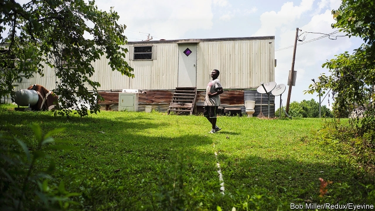

###### Race

# American poverty continues to affect people of colour most 

 

> print-edition iconPrint edition | Special report | Sep 28th 2019 

 THE RAW sewage from Pamela Rush’s toilet travels through a straight plastic pipe directly into the backyard of her dilapidated mobile home. It smells badly in hot weather. Mosquitoes swarm and the children are forbidden from playing there. But when it rains, the stuff pools and it is unavoidable. Because the soil in Lowndes County, Alabama, where Ms Rush lives, sits atop a relatively impermeable base of limestone, a proper public sanitation system for the sparsely populated place would be expensive. Sanitation is left to private systems, which poor residents like Ms Rush cannot afford. Foul-smelling flooded lawns are a common sight. They are also the reason that hookworm—a parasitic disease transmitted largely by walking barefoot on open sewage—has been detected among the residents there. It is a disease most often encountered in developing countries. Yet decades after it was thought to be eradicated, it can be found in America, again. 

Lowndes County is part of the Black Belt—the swathe of land named for its fertile topsoil which produced vast amounts of cotton on the back of slave labour and, later, sharecropping, and where emancipated black workers farmed rented land. Despite all the wealth that was extracted from the fields, those who remain there today have little; the median household income is a mere $29,785 and the official poverty rate is 30%. Three-quarters of residents are black, and they are nearly eight times as likely to be poor as whites in the county. Across America, black people remain disproportionately poor. More than 20% live in poverty, twice the rate of whites. After a moderate amount of progress was erased by the Great Recession, median black household wealth nationwide is one-tenth that of white households, just as it was 50 years ago. 

The mobile house in which Ms Rush lives today has mouldy cupboards, an unusable bathtub and holes plugged with many ingenious patches. Her income is meagre—$770 a month in disability benefit, $129 for each of her two children in child support. Her ten-year-old daughter has health problems that require a visit to a specialist in Birmingham 100 miles away every three months—a difficult journey without a car. 

In one county in South Dakota, life expectancy is lower than in Sudan 

While on a tour of the region, Philip Alston, the UN special rapporteur on extreme poverty and human rights, remarked that he had never seen such conditions in the rich world. But it is seldom a concern of candidates for political office. Since the days of Lyndon Johnson and Robert Kennedy, poverty alleviation has hardly been at the centre of either party’s political campaigns. Part of that is because of the brutal maths of vote-getting. As income declines, so does the propensity to turn out at the ballot box. 

The problem is more than black and white, however. About 22% of Hispanics live in poverty. Yet, though many of them are poor when they immigrate to America, successive generations are likely to be less so. A study of tax-returns data showed that poor Hispanics, especially men, have much higher mobility than poor blacks. Asians, too, have a better record of moving up. Though pockets of poverty remain—among those born in Bangladesh and Cambodia, for example—rates are the lowest of any race, at 11.9%. Native Americans fare the worst. On some reservations, the estimated poverty rate is 52%, and 60% among children. In one county in South Dakota, life expectancy is lower than in Sudan. 

Working out what issues are caused by history and what are a result of current policies also contributes to the analytical paralysis of policymakers. The yawning gap in poverty levels of blacks and whites partly results from the centuries of discrimination faced by black Americans before the civil-rights era. Macroeconomic shifts unrelated to race, like deindustrialisation, have also damaged black families and livelihoods. 

Some modern conservatives are putting forward solutions to poverty that go beyond public-funding cuts and private charity. These still tend to be studiously race-neutral. Oren Cass of the Manhattan Institute has pitched more substantial wage subsidies as the heart of a new conservative anti-poverty agenda. After reforms in 1996, the safety net has already become more centred on “workfare” (such as the earned-income tax credit) than welfare. But many Republicans continue to see welfare as a poverty trap wrought from overreliance on the safety net, however patchy. 

Looking at the same issues, progressives within the Democratic Party arrive at a very different set of answers. The failure is not personal, but of public policy, because of slavery, mass incarceration or redlining that denied mortgages to residents of minority neighbourhoods. This has led to the more left-wing members of the party to call for reparations to black people. 

Yet reparations are also a political third rail. Even today’s crop of Democratic presidential candidates, who have been drifting left in almost every other respect, have shied away from endorsing the idea, though some have pledged to appoint a committee to study the issue. The clearest explanation for this comes from Martin Gilens of Princeton University, author of “Why Americans Hate Welfare”. It found that overly racialised attitudes—the idea that white money was going to non-white people—prevented widespread support of means-tested programmes. “In large measure, Americans hate welfare because they view it as a programme that rewards the undeserving poor,” Mr Gilens writes. 

Implicit benefits for minorities are difficult enough to create and maintain. An explicitly race-based programme such as reparations would attract even more condemnation—and one sure to fail without a Democratic president and supermajorities in Congress. In all likelihood, the reduction of racial disparities in poverty will have to be done through race-neutral means. As policymakers grapple with how to do that, enterprise and philanthropy are trying to fill the gap. ■ 

