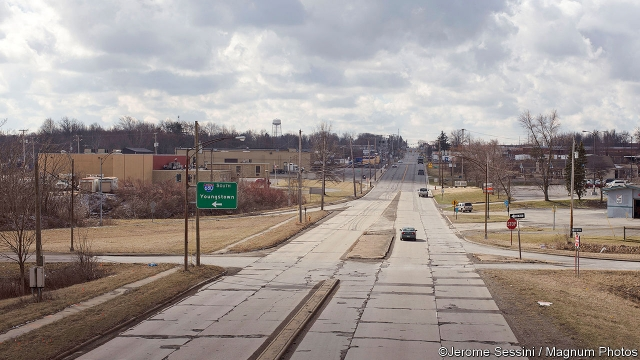
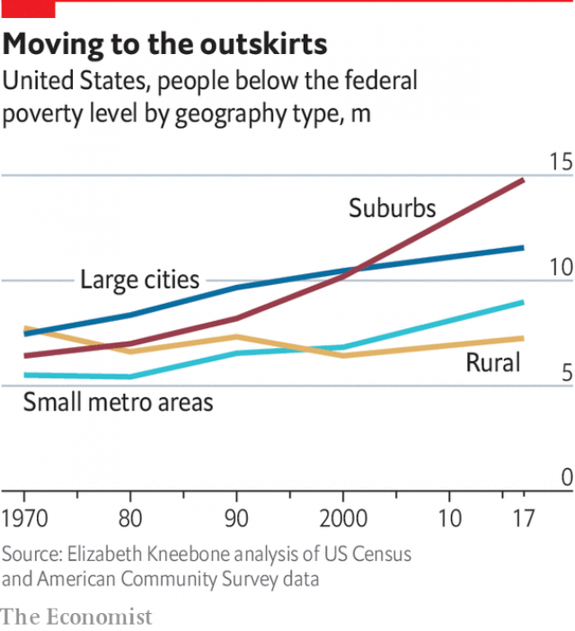

###### Geographical changes

# American poverty is moving from the cities to the suburbs 

 

> print-edition iconPrint edition | Special report | Sep 28th 2019 

FOR MANY, the stereotypical image of American poverty still resembles the infamous Cabrini-Green Homes, a housing estate completed in 1962 near the heart of Chicago. It became overrun by gangs, drugs and violence. City police, in effect, ceded control. This popular conception of poverty remains largely urban, black and ghettoised. But the stereotype is outdated. The Cabrini-Green estate, which once housed 15,000 people, is no more. The city finished demolishing it in 2011. The new neighbourhood is peaceful, with low-slung apartments, a new school, playgrounds and green space aplenty, alongside wine shops and cross-fit gymnasiums for the millennial crowd. In 1981 Jane Byrne, then the city’s mayor, moved into a Cabrini-Green building on 1160 North Sedgwick Street to draw attention to high crime rates—only to turn tail and flee a mere three weeks later. Today that address is an attractive brick building overlooking an upmarket bakery and a Starbucks coffee shop. 

To see the changing geography of American poverty, go instead to Harvey, a small suburban town of 26,000 just 20 miles (32 km) south of Chicago. Despite its proximity to a large city, median household income is an abysmal $24,343. After mismanagement and missed bond payments, the city’s finances are in freefall. One in four flats now sits vacant. Nearly 36% of its residents are classified as poor, higher than in many of the poorest counties in eastern Kentucky and the rest of Appalachia. Though Harvey was never rich, that is a drastic increase from the 22% poverty rate in 2000. And as politicians, journalists and sociologists continue to focus attention on the well-known urban ghettos on the city’s south and west sides, few are taking note of the worsening plight of places like Harvey or nearby Dolton, where concentrated poverty is now just as bad. 

After the demographic changes over the past decade, there are now more poor people in Chicago’s southern suburbs than in the city itself. The same is true for the rest of America: a poor person is now much likelier to be found in the suburbs than in the big cities. According to the census taken in 2000, 10.5m, or 31%, of all poor people lived in the suburbs of America’s largest cities. The most recent estimates from the Census Bureau show that the number of poor people living in those suburbs has exploded to 16.3m, an increase of 56%. Unlike urban poverty, which has long been associated with destitute blacks, suburban poverty is more pronounced among poor whites and Hispanics. 

 

The dire fortunes of Harvey illustrate the urgent problem of modern poverty in America. It is not growing nationwide, but it is evolving into something more virulent. The poor are increasingly clustered together outside newly thriving central cities, and thus out of sight. Being poor is difficult enough, but opportunities dwindle if you live in a district of concentrated poverty (where 20% of neighbours live below the poverty line) or of extreme poverty (where 40% fall below the threshold). Where you grow up affects the trajectory of your life. Rising housing costs and income inequality have made the problem worse. The number of Americans living in concentrated poverty has increased by 57% since 2000, according to Elizabeth Kneebone of the University of California, Berkeley. Because of the growth of concentrated poverty in suburbs and small cities, a majority of poor Americans now live in these distressed neighbourhoods. 

Plot the rate of almost any social dysfunction—addiction, crime, infant mortality, joblessness or mental illness—and you invariably reproduce the same map. The cumulative effect of these overlapping disadvantages is worse than any individual one; concentrated poverty is more damaging than mere poverty. The clearest evidence comes from three economists—Raj Chetty, Nathaniel Hendren and Lawrence Katz of Harvard University—who analysed a randomised experiment in which some poor families were given housing vouchers to move out of impoverished districts into lower-poverty ones. For children who moved to better neighbourhoods while young, the researchers found massive effects on an array of long-term life outcomes. College attendance rates increased by 16.5%; annual incomes as adults were 31% larger; women were 26% less likely to become single mothers. 

Often, the effect crops up in unexpected ways. A study of black children in Chicago by Rob Sampson, Patrick Sharkey and Stephen Raudenbush, three sociologists, estimated the negative effect on vocabulary and verbal ability from growing up in the city’s most troubled areas as equivalent to missing a year of school. Mr Sharkey has found that the harms accumulate. Two consecutive generations in poor neighbourhoods cause the measured intelligence of children to drop by eight or nine IQ points. For a child of average intelligence, the drop is equivalent to moving from the 50th percentile to the 28th. 

A more corrosive consequence of concentrated poverty, though harder to measure, is on feelings of hopelessness and despondency. Poverty is more than just physical deprivation. It is also psychologically debilitating—breeding constant anxiety about the near future, and inuring people to daily traumas, of hunger or violence or addiction. The temporary cognitive load for adults is daunting: scientists have measured it as equivalent to shaving off 13 IQ points. 

Half the children in Cleveland live in poverty 

Outside cities, poverty is more difficult to deal with because social services are harder to provide. Big cities—even quite poor ones such as Baltimore and Detroit—are still able to operate the large bureaucracies needed to help the poor. As a result, urban counties spend ten times as much per person on support for poor residents as suburban ones, according to Scott Allard of the University of Washington. The small towns that struggle are less able to help their residents. Their finances are in bad shape. They have barely enough money to cover essential services like policing and street-sweeping, let alone operate job-training programmes or compete for complicated federal grants. Public transport is rare outside big cities, and the costs of maintaining a car are too high for many. 

Take Cleveland, Ohio, one of America’s poorest cities. Though nearby Detroit is often thought of as even poorer, half the children in Cleveland live in poverty, the highest rate of any large city in the country. In the city’s central district, where public housing for poor, black residents is still concentrated, the child-poverty rates are estimated at 80%. “It’s the same recurring story,” says Shanda Davis, a pastor and local activist in Cleveland’s Tremont neighbourhood. “We have children who are displaced, mothers who aren’t making enough, fathers who are walking away from their own home life.” 

Ms Davis, a kindly, soft-spoken woman, endured many of the horrors of a poor and unstable upbringing: an alcoholic mother, molestation while still a girl, dropping out of high school, getting pregnant while young and domestic violence afterwards. Somehow she pulled through. Her humble operation now dispenses food, clothes and love to locals. “We pull out of our cabinets whatever we have. The scripture says to give what you have, and it becomes more than enough,” she says. Despite her efforts, the troubles remain. Drug-dealing is common in the neighbourhood. 

At least there are still some institutions that can help. The Sisters of Charity Health System, which runs a nearby hospital, has also set up a foundation hoping to break the cycle of intergenerational poverty in the neighbourhood. Like Pittsburgh, the city of Cleveland has the cultural and financial assets to get itself out of a rut; it has a world-class hospital, a major research university, an international airport and a few corporate headquarters. 

Things are worse in small cities nearby. Youngstown, once a booming centre of steel production with a peak population of 170,000, is now a hollowed-out town of 65,000. Bruce Springsteen wrote a song about its decline. The poverty rate is 37%, higher than in Cleveland. Reviving it will be hard. “Unlike Cleveland, Youngstown has no assets. It’s experienced extreme depopulation. There weren’t any elite institutions there,” says Aaron Renn of the Manhattan Institute, a think-tank. 

As in most distressed places in America, some residents still work to turn things around. Ian Beniston runs the Youngstown Neighbourhood Development Corporation with a small staff and volunteers. They clear rubbish from lawns, rehabilitate abandoned properties and pester slumlords. “It’s basic stuff,” he admits. “But the most radical thing we can do as young people is stay in cities like this.” 

For Democrats and Republicans alike, priorities have shifted away from saving persistently poor places in favour of more middle-class concerns like income inequality and lack of social mobility. President Donald Trump invokes the poverty in Baltimore only as a cudgel against his political opponents. This makes little sense, however, since ignoring the compounded disadvantages of poverty condemns today’s poor children to becoming poor adults. And it is all made more difficult by the problems of race. ■ 

