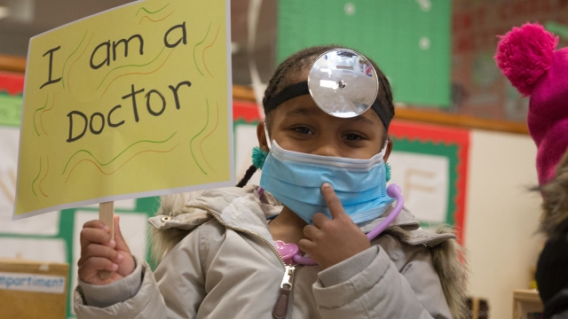

###### Non-public options

# How much can enterprise and philanthropy help alleviate American poverty? 

 

> print-edition iconPrint edition | Special report | Sep 28th 2019 

HARLEM IS A neighbourhood in upper Manhattan that was once a byword for poverty, crime and urban failure. It was a place where, as recently as 1980, black men had a lower life expectancy than in Bangladesh. Large parts of it look different today. Life expectancy has soared, and the neighbourhood has improved dramatically. Although a considerable share of children there—35%—remain poor, their life chances still look much better than a generation earlier. 

That is in no small part because of the efforts of the Harlem Children’s Zone (HCZ), a non-profit group which has “adopted 100 blocks” and set itself the goal of breaking the intergenerational chain of poverty by providing good parenting advice, healthy food and education. New parents who attend the zone’s Baby College learn about proper nutrition and reading habits for their infants. Older children can attend free, full-day pre-kindergarten and some go on to attend the HCZ network of charter schools. Their impressive initial results are seen as a national model. 

The zone serves 14,000 children and 14,000 adults at a cost of just $4,600 per person per year (raised from a mix of public and private sources). That is not a large sum of money, points out Anne Williams-Isom, the zone’s boss. “We spend $167,000 on an inmate in Rikers [jail]. We find the money to scale that and we find the money to replicate all of that,” she adds. “I’m telling you if you gave me half of that for a third-grader, I could do what I needed to do to give them and their family what they needed.” 

Philanthropy such as this helpfully complements public efforts, filling holes in the American safety net. Two major anti-poverty programmes for new mothers—the Supplemental Nutrition Assistance Programme (SNAP), better known as food stamps, and Women, Infants and Children (WIC)—are in-kind services that do not cover the cost of nappies, for example. Many nurseries will not accept care of young children unless parents provide them, says Ann Marie Mathis, who runs a charity called Twice as Nice Mother & Child that distributes nappies in Illinois. 

This gap is plugged by charities like hers, which distributes 350,000 nappies a year. Food banks, ranging from factory-style operations to small outfits run out of a church cupboard, remain in high demand as a supplement to food-stamps benefits, which average $1.40 per meal. In 2017, data from the Census Bureau’s annual survey on food security showed that at least 15.9m Americans reported using food banks that year—an increase of 65% since 2002. Because only people with low incomes are asked, actual use may be higher. The largest food-bank network in the country, Feeding America, estimates that it helps 46m people at least once a year. 

Philanthropic efforts also tap into the quintessentially American tendency, noted 200 years ago by Alexis de Tocqueville, a French writer, of people to provide for their neighbours through private associations and charity. However, charity alone cannot substitute for a public safety net. In 2018, all of American charitable giving—not just to anti-poverty organisations—amounted to $428bn. This is no small amount, but adds up to just two-thirds of the current cost of Medicaid, the health-insurance programme for the poor. Add in other large programmes—Medicare, Social Security, the earned-income tax credit, food stamps and housing assistance—and the sum looks small. It could be argued that public profligacy has crowded out private philanthropy. But, at around 2.1% of GDP, charitable giving has stayed roughly the same for 40 years. 

Though the problem of poverty in America provokes deep disagreement, nearly every thinker on the subject agrees that the ideal exit is stable, well-paid employment and not permanent dependence on public support. Working-age adults are a bare majority of the poor population because of the over-representation of children. Of those, about one-fifth are disabled. Among the able-bodied, a majority already work or attend school full time—the problem is that they work too few hours or their wages are too low. For this group, the next step is not securing a job, but a better one. 

For low-skilled workers with few educational qualifications, even in current tight labour-market conditions, chances for advancement are limited. Another problem is that persistently poor places also have weak private sectors that lack such jobs. In the main town of Pine Ridge, a Native American reservation in South Dakota—by some measures, the poorest place in the country—the private sector hardly extends beyond a few, cash-only petrol stations. The few good jobs that do exist are often publicly funded—in local government offices, schoolhouses, hospitals or prisons. 

Policymakers have long wanted to use public dollars to jump-start private investment in poor areas, but the results of such programmes have consistently disappointed. Most follow-up assessments for “enterprise zones”, created in the 1980s to provide tax credits for businesses in high-poverty areas, have found no employment growth or poverty reduction, yet higher house prices. “Opportunity zones”, the latest iteration of a place-based policy signed into law by the Trump administration, seem destined for a similar fate. There is little oversight over which zones qualify for tax credits, and no plan to track results systematically. Planned projects include a gastro-tourist spot in Portland, Maine, and the construction of a glassy new office building in Miami. The anti-poverty results of such investments may be minimal. 

Federally funded retraining programmes for displaced workers also seem to have achieved little, though some economists argue that is because they have not been properly financed. Federal programmes paid for by the Workforce Investment Act, in place from 1998 to 2014, seemed actually to reduce the earnings of displaced adult workers. Its predecessor, the Job Training Partnership Act, had similarly weak returns. The current version, the Workforce Innovation and Opportunity Act, has even less funding and is the same basic model. The mixed results reflect a general trend in poverty research: as people get older, it becomes harder to discern which policies are best. It also becomes more expensive to fix. 

Private efforts—whether philanthropy or more effective retraining—are most helpful when they show innovative approaches to poverty reduction that can then be scaled up with public dollars. This can help sidestep one problem of relying on charity alone: well-endowed foundations focusing on the plight of cities, not small towns. While Barack Obama was president, the Department of Education began a “Promise Neighbourhood” programme that sought to replicate HCZ-style zones in places like eastern Kentucky. But measuring the ultimate success of these initiatives requires decades of tracking. In the meantime, poverty prevention among children is almost certainly cheaper than rehabilitation. ■ 

