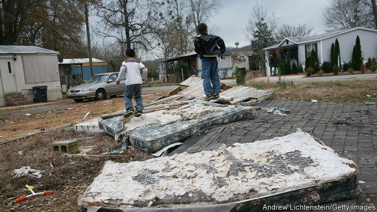
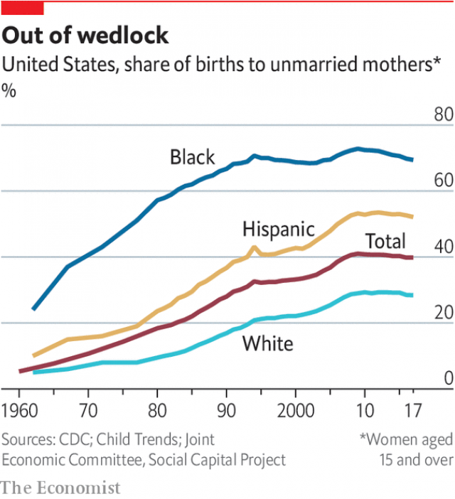

###### Children

# Poverty in America has long-lasting, destructive consequences on children 

 

> print-edition iconPrint edition | Special report | Sep 28th 2019 

EVEN CRITICS who think that poverty results from a defective character concede that poor children, all 13m of them in America today, are not to blame for their plight. But as soon as they reach the age of 18, many of those children will become poor adults who will then be unceremoniously deemed culpable for their predicament. By the official statistics, nearly one in six American children is poor. By the SPM, which takes benefits and cost of living into account, things look only a bit better: just over one in six is poor. They are concentrated in clusters across every state in America. They are found in depressed areas like Cleveland, where half of children live below the federal poverty line, rural South Dakota and central Appalachia. They are also found among immense prosperity—the children living in the Bronx or of the service workers who drive three hours each way to do menial jobs in San Francisco. 

This American tragedy is an ignored one. Poor children neither vote nor hire lobbyists. It is also morally senseless, punishing children for the sins or misfortunes of their parents. It is economically pointless, too. Poor children who grow up to be poor adults have not just reduced incomes, but shorter lives and a higher risk of criminality. The safety net, although important, does less to blunt poverty in children than in adults. 

It was not always this way. When Michael Harrington wrote “The Other America” in 1962—a seminal study which helped spark Lyndon Johnson’s war on poverty—the elderly, hobbled by medical and housing costs, were the poorest age group in the country. “Fifty per cent of the elderly exist below minimum standards of decency,” he wrote. Today, the problem has been inverted. With the advent of universal programmes like Medicare, the health-insurance scheme for the elderly, and Social Security, the public-pension programme, there is no age group better served. According to the SPM, 48% of elderly Americans would have been poor without the safety net. After taxes and transfers, that figure is down to 14%. 

What America has done for its elderly, it can also do for its children, with less complication and cost. The primary lever is reorienting public safety-net spending around poor children. It is important to spend so that poor adults do not go hungry, homeless or untreated for illness. But while it is hard for a person reliant on food stamps at the age of 40 to achieve self-sufficiency, opportunities still abound for the poor child receiving free lunches at school. 

The second imperative is for integration. Increasingly, poor children are segregated, living and attending school with others like them. A bifurcated society is more than just damaging democratically. Living in concentrated poverty worsens outcomes in future health, criminality, employment and happiness. 

Severely reducing or eliminating child poverty through the simplest means imaginable—unrestricted cash transfers—can seem starry-eyed until one studies the details. David Grusky of Stanford University says that the state of California, which has the highest share of poor people after accounting for taxes, transfers and cost of living, could end deep child poverty with targeted cash transfers that amount to a mere $2.8bn per year. This is “insane”, he adds. It is a quarter of the sum the state spends on prisons. 

Targeted anti-poverty programmes in America usually attract a backlash from voters who think the money goes to other people’s children. But even a universal child credit—a small amount of cash given for each child each month—“probably comes close to cutting child poverty in half just on its own,” says Jane Waldfogel, a professor of social work at Columbia University. Most of America’s peer countries already have a universal benefit scheme. After Canada fully implemented its programme, which offers higher benefits to poorer families, the number of children living in poverty fell by a third in just two years. If a similar programme—giving $400 per month for all young children and $340 for older ones—were implemented in America, it would indeed reduce child poverty by more than half. It would cost around $300bn a year, less than the grandiose proposals pitched in the Democratic presidential primary, such as a universal basic income and free college. 

 

A slightly less generous proposal along these lines has already been made by Michael Bennet and Sherrod Brown, two Democratic senators, though public enthusiasm for it has been muted. The likely benefits are not mere conjecture. When economists examine the long-term outcomes for children who received more generous benefits, whether in food assistance, tax credits or access to health insurance, they find big long-term improvements in health, as well as higher university attendance and higher incomes. 

But it is not enough to deal with poverty atomistically—to reduce individual suffering through a more robust safety net. It must also be dealt with spatially and collectively, meaning that it must be deconcentrated. Although housing benefits are allocated sporadically in America (only a quarter of those who qualify actually receive them because the benefit is not an entitlement, and funds are limited), there is little encouragement for families to move towards good neighbourhoods. Moving everyone to opportunity is not a scalable solution, but could happen more often. 

The same applies to schools. Rucker Johnson of the University of California, Berkeley, has produced compelling research showing clear benefits for black children who attended integrated schools, not segregated ones. Five years in desegregated schools boosted incomes by 30% later on in life; exposure to integrated elementary schools reduces the chance of incarceration by 22 percentage points. Unfortunately, the national trends in income segregation between the rich and the poor are heading in the opposite direction—increasing 15% from 1990 to 2010, and 40% within large school districts. The same is true of where American families live. 

The idea that safety-net programmes function as a poverty trap—or, in the words of Paul Ryan, a former House Speaker, as “a hammock that lulls able-bodied people to lives of dependency and complacency”—remains. Additional income will incentivise people to work less. But it is hard to imagine rational people giving up work for the meagre sums offered for disability ($1,234 per month on average), food stamps ($126 per month) and Medicaid (which cannot be cashed out). 

There are important ways in which liberals, particularly vocal white urban ones, also misunderstand the path to alleviating poverty. One cause of school segregation within American metropolitan areas is the intentional gerrymandering caused by school-district lines. This elicits only muted fury from the people who often preach the virtues of diversity in other arenas. “Neighbourhood schools” drive neighbourhood effects—both the beneficial ones of posh parts and the harmful ones experienced in America’s growing ghettos and barrios. The same people are strong critics of charter schools, which are publicly funded but privately run, for allegedly destabilising traditional state schools (and their associated teachers’ unions). For generations, poor, minority children have received inadequate education from their segregated traditional school districts. Although charter schools have similar results when evaluated nationally, they perform much better in the kind of struggling urban districts—such as New Orleans, Newark and Boston—where there are more poor children who need help. Among dedicated Democratic voters, 58% of blacks and 52% of Hispanics—the groups who benefit most from them—support charters, against just 26% of whites. 

There is also a longstanding reluctance among liberals to discuss the impact of family structure on child poverty. Much of this stems from the explosive reception to the Moynihan report—a study published in 1965 that sought to explain the roots of black poverty by analysing out-of-wedlock births—and the stigmatising argument that it seemed to imply. When Daniel Patrick Moynihan wrote his report, around a quarter of black children were born out of wedlock. Today that share is 70% for black children, more than 50% of Hispanic children and almost 30% for whites—all concentrated among poorly educated mothers. The official poverty rate for the children of single mothers is 39%, compared with 8% for those living with married parents. 

The reluctance to acknowledge that children in stable, two-parent households do better may seem understandable. Such statistics can be marshalled to stigmatise single mothers, and to then argue for benefit cuts. Some suggest that marriage promotion is a worthy avenue, but it is difficult to imagine bureaucrats successfully steering social norms. What should matter for policymakers is not attempting to apportion blame, but starting to chart a course out of the problem. ■ 

