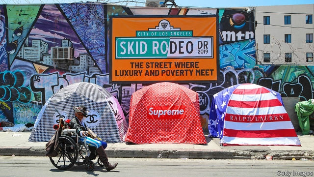

###### The future

# Progress is possible in America’s ongoing war on poverty 

 

> print-edition iconPrint edition | Special report | Sep 28th 2019 

AS A POOR American it is easy to feel ignored. “We’re forgotten and because we’re poor, people think we’re unimportant,” laments BarbiAnn Maynard, the woman agitating for clean water in eastern Kentucky, as she sits in her favourite contemplation spot—a boulder atop a reclaimed coal mine that offers a spectacular vista of the mountains. Before Rosazlia Grillier became an activist for COFI, a community group campaigning for school reform in Chicago, she lived in a poor area, with little hope. She had young children, not much income and was sick with cancer. “I had literally given up hope on anything. It was really a deep depression,” she says. Both women are steel-willed and committed to improving their communities. But even they are not immune to the creeping spells of despondency that poverty brings—a psychological dimension to suffering that is not captured by the statistics. 

Disrupting the intergenerational transmission of poverty requires a programme of serious public policy, which first requires public attention. This does not exist at present in America. That is partially because the poor do not vote. But much more it is because the debate gets bogged down in the futile attempt to separate the deserving poor from the undeserving. According to the American National Election Studies, voters on all sides feel more warmly towards “poor people��� than towards “people on welfare”. 

The consequences of inaction are clear. Poverty, unfortunately, is an inheritable condition. For some, like the black descendants of slaves in the South and those in the forcibly segregated inner cities, the ancestry can be drawn to previous government policies. The same is true of Native Americans. Others, like recently immigrated Hispanics and rural whites, are left behind because the economy rewards high levels of education and clusters in cities. Given these trends, the poor children of every race are likely to become the next generation of poor adults. The national shame of such penury will endure. 

This is not just the fault of the federal government and the unwillingness of conservatives to believe that government intervention can help. The driving force behind income segregation and the worsening concentration of poverty is rising house prices, which are pushing the poor together, concentrating disadvantage in the suburbs and small towns least equipped to deal with it. The problem is most acute in America’s most thriving cities—the ones governed by unabashed liberals—driven by poor housing supply blocked by local control over zoning. 

Rent can consume as much as half the income of the poorest residents. The housing assistance that might buffer some of these trends is underfunded relative to need. Competition drives rents up, particularly around good schools. Homelessness—perhaps the most extreme form of poverty—is a symptom, surging in high-cost cities. In 2018 New York estimated its homeless population to be over 79,000, or 48% more than in 2010. It spends $3.2bn on homeless services each year. California now accounts for one in four homeless Americans. 

What is needed is recognition that the anti-poverty programmes have indeed helped the poor as intended—a point that is obscured by the inadequacies of the official poverty accounting. Unencumbered by such fatalism, a new war on poverty would be most effective if centred on children. That is partly because of politics, since aiding poor children avoids the paralysing debate over culpability. But it is also a question of simple cost-benefit analysis. Earlier intervention boosts earnings (and thus tax revenue) and reduces spending on prisons and anti-poverty programmes. Research by Nathaniel Hendren and Ben Sprung-Keyser of Harvard University, assessing the return on public investment in various government schemes, finds that the benefits of programmes targeting poor children yield returns many times higher than those targeting poor adults. Simple measures like a universal cash allowance for children and enabling poor families to move to opportunity would be relatively inexpensive national goals. 

The war on poverty has improved countless American lives, but there is much that still needs to be done. Amid the other controversies in a nation sorely divided, many are struggling to live out their own version of the American Dream because of forces beyond their control. It may need another half-century before victory can be declared in the war on poverty begun by Lyndon Johnson, but that is surely no reason to stop trying. ■ 

