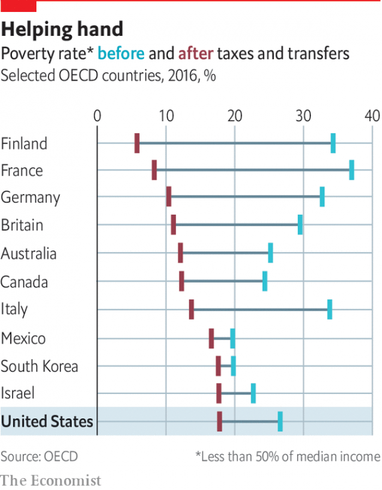
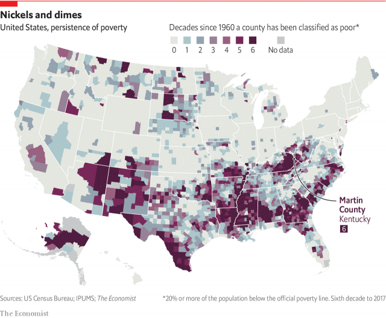

###### Poverty in America

# The best way to eradicate poverty in America is to focus on children 

 

> print-edition iconPrint edition | Special report | Sep 28th 2019 

ELDERLY RESIDENTS of Inez, the tiny seat of Martin County, Kentucky, deep in the heart of Appalachia, can still vividly remember the day the president came to town. Fifty-five years ago, while stooping on a porch, Lyndon Johnson spoke at length to Tom Fletcher (pictured), a white labourer with no job, little education and eight children. “I have called for a national war on poverty,” Johnson announced immediately afterwards. “Our objective: total victory.” That declaration transformed Fletcher and Martin County into the unwitting faces of the nation’s battle, often to the chagrin of local residents who resented the frequent pilgrimages of journalists and photographers. The story never changed much: Fletcher continued to draw disability cheques for decades and never became self-sufficient before his death in 2004. His family continued to struggle with addiction and incarceration. 

Today Martin County remains deeply poor—30% of residents live below the official poverty line (an income of less than $25,750 a year for a family of four). Infrastructure is shoddy. The roads up the stunning forested mountains that once thundered with the extraction of coal now lie quiet, cracked to the point of corrugation. Problems with pollution because of leaky pipes mean that some parts of the county are without running water for days. “Our water comes out orange, blue and with dirt chunks in it,” says BarbiAnn Maynard, a resident agitating for repairs. She and her family have not drunk the water from their taps since 2000; it is suitable only for flushing toilets. Some residents gather drinking water from local springs or collect rainwater in inflatable paddling pools. 

The ongoing poverty is not for lack of intervention. The federal government has spent trillions of dollars over the past 55 years. Programmes have helped many. But they also remain fixated on the problems of the past, largely the elderly and the working poor, leaving behind non-working adults and children. As a result, America does a worse job than its peers of helping the needy of today. By the official poverty measure, there were 40m poor Americans in 2017, or 12% of the population. This threshold is extremely low: for a family of four, it amounts to $17.64 per person per day. About 18.5m people have only half that amount and are mired in deep poverty. Children are the likeliest age group to experience poverty—there are nearly 13m of them today, or 17.5% of all American children. 

In international comparisons, that makes America a true outlier. When assessed on poverty relative to other countries (the share of families making less than 50% of the national median income after taxes and transfers), America is among the worst-performing in the OECD club of mostly rich countries (see chart). Despite its higher level of income, that is not because it starts with a very large share of poor people before supports kick in—it is just that the safety net does not do as much work as elsewhere. On this relative-poverty scale, more than a fifth of American children remain poor after government benefits, compared with 3.6% of Finnish children. 

 

Child poverty often leads to adult poverty and all of its problems: psychological distress, exposure to crime and lost productivity. The National Academies of Sciences, Engineering and Medicine, in a new 600-page study on the subject, estimate that child poverty costs America between $800bn and $1.1trn annually because of lost earnings and greater chances of criminality and poor health. 

How can one of the richest countries in the world have so many poor people, and what can be done about it? This special report will aim to answer these questions. It will show how poverty is shifting geographically from cities to suburbs and examine the continuing influence of race. It will consider philanthropy and private enterprise. And it will conclude by arguing that heftier anti-poverty spending on children is the best way to make a difference. 

For those who disparage the trillions of dollars spent on safety-net programmes as a well-intentioned but quixotic endeavour, the case of Martin County would seem a clear cautionary tale. “We waged a war on poverty, and poverty won,” Ronald Reagan lamented while president. That fatalism remains alive and well in American politics—from both the right, which often sees poverty as an inescapable problem of character and choice that is impervious to government intervention, and much of the left, which increasingly sees it as an inescapable consequence of predatory capitalism. Both strains of pessimism are simplistic and incorrect. Now, as then, solutions do not adhere neatly to liberal or conservative agendas. The left has, in the past, overemphasised the ability of the government to achieve change. The right, mistrustful of state intervention and too convinced that a free market will automatically bring universal well-being, has done little creative thinking. 

Because of this, the politics of poverty have become stuck. America is bogged down in the interminable exercise of separating the deserving poor from the undeserving. Treating the poor as responsible for their predicament is callous; treating them as victims of social structures and bad circumstances robs them of agency and dignity. Fair-minded people can find themselves anywhere in between. Moreover, settling the debate over personal responsibility is also impossible, at least to the satisfaction of the most committed ideologues. A person who is convicted of a violent felony—a blameworthy choice—could face years of penury, but their childhood in a poor, segregated neighbourhood with little support from school or family—unlucky circumstances—are likely to have contributed to that action. 

 

The partisan debate is focused on whether able-bodied, working-age adults should receive cash handouts. Yet such adults are a minority of the poor population today. Only a small number of them report unemployment or voluntary non-participation in the labour force. Straightforward cash welfare for non-working mothers—the battleground of the Clinton-era debate—is now only a small part of the safety net compared with in-kind programmes (like food stamps or Medicaid, the government health-insurance programme for the poor) and tax credits that boost the wages of the working poor. The main conduits of direct cash are disability payments and Social Security for the elderly which, by definition, do not go to able-bodied adults. 

Some see the continued existence of deprivation in America as a reason to shrink the safety net, believing it to have been ineffective. Yet poverty persists today not because of the failure of the net, but in spite of its widespread impact. The correct way to evaluate the success of anti-poverty programmes is counterfactually. The question is not whether poverty still exists, but how much worse it would be without government action. Answering that is made harder by the arcane way in which America measures poverty. The official level relies on pre-tax income, disregarding aid from safety-net programmes and differences in living expenses, making improvements difficult to register. 

When a better tool is used—the supplemental poverty measurement (SPM), which takes these deficiencies into account—the effect of the expanded safety net becomes clear (see article). In 1967 safety-net taxes and transfers barely dented poverty: 26.4% of Americans were poor before, and 25% remained poor after. Without a safety net, nearly the same proportion of Americans, 24.6%, would be poor today as were 50 years ago. 

Yet because of greatly expanded anti-poverty programmes, such as food stamps and the earned-income tax credit, which tops up the wages of low-paid Americans, only 13.9% are poor after taxes and transfers. The elderly were once among the poorest groups—and still would be were it not for the old-age cash and health benefits provided by Social Security and the Medicare programme. Now, they do about as well as working-age adults. 

Eastern Kentucky exemplifies the evolving nature of poverty in America since Johnson declared his war. Compared with the rest of the country, poverty there remains high. But in absolute terms, the share of poor residents has dropped by nearly half since 1960. When John F. Kennedy campaigned for the presidency in West Virginia, he was horrified not by the state of the roads but by the emaciated people. Out-and-out hunger is much rarer today. However, new social pathologies have sprung up: obesity, joblessness, disability and addiction. 

Each new social problem compounds the others. Individual choice and social structure co-mingle, yielding a Gordian knot of pathology difficult for policymakers to cut. The national economy has evolved to one that prizes education, leaving low-skilled workers behind. Deindustrialisation and incarceration have particularly decimated the prospects for black men. 

Poor families of all races have become increasingly unstable as a result. Rates of non-marriage and births out of wedlock have risen among this population, leading to many more single-mother families—41% of children in such households live below the poverty line. Drug use, particularly of opioids, has grown exponentially, fracturing families even more. “I became a mother at 72 again,” says Debbie Crum, who has lived nearly all her life in Martin County. “My great-nephew and his girlfriend had the baby. But they were hooked on drugs. The family had to go all the way back to me before they could find someone who could take care of the baby, who could pass the background check and drug test.” Ms Crum is a loving carer, but not all children are so lucky. 

The Bureau of Economic Analysis publishes detailed data on sources of income, public and private. In some counties of Kentucky, federal transfers—through food stamps and disability and old-age benefits—account for 36% of all income. Without them, crises like joblessness and drug addiction would be far worse. Hospitals, schools and local government are often the largest providers of stable jobs. Medicaid, which was expanded in Kentucky through Obamacare, pays for substance-abuse treatment in parts of America hit hardest by the opioid epidemic. 

The existence of poverty does not undermine the American dream, but the persistence of it does. The safety net looks stuck in time, even though the problem of poverty has evolved. And now there is a new danger. Because of rising income inequality and housing costs, poverty is moving out of cities and into suburbs, where it is less visible. Poor white and Hispanic Americans are much more likely to live in such places. Combating this looming problem is not at the heart of any political agenda. That is unfortunate and self-defeating. A wealth of economic and sociological studies show that poor children who grow up in districts of concentrated poverty have profoundly worse life outcomes—their incomes sag, their health deteriorates and their family lives turn dysfunctional. The job of the safety net is to arrest this cycle. If this generation of poor children is to do better than the one before, the net will need to become stronger still.■ 

