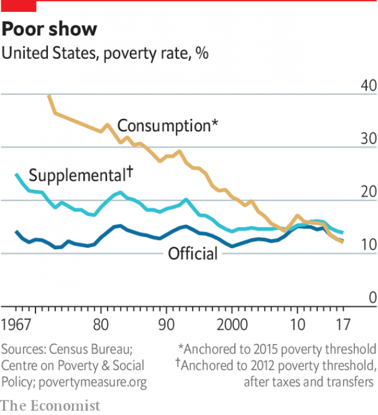

###### Who counts as poor?

# The official way America calculates poverty is deeply flawed 

 

> print-edition iconPrint edition | Special report | Sep 26th 2019 

FOR LYNDON JOHNSON to wage a successful war on poverty, he first needed to define it. The brainy work was done by Mollie Orshansky, a statistician for the Social Security Administration, who developed the first federal poverty line in 1963. Ms Orshansky’s method was plausible enough for the times. From a survey conducted in 1955, she calculated that families would typically spend a third of their household budgets on food. So she computed the cost of bare-essentials food plans for families of varying sizes and multiplied these thresholds by a factor of three. These numbers, after simple annual adjustments for inflation, are the modern poverty lines used by federal government. 

Times have changed. Globalisation and advances in agriculture mean that modern households now spend only one-eighth of their incomes on food. Better data are available. They show that housing and child care—not food—are the biggest constraints on the household budgets of poor people. The majority of American renters who make less than $30,000 now spend more than half of their income on housing. Among poor families with children, those with such severe rent burdens tend to reduce the amounts spent on other necessities like food, transport and health care. And deciding who counts as poor is not merely a matter of statistical arcana. Eligibility for safety-net programmes, which disburse trillions of dollars, is determined by the federal poverty level. Its deficiencies also fuel the perception that safety-net programmes have had no positive effect. 

America’s antiquated poverty line presents several problems. The most significant is that income is calculated before taxes and transfers, meaning that the poverty-reducing effects of the earned-income tax credit ($63bn annually) or food stamps ($68bn) is ignored. Progress against poverty goes undercounted as a result. There are two commonly cited measures of American poverty more sophisticated than the official one—the supplemental poverty measure (SPM), which takes benefits and cost of living into account, and the consumption poverty measure, based on expenditure instead of income, developed by two economists, Bruce Meyer and James Sullivan. Both of them show sharp and sustained declines over the past half-century upon accounting for safety-net programmes (see chart). 

 

Another problem is that the poverty line is set far too low. Most developed countries do not use only measures of absolute poverty, as America does. They also employ relative poverty measures. In Britain, for instance, families with incomes below 60% of median income are classified as poor. In America the median income for a family of four in 2017 was $94,876—yet the poverty threshold was just $24,600, or 26% of median income. Because income growth has outstripped inflation, the divergence has increased over time. In 1975, for example, the poverty level was as much as 40% of the median income for a family of four. Government programmes try to take this inadequacy into account, albeit inconsistently. 

A third issue is that there is no accounting for variation in the cost of living—the poverty line in San Francisco is the same as in rural Louisiana. That scrambles the perception of rich states and poor states. A favourite saying in poor states like Kentucky or Alabama is “Thank God for Mississippi”—the state that finishes last on poverty indices. Yet when measures that take the cost of living into account are used, like the SPM, it turns out that California is at the bottom of the rankings. Despite the progressive state’s more generous safety net, the out-of-control housing costs push more people into destitution than anywhere else. 

This deficiency in the official poverty statistics is exploited by some right-wing politicians. Paul Ryan, a Republican former Speaker of the House, justified his proposal in 2016 for modifying safety-net programmes—largely by adding work requirements—by noting that “Americans are no better off today than they were before the war on poverty began in 1964.” That might be right by the official statistics but, when poverty is properly measured, it is plain wrong. 

