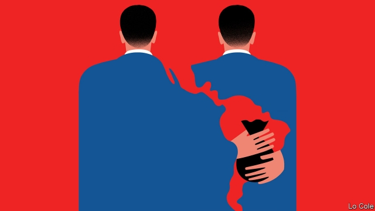

###### Persistent graft

# The war against corruption in Latin America is in trouble 

 

> print-edition iconPrint edition | The Americas | Sep 28th 2019 

IT GOES ON and on and on. In Mexico, Rosario Robles, a former minister, was jailed last month while under investigation regarding the siphoning off of some $250m. Emilio Lozoya, the former boss of Pemex, the state oil company, is on the run in Europe from corruption charges. In Peru, Susana Villarán, who was the mayor of Lima, is accused of taking illicit campaign money from Odebrecht, a Brazilian construction firm. Her jail mates include Keiko Fujimori, the leader of the opposition, who faces a similar accusation. All deny wrongdoing. 

Corruption has rarely before been an issue of such burning public concern in Latin America. In a survey of more than 17,000 people in 18 of the region’s countries published this week by Transparency International (TI), a Berlin-based watchdog, 85% said that government corruption was “a big problem” in their country, 53% think it is getting worse and 57% said it is not being tackled well. Broadening the scope of the question to include legislatures, police, judiciaries and business as well as executives, more Latin Americans see blanket corruption than in TI’s equivalent poll in Africa. 

That is surprising, because corruption tends to diminish as incomes rise and Latin America is better off than Africa. There are two caveats. Perception is not always reality: free media in Latin America have relentlessly publicised corruption cases since Brazil’s sprawling Lava Jato scandal, centred on Odebrecht, broke in 2014. And some countries are cleaner than others. Uruguay and Chile, for example, are seen as less corrupt than many European countries. 

Elsewhere, though, corruption is systemic and hydra-headed. It involves not just stealing public money, but distorting public spending and policy priorities by taking illicit money from private business. Once seen as necessary political grease, it is now recognised as a millstone. Estimates of its annual cost in Mexico vary from 2% to 10% of GDP. In a pioneering history of corruption in Peru, Alfonso Quiroz reckoned that between 1820 and 2000 it snaffled up to 40% of government spending and 3-4% of GDP growth per year. 

Public anger has gone hand in hand with an unprecedented offensive against corruption in the region, which gathered strength with Lava Jato. The crackdown has been led by determined prosecutors and judges. New legal tools have been deployed, such as specialised anti-corruption investigators, plea-bargaining, preventive prison and international agreements to share financial information. This has delivered results. In Brazil, scores of politicians and businessmen are in jail. In Peru, four former presidents are under investigation (one, Alan García, committed suicide in April). In Guatemala, a former president and his vice-president are in prison. 

But there have been excesses. Some question whether preventive prison has been abused. Peru’s constitutional tribunal was this week hearing a plea to release Ms Fujimori, who has been in jail for 11 months without charge. The credibility of Lava Jato has been undermined by revelations, obtained by hacking, that Sergio Moro, its main judge, worked in unethical complicity with prosecutors. 

Only in part because of such excesses, the crackdown is at a turning point. A backlash has begun. “The anti-corruption struggle…is a chessboard in which the black pieces play too,” notes Delia Ferreira, an Argentina lawyer who is president of TI. Brazil’s supreme court recently quashed one corruption conviction because of a procedural mistake and is reviewing others. Guatemala’s president has thrown out a UN-backed anti-corruption commission (though El Salvador’s new leader is setting up a similar body). After a primary election pointed to the return to power of Cristina Fernández in Argentina, courts have begun to stall graft cases against her. 

But the mistakes suggest that the campaign should be sharpened, not abandoned. The impunity long enjoyed by the powerful in Latin America has at least been checked in some countries. The task now is to widen and fine-tune the use of the new legal tools, and to complement them with other reforms—of campaign finance and the judiciary itself. In the short term there is a risk that public anger generates an anti-political mood. That helped contrasting populists, Jair Bolsonaro and Andrés Manuel López Obrador, to power in Brazil and Mexico. But as Mr Quiroz has pointed out, corruption is a cause as well as a consequence of weak institutions. Trying to slay it is a duty that cannot be dodged. 

