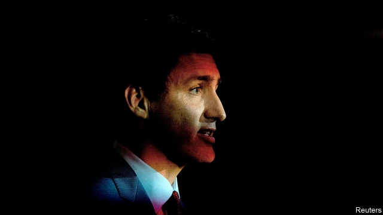

###### Politics in Canada

# To keep his job, Justin Trudeau must fight on two fronts 

 

> print-edition iconPrint edition | The Americas | Sep 28th 2019 

THE LIBERAL PARTY supporters who lined up behind Justin Trudeau during a campaign stop in Brampton, near Toronto, were an ethnically diverse lot. But they looked universally glum. Thanks only partly to the release of several photographs showing a younger Mr Trudeau wearing blackface make-up, the man who was once his party’s greatest asset has become its biggest problem. 

Mr Trudeau, who came to power in 2015, is a prominent exception to the domino run of right-wing populist world leaders. At international events he promotes immigration, globalisation and feminism. At home, his government has raised taxes on the wealthy, launched a means-tested child benefit, imposed a carbon tax in provinces that do not have their own ones and legalised marijuana. 

Gradually, though, Mr Trudeau has acquired a shifty reputation. In 2017 he broke his promise to reform Canada’s first-past-the-post electoral system, which benefits his party. In February this year he broke the parliamentary ethics code by pressing his attorney-general to intervene in the criminal prosecution for bribery of a large Quebec engineering firm. Then the blackface pictures appeared. Mr Trudeau has told reporters that his privileged background as the son of former prime minister Pierre Elliott Trudeau left him with a blind spot about race. He is somewhat vague about when his vision improved. 

To keep his job as prime minister in next month’s elections, Mr Trudeau must do two things. He has to hold onto moderate voters who might be tempted by the Conservative Party, while convincing supporters of the Green Party and the left-wing New Democratic Party that he is their best hope for pushing through a progressive agenda. The Greens and the NDP are polling at about 10% and 15% respectively; thanks to the first-past-the-post system, neither stands to win many seats in parliament. But the right-left two-step is a tricky dance. 

The Conservatives, who are neck-and-neck with the Liberals in the polls, are running a good campaign. Andrew Scheer, a former speaker of the House of Commons who leads the party, has tapped into widespread unease about the cost of living. His promises, which include tax cuts for people on low incomes, tax credits for new parents and children’s sports activities, and loosening mortgage rules so that more young people can buy homes, fit tidily under the Conservative campaign: “It’s time for you to get ahead”. He talks often about fighting for ordinary people against elites—a tiresome populist trope that works better when aimed at a political scion like Mr Trudeau. 

Canada’s unemployment rate was just 5.7% in August, close to a 40-year low. Average wages are growing by nearly twice the rate of inflation. Mr Trudeau repeats some version of these numbers frequently. Yet Mr Scheer’s message about affordability resonates and has forced the prime minister to focus on the issue. He presented slightly altered versions of the Conservative tax cut and maternity-benefits plan within days of their announcement. 

Meanwhile parts of the coalition of voters that brought Mr Trudeau to power are looking shaky. In 2015 eight out of the ten constituencies with the highest proportion of immigrants went for his party. The blackface scandal could put some immigrant voters off, although Mr Trudeau’s support for high levels of immigration will weigh in his favour. Just over 321,000 permanent residents were admitted in 2018 (0.9% of Canada’s population) and the target for 2021 is 350,000. 

Young voters, who also backed the Liberals in 2015, may be harder to retain. The environmentally minded were offended by the government’s decision to buy an oil pipeline whose backer was threatening to pull out. But Mr Trudeau is trying to woo them. On September 24th his party announced that it would commit to reaching net zero carbon emissions by 2050. 

On this issue, the dividing line is sharp. The Conservatives, who have a strong base in oil-rich Alberta, vow to repeal the national carbon tax of C$20 ($15) a tonne. Peering through his affordability lens, Mr Scheer says the tax raises the cost for ordinary people of heating their homes and driving to work. The Conservative climate-change plan, which includes investments in green technology and tax credits for homeowners who retrofit their homes, has been criticised as expensive. For what it is worth, such measures are less economically efficient than a carbon tax. 

Mr Scheer has some weaknesses. He has had to rebut Liberal suggestions that he might try to restrict abortion and ban same-sex marriage once in power. In Ontario he is tainted by association with Doug Ford, the unpopular Progressive Conservative premier who cut education and health-care services after promising not to. And the Conservatives must watch their right flank, too. The People’s Party of Canada, a new outfit, opposes Mr Trudeau’s “cult of diversity” and wants to slash immigration. 

Yet this election, like most, is a referendum on the incumbent. And Mr Trudeau is no longer the fresh-faced celebrity that he was four years ago. Glum acceptance might be the best he can hope for. ■ 

