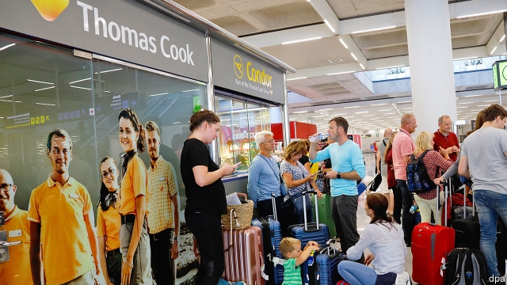

###### American politics

# Business this week 

> Sep 28th 2019 

Adam Neumann quit as chief executive of WeWork, the office-rental startup that he helped found. He had been blamed by investors for the postponement of WeWork’s IPO, which was shelved after a sharp drop in its expected value. Mr Neumann is staying on as chairman, but is reportedly ceding control of WeWork by curtailing his shareholder voting power. See article. 

Juul replaced its chief executive, as concerns mount about the health risks of e-cigarettes. The firm’s new boss comes from Altria, a tobacco company with a 35% stake in Juul. Health officials have identified hundreds of cases of lung illness related to vaping. Walmart decided to stop selling e-cigarettes because of the “regulatory complexity and uncertainty”. Massachusetts banned the sale of all vaping products for four months. 

With the market for e-cigarettes facing a cloudy future, Philip Morris International and Altria ended their attempt to merge, reportedly in part because of the risk from Altria’s exposure to Juul. 

German prosecutors charged Volkswagen’s chief executive, Herbert Diess, and chairman, Hans Dieter Pötsch, with failing to tell investors in the summer of 2015 that the carmaker was being investigated for cheating emissions tests. When news broke of the scandal in September that year VW’s share price plunged. Martin Winterkorn, the company’s CEO at the time, was also charged (he is also facing separate indictments of fraud). All three deny the charges. 

Nissan and Carlos Ghosn settled with America’s Securities and Exchange Commission for filing fraudulent financial forms relating to his retirement package. Mr Ghosn was sacked by the Japanese carmaker as chairman last November for various alleged misdeeds and awaits trial in Tokyo. Both he and Nissan neither admitted nor denied wrongdoing. 

Once described as a “Tesla killer”, NIO shed a quarter of its stockmarket value after reporting a big quarterly loss and drop in sales. The Chinese maker of electric vehicles has been hurt by a recall related to battery problems and the phasing-out of Chinese subsidies for green-energy cars. 

Kristalina Georgieva was confirmed as the new managing director of the IMF. Ms Georgieva, a Bulgarian, is the first person from a developing economy to hold the job. In a speech she said the world must prepare for a downturn. 

The EU’s second-highest court struck down the European Commission’s finding in 2015 that Starbucks had benefited from illegal tax breaks in the Netherlands. 

Anheuser-Busch InBev priced the shares being sold in the forthcoming IPO of its Asian business at the bottom end of an indicative range it had set. The brewer has already sold some of the assets in the business, but the scaled-down flotation in Hong Kong should still raise at least $5bn, which would make it the world’s second-largest IPO this year, after Uber. 

Royal Bank of Scotland appointed Alison Rose as chief executive, succeeding Ross McEwan, who has held the job for six years. Ms Rose takes over at a challenging time for RBS. The bank is still majority-owned by the taxpayer, 11 years after a bail-out. The government’s plan to return it to full private ownership by 2024 is less certain given RBS’s recent warning that Brexit could affect its profit. 

 

The collapse of Thomas Cook led to the largest ever peacetime repatriation in Britain, as the government chartered planes to return 150,000 stranded tourists. The holiday firm requested a state bail-out, which was rejected amid reports that executives were still rewarding themselves hefty pay packages. Condor, a German airline and subsidiary of Thomas Cook, had better luck, securing a bridging loan backed by the German government to keep it flying. See article. 

Facebook acquired CTRL-Labs, a startup that is developing a technology to enable people to manage computers with their brains. It has designed a wristband that captures signals sent from the brain to the hand and transmits them to a computer. The head of Facebook’s virtual-reality business said this allows someone to share a digital photo “just by…intending to”. 

Peloton launched its IPO on the NASDAQ stockmarket, pricing its shares at the higher end of expectations. It describes itself as “an innovation company transforming the lives of people around the world through our ever-evolving fitness platform”. Translated, that means selling internet-connected bikes for $2,245 and subscriptions to workout plans. A sensation with svelte hipster-types, its finances are a bit flabby; it lost $196m in its latest financial year. Peloton will have to up the pace as it becomes a public company. 

