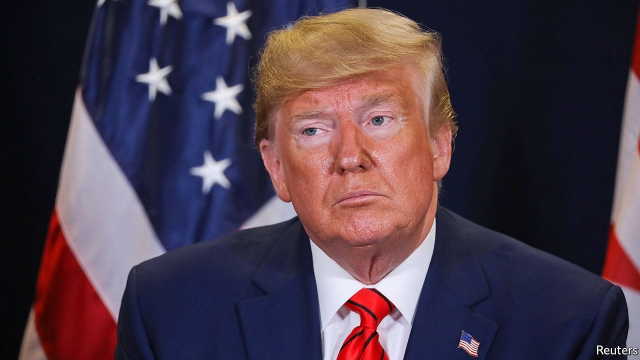

###### American politics

# Politics this week 

 

> Sep 28th 2019 

Donald Trump asked the Ukrainian president, Volodymyr Zelensky, to “do us a favour” and investigate the business dealings of Joe Biden’s son in Ukraine, according to the rough transcript of a phone conversation they had in July. The White House released the transcript after it emerged that Mr Trump’s attempt to lean on a foreign power to discredit the front-runner among Democratic presidential candidates had formed the basis of a whistle-blower’s complaint to the intelligence services. After months of warning her party about the unintended consequences of trying to impeach Mr Trump, Nancy Pelosi, the Democratic Speaker, announced that the House would start an impeachment inquiry. See article. 

The Intergovernmental Panel on Climate Change reported that the world’s oceans and frozen regions have been “taking the heat” from climate change, and that the “consequences for nature and humanity are sweeping and severe”. Meanwhile, roads were closed on the Italian side of Mont Blanc as experts warned that part of a glacier could collapse. Sea article. 

Britain’s Supreme Court ruled unanimously that Boris Johnson, the prime minister, acted unlawfully when he advised the queen to prorogue Parliament. The court concluded that suspending Parliament would have limited “without reasonable justification” MPs’ ability to hold the government to account. Mr Johnson faced calls to resign from other party leaders. He said that only a general election could provide a way out of the Brexit fog. See article. 

Interior ministers from five EU countries, including France, Germany and Italy, agreed to a temporary arrangement for sharing out migrants rescued in the Mediterranean. The governments are pushing for a wider deal involving more EU countries, but that will be much harder to achieve. See article. 

Hundreds of Egyptians in Cairo and other cities protested against the government. They were motivated, in part, by videos posted online by Muhammad Ali, a disgruntled businessman and former actor, who accuses the government of corruption. (Mr Ali lives in self-imposed exile in Spain.) The authorities arrested hundreds of people, hoping to prevent more unrest. See article. 

A week after a parliamentary election in Israel produced no clear winner, Binyamin Netanyahu, the prime minister, was given the first shot at forming a government. He has been talking to Benny Gantz, his main rival, about forming a national-unity government. 

Britain, France and Germany joined America in blaming Iran for attacks on Saudi oil facilities. Meanwhile, Iran lifted a detention order on a British-flagged oil tanker held since July. But an ongoing investigation of “some of its violations” prevented the ship from leaving Iran. 

Zine el-Abidine Ben Ali, a former president of Tunisia, died. Ben Ali led Tunisia for 23 years, keeping the country stable. But he was criticised for his oppression and corruption. Big protests in 2011 finally forced him from office. The event sparked similar uprisings across the Arab world. 

Africa’s continental free trade agreement caused trouble between Nigeria and Benin just months after both countries signed up to it. Nigeria has partially closed its border with its small neighbour to curb the smuggling of rice. 

An opposition politician in Rwanda was stabbed to death in what his party says is the latest in a series of attacks on its members. 

The World Health Organisation accused health authorities in Tanzania of withholding information about suspected cases of Ebola. The WHO said it had received unofficial reports that one person who tested positive for the virus had died, but that Tanzanian officials had insisted that there were no cases in the country. 

Nicolás Maduro, Venezuela’s socialist president, visited Moscow for talks with Vladimir Putin. Russia is the biggest backer of Mr Maduro’s government, which has crippled the economy. America called for tougher sanctions on the Maduro regime and more help for the people who have fled the country, expected to top 5m by the end of the year. 

In Brazil charges were laid against employees of Vale, a mining company, and staff at a German safety-inspection firm for the collapse of a dam in the state of Minas Gerais in January, which killed at least 248 people. Police claim the employees knew the dam would burst but concealed the danger. 

Violent protests against perceived government racism and repression continued in the Indonesian part of New Guinea. Police said that 32 people had been killed across Papua, as the region is known, most of them migrants from other parts of Indonesia. Elsewhere in Indonesia, students protested against the watering down of anti-corruption laws and proposed changes that would outlaw extramarital sex. See article. 

India’s government said it would cut corporate tax rates by ten percentage points in a bid to boost business confidence and revive the economy. The country’s main stockmarket soared on the news. 

Kiribati, a thinly populated archipelago in the Pacific, became the second country in a week to switch diplomatic allegiance from Taiwan to China. The move leaves Taiwan with formal diplomatic relations with just 15 countries. 

Anti-government protests continued in several districts of Hong Kong. Participants threw petrol bombs and set fires. Police responded with tear gas and rubber bullets. Some of the demonstrators targeted businesses perceived as sympathetic to the Chinese government, covering their premises with slogans. See article. 

China’s president, Xi Jinping, opened a colossal new airport, Beijing Daxing International, about 45km south of the capital. The project cost 80bn yuan ($11bn) and took five years to complete. It has four runways and is expected to handle 45m passengers a year by 2021. 

