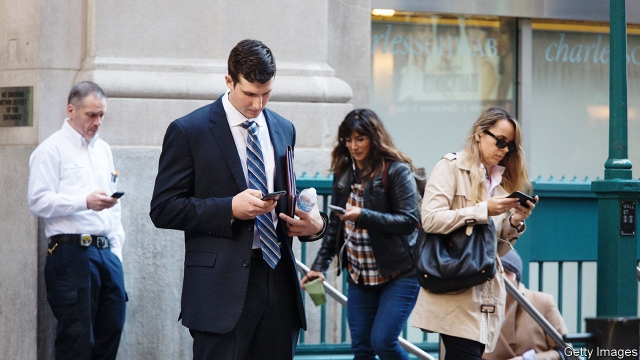

###### Straight to voicemail

# A new iPhone feature poses a threat to opinion pollsters 

 

> print-edition iconPrint edition | United States | Sep 28th 2019 

AMERICAN MOBILE-PHONE users are inundated with spam callers. Hiya, a Seattle-based call-monitoring service, estimates that consumers received 26.3bn robocalls in 2018, up 46% from 18bn the previous year. Phone manufacturers have taken note of their customers’ woes. In its latest software release, Apple has made it possible for iPhone users to send all unknown callers to voicemail automatically. Although the feature will no doubt prove useful to the millions of customers whose peaceful suppers are ruined by fake calls, it could be disastrous for the faltering public-polling industry. 

The challenges telephone pollsters face have been growing. Polling by phone has become very expensive, as the number of Americans willing to respond to unexpected or unknown callers has dropped. Back in the mid-to-late-20th century response rates were as high as 70%, according to SSRS, a market research and polling firm. But the Pew Research Centre estimates that it received completed interviews from a mere 6% of the people it tried to survey in 2018. Although polls with low response rates can still be accurate, their costs increase dramatically as pollsters must spend more time and money calling more people. According to the American Association for Public Opinion Research, a traditional, high-quality survey of 1,000 Americans costs roughly $48,000. 

Apple’s new call-blocking feature could push costs and response rates into more perilous territory. Robert Griffin, research director for the Democracy Fund Voter Study Group, a group of public-opinion researchers, says the software poses an “existential problem”. With call-blocking, the barrier to carrying out good polls shifts “from people not picking up their phones to people not even getting the call at all”. Analysts do not even know precisely how the new technology will affect the industry—but with response rates already falling sharply, whatever is in store for pollsters cannot be good. 

Mr Griffin does his best to see a bright side. The challenges of phone-based public-opinion polling could spur researchers to adopt newer, more innovative methods, including online polls. They are cheaper and quicker than telephone surveys, and provide a better framework for studying Americans’ attitudes and behaviour. Surveys conducted over the internet allow researchers to check in on the same individuals over time—a method that allows pollsters to conduct what they call “panel” surveys—to measure actual changes in opinions and to focus on smaller sections of the population. Both these practices are close to unaffordable for all but the best-funded telephone pollsters. 

The future of polling has yet to be determined. “It pays to be nimble,” Mr Griffin says. Online surveys rely on complex statistical adjustments called “weighting” to ensure the demographics of their respondents match the overall portrait of Americans. At present this strategy is working, but only because Americans’ political behaviour is closely related to their demographic group. African-Americans and whites differ on who they want as president as do voters with and without college degrees. Changes in those correspondences can catch pollsters off-guard. Researchers at the University of New Hampshire neglected to take education into account when weighting their polls for the 2016 presidential election, over-counting degree-holders. They predicted Hillary Clinton would beat Donald Trump in the state by 11 percentage points. In the end, she won by 0.4 points. 

“The truth is that surveying people is hard,” Mr Griffin says, “and any single solution is probably going to be inadequate.” The only way to future-proof the public-polling industry is to experiment constantly with new technologies. Many organisations are doing just that. Because of the speed of technological change, the ones that are not will soon be forced to follow suit—or shut their doors. ■ 

