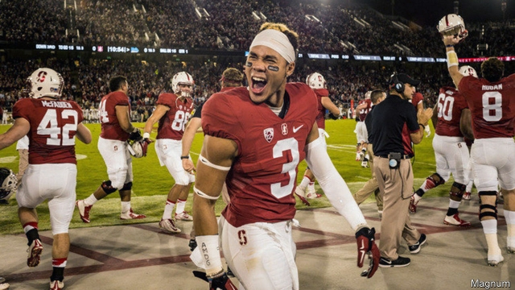

###### Pay for play

# College athletes in America may be allowed to profit from their talent 

 

> print-edition iconPrint edition | United States | Sep 28th 2019 

TUNE IN TO a college football match in America, and you might think that you were watching a professional rather than an amateur sport. The biggest stadiums routinely fill over 100,000 seats. Corporate sponsorships are common. Television broadcasts are supersaturated with ads for expensive pick-up trucks and beers. All told, America’s college athletic departments brought in a combined $18.1bn of revenue in 2017, up from $9.8bn in 2007. 

Despite the popularity of their output, college athletes receive no remuneration. The National College Athletic Association (NCAA), which governs college sports, has long forbidden its players to receive any compensation. These ordinances have always been controversial. But after years of legal challenges and intense public scrutiny, the NCAA’s clampdown on paying jocks is at last starting to crack. 

On September 10th California passed a bill which would allow athletes at colleges in the state with lucrative sports programmes to hire agents and earn money on the side through sponsorship deals or autograph sales. The bill still needs to be signed by the governor, and would not come into effect until 2023. Similar legislation is being considered in other states and at the federal level. 

Some lawmakers would like to go one step further. Senator Bernie Sanders, a presidential candidate, put it plainly when he tweeted: “College athletes are workers. Pay them.” Yet treating athletes as employees could create complications. Title IX, a federal law, prevents colleges from discriminating between students by sex. Would this mean that colleges would have to pay their female basketball players as much as males, for example, even if the men bring in more revenue? 

Richard Borghesi, an economist at the University of South Florida-Sarasota, has written a pair of papers looking at how much top athletes would make if they were paid according to their ability to generate revenue for their colleges. In addition to ticket and merchandise sales, college athletes also play a role in soliciting donations from rich alumni. Taking these factors into account, Mr Borghesi estimates that the top 10% of football and 16% of basketball players would be paid around $400,000 and $250,000 a year respectively. 

The NCAA opposes California’s efforts. The association notes that college athletes already receive compensation in the form of scholarships, and argues that any further remuneration would jeopardise the integrity of what is meant to be an amateur endeavour. The NCAA has also threatened to ban Californian colleges from competing in national championships. 

Although the NCAA’s objections may have been valid at some point, they make little sense today. The two most lucrative college sports, American football and basketball, are highly competitive. Many universities are willing to bend over backwards to enroll talented players. And the argument that university athletics remains amateur would hardly earn passing marks in even an introductory college course. ■ 

