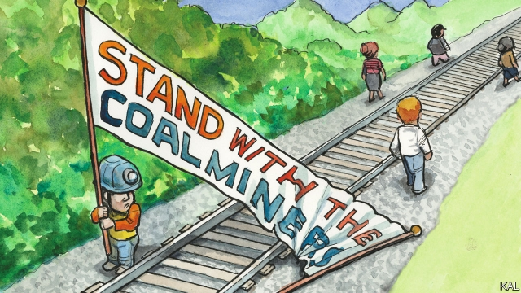

###### Lexington

# Lessons from Bloody Harlan 

 

> print-edition iconPrint edition | United States | Sep 28th 2019 

NOT SINCE the 1970s had the miners of “Bloody” Harlan County been so united in fury. It was bad enough when Blackjewel mining, one of the main employers in their eastern Kentucky community and the sixth-biggest mining company in America, went bust in July with their wages unpaid. But then word got out that the bankrupt company had sold—and was about to shift—almost 100 trucks of coal that the unrecompensed miners had dug up. 

Half a dozen of them took to the tracks and turned the train back. Another score, with wives and kids and neighbours in tow, helped them pitch a makeshift camp across the line. “No pay, we stay” was their slogan—daubed, in a militant-rustic style, on a bedsheet banner. A local restaurateur sent provisions, bluegrass musicians provided entertainment and journalists brought attention to the fight. Yet it was when the miners were joined by a group of transgender anarchists, acknowledged some of the handful still camping out on the track last week (amid vast piles of donated toiletries and food and a rising panic about bears), that they really got their camp organised. 

It is amazing how strange this impromptu protest has turned out to be—and how revealing of America’s culture wars. That is in part because of history. The miles-deep coal mines of Harlan County, a region of wooded Appalachian hills rising up to Kentucky’s highest point, were for decades synonymous with violent industrial action. Clashes in the 1930s sparked by the miners’ efforts to unionise gave the county its “bloody” moniker. Many of the Blackjewel miners’ fathers and grandfathers were involved in them. “My dad told me about it, gun battles and company gun thugs that beat you to death,” recalled Darrell Raleigh, seated beside the tracks. A veteran of 46 years underground, he himself took part in another round of strikes, in the 1970s, which left one dead and was the subject of an Oscar-winning documentary. 

Publicised on social media as #BloodyHarlan, the Blackjewel blockade looked like a time-honoured, morally unambiguous stand-off—“the little man against the big man,” as Mr Raleigh said with relish. The Harlan miners had been stiffed; their community had rallied around them splendidly; and Blackjewel’s CEO, Jeff Hoops, looked like a classic fat-cat villain. While running his mining company into the ground, and never mind its 1,700 miners, he defaulted on corporate taxes while pouring millions into a vanity project—an Appalachian resort called The Grand Patrician, named after his wife Patricia, that will boast a 3,500-seat replica of the Coliseum. For liberal observers, including journalists, activists and Bernie Sanders, whose campaign sent a batch of pizzas to express its support, the protest represented a rare opportunity to set aside the vexed and divisive realities of America’s dying coal industry—its pollution, its outsize political influence, its unanimous support for Donald Trump (for whom 85% of Bloody Harlanders voted)—and reignite the class war. 

The arrival of the anarchists—a roving band of hard-left protesters—was emblematic of that effort. Led by a transgender activist called Lill, who refused to give a second name and preferred to be referred to by the pronoun “they”, these efficient activists helped install a solar shower and camp kitchen, while dispensing legal advice to the miners. “They were just a big bundle of joy,” sighed Stacy Rowe, who has been camping out with her miner-husband Chris throughout the protest. Yet politics impinged. 

Early this month the anarchists left in a huff after the miners refused to bar another visitor to the camp—a member of a group of activist truckers—on the basis that he wore a Trump T-shirt and espoused far-right views. Ms Rowe says she feels for them. “But I can’t tell someone how to believe politically. And we did end up eating Bernie Sanders’s pizzas, which I didn’t have a problem with.” Yet since the anarchists’ exit, coincidentally or not, the protest has petered out. Most of the miners drifted away; some to mines in other states, others to retrain as truckers, or in hope of being hired by the company seeking to reopen Blackjewel’s five local mines. Mr Raleigh insists he will stay put “until we get paid what’s owed to us”. But given the miners’ poor chance of recovering the full sum, and that the Rowes—mainstays of the camp—are about to take off in a new truck, that seems unlikely. In a few days, the bears that Mr Raleigh and his wife are sleeping in their car for fear of will probably be free to consume the camp’s leftover reserves of cookies and watermelons unmolested. 

For those on the left, such as Mr Sanders, who hope to win back the white working class with economic programmes and class-infused rhetoric, this is a cautionary saga. The industries and unions that made those politics possible are too diminished. Kentucky has as many lawyers as it has miners—only about 6,000, few of whom are unionised. That helps explain why those in Harlan are still awaiting justice—even after the state governor and other powerful politicians have spoken up for them during the stand-off. The social decay that has followed that institutional retreat is another reason why the politics of economic incentive now finds little purchase among them. The population of East Kentucky is one of the unhealthiest, most addicted, prematurely aged—and otherwise unemployable—in America. 

Mr Trump’s popularity among blue-collar whites, in Harlan and elsewhere, is not based on his promise to rebuild their shrunken industries. Having long since given up hope of that, they were turning to the Republican Party’s quiet white identity politics long before he upped its volume. That is why hardly any miner in Harlan County appeared to blame a president who promised to “bring back coal” when most of their mines closed. Without wishing to make too much of a single incident, it was also why a row at the blockade between a trucker in a Trump T-shirt and an obliging transgender hippie was always likely to go the trucker’s way.■ 

