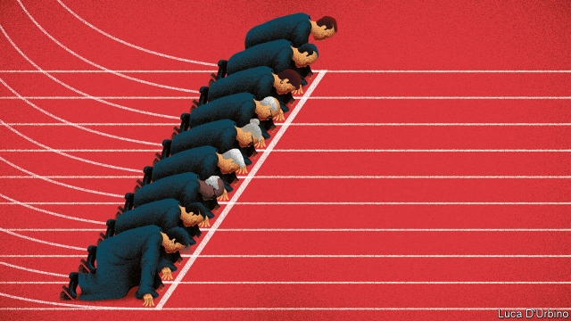

###### Robes on

# What to expect from the Supreme Court’s new term 

 

> print-edition iconPrint edition | United States | Sep 28th 2019 

A BOLSTERED five-justice conservative majority begins its first full term together when the Supreme Court returns to work on October 7th. The session follows four tumultuous years that saw one death, a retirement, three pitched Senate confirmation battles, two new arrivals and, for Justice Ruth Bader Ginsburg—86 and the anchor of the court’s liberal wing—two cancer diagnoses. A bundle of hot-button controversies await the nine. 

Discrimination against gay and transgender people is on the docket on the justices’ second day back. The question is whether the bar on discrimination “because of sex” in Title VII of the Civil Rights Act of 1964 prevents an employer from disadvantaging employees on the basis of their gender identity or sexual orientation. Fewer than half the states have laws against sacking workers because they are gay or trans. Now the Supreme Court will decide if the federal civil-rights umbrella protects some 8.1m LGBT workers across America. 

Gerald Bostock, a child advocate (welfare officer) in Georgia, was fired after joining a gay softball league. Donald Zarda, a skydiving instructor in New York, was sacked after he told a customer he was gay. Mr Zarda died in 2014, but in 2018 he prevailed posthumously in the Second Circuit Court of Appeals. Sexual-orientation bias, the judges held, is “a subset of sex discrimination”, because it is based on notions about “how persons of a certain sex can or should be”. Mr Bostock’s similar contention was rejected in the 11th Circuit, creating a split that the Supreme Court is this term stepping in to resolve. 

Transgender discrimination gets separate treatment in R.G. & G.R. Harris Funeral Homes Inc. v Equal Employment Opportunity Commission. After six years as a funeral director in Michigan, Aimee (née Anthony) Stephens wrote to Thomas Rost, her boss, explaining that she planned to transition and would present herself as a woman at work. Two weeks later Mr Rost fired Ms Stephens. Failing to wear the suit and tie required of male employees and presenting as a woman would have a negative impact on his clients’ “healing process”, Mr Rost’s lawyers say, and the “original public meaning” of sex discrimination when Congress wrote Title VII in 1964 did not require transgender people to be treated according to their self-declared gender identity rather than their biological sex. 

A three-judge panel of the Sixth Circuit Court of Appeals disagreed. Mr Rost illegally discriminated against Ms Stephens, the panel held unanimously, by treating her differently from how he would have treated a female employee and by requiring her to conform to male stereotypes. 

The Trump administration has taken the employers’ side in the Title VII cases—contrary to the view of another arm of the federal government, the Equal Employment Opportunity Commission—and will take part in oral arguments. The federal government has a more direct stake in two immigration disputes to be heard on November 12th. A reprise of a 2017 case asks whether a border-patrol agent can be sued for shooting and killing a Mexican boy across the southern border. The justices will also sort out a two-year-long fight over Donald Trump’s attempt to wind down Deferred Action for Childhood Arrivals, or DACA, Barack Obama’s programme granting relief to undocumented immigrants who arrived as children. Challengers and several courts have said the rollback was “arbitrary and capricious”, in violation of the Administrative Procedures Act. 

A significant Second Amendment case involving a gun regulation in New York City is scheduled for argument on December 2nd. But after the Supreme Court said it would review the constitutionality of the law—which prohibits New York City residents with firearms licences from taking their guns to the suburbs—the rule was rescinded. The plaintiffs, anxious to fortify the individual “right to bear arms”, have implored the Supreme Court to keep the case on its docket. But New York says there is “no ongoing injury” to the aggrieved gun owners and no controversy left to adjudicate. On October 1st, when the justices meet privately to review reams of petitions that have piled up over the summer, they will discuss whether to scrap New York State Rifle & Pistol Association Inc. v City of New York or carry on as planned. 

Other notable cases among the 50 the justices have already agreed to hear include a driver’s privacy row in Kansas; fallout from the 2013 “Bridgegate” scandal in New Jersey; and a church-state fight in Montana. Several budding petitions could make headlines, too. An immigration case that Stephen Vladeck, a law professor at the University of Texas, says may have “sweeping ramifications” asks if undocumented immigrants on American soil have a constitutional right to judicial review when being detained or deported. A case involving Louisiana abortion-clinic regulations nearly identical to rules the court struck down as an “undue burden” in 2016 gives the new conservative bloc a first swipe at pushing back abortion rights. 

According to Kate Shaw, a professor at Cardozo law school, “it seems almost certain” that the limits of presidential power will soon be another point of contention. Likely subjects include the president’s push for the power to remove the director of the Consumer Financial Protection Bureau, executive privilege in battles over tax returns, a crackdown on asylum, emergency funding for a border wall and the president’s ability to block critics on Twitter. 

In April Mr Trump tweeted that if “the partisan Dems ever tried to impeach”, he would “first head to the US Supreme Court”. By narrow votes, the justices have backed several of the president’s controversial moves, but Mr Trump should not expect them to come to his rescue during impending impeachment proceedings. In 1993 Chief Justice William Rehnquist wrote for a unanimous court that impeachment authority “is reposed” in Congress, “and nowhere else”. Still, if the House of Representatives winds up impeaching Mr Trump, the politics-shy Chief Justice John Roberts will find himself playing a constitutionally required role he is unlikely to relish: presiding over the president’s removal trial in the United States Senate. ■ 

