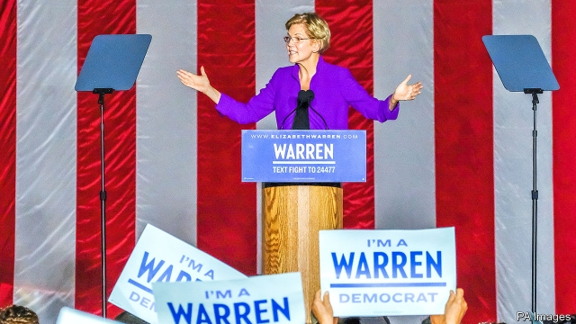

###### Primary health care

# Why Elizabeth Warren remains vague on health care 

 

> print-edition iconPrint edition | United States | Sep 28th 2019 

SPEAKING TO A crowd of 20,000 from beneath the arch of Washington Square Park in New York on September 16th, Elizabeth Warren received the loudest cheers when she declared: “I know what’s broken, and I’ve got a plan to fix it.” In a Democratic presidential primary contest in which there has been little movement in the candidates’ positions in the polls, Ms Warren, a senator from Massachusetts, has engineered an exceptional rise, thanks in part to her plans, both wonkish and attention-grabbing, for universal child care, a wealth tax, a $3trn climate-change plan and the break-up of America’s biggest technology firms. But on health care—which may be the biggest issue of the election—Ms Warren does not have a plan of her own. Nor, it seems, does she intend to release one. 

Throughout the primary, Ms Warren has signalled unwavering fealty to the Medicare for All proposal advanced by Senator Bernie Sanders, a fellow progressive. But she was once more open to other positions. Though all the Democratic Party’s primary candidates agree on the need for universal coverage (27.5m Americans, or 8.5% of the population, still lack health insurance), they disagree on the best way to achieve it. Medicare for All, which has become the default progressive plan, envisages a single-payer system free at the point of service—abolishing private health-insurance schemes altogether. The moderates who dislike Mr Sanders’s ideas—like Joe Biden, Pete Buttigieg and Amy Klobuchar—propose improvements to private health-insurance exchanges created by Obamacare and the creation of a public option for those who want it. 

Ms Warren previously seemed persuaded by such a policy. Her Consumer Health Insurance Protection Act, reintroduced in April of this year, sensibly focuses on shoring up exchanges, ending surprise billing and closing some loopholes for sub-standard health insurance. At a town-hall meeting broadcast on CNN in March, she sounded open to “different pathways” to Medicare for All. 

She has remained vague on the subject. Though she is famous for her attention to detail, she often talks about health care in no more than generalities. On September 19th Mr Buttigieg took a swipe at her for being “extremely evasive” when she was asked whether Medicare for All would increase middle-class taxes. Ms Warren seems reluctant to talk about details like costs and implementation timelines, perhaps because remaking the enormous American health-care sector in the image of Britain’s National Health Service could realistically take a decade. 

This uncertain positioning is not unique to Ms Warren. Kamala Harris has performed a tortured dance of support for the Medicare for All plan, flip-flopping several times on whether or not she would ban private insurance, as the plan dictates. Yet even Ms Harris, who has been much woollier on policy than Ms Warren, has released her own version of Medicare for All. Other candidates who are further down in the polls, like Cory Booker, a New Jersey senator, and Andrew Yang, a businessman, have embraced Mr Sanders’s plan without offering their own. 

The drawback of Ms Warren’s vague approach is that Mr Sanders’s specific vision for achieving universal coverage goes unchallenged. Both Germany and Australia have done what he proposes through a mix of public and private options—a model that may be more easily accomplished in America than a single-payer option. At the same time Medicare, in its current form, also has some disagreeable attributes: it is far from free at the point of service, it pays for many expensive drugs without conducting cost-benefit analyses and it involves some onerous billing paperwork. 

Preliminary costings of a Sanders-style plan suggest new government expenditures of $30trn or more over the course of a decade. That is 11 times the (optimistically estimated) revenue brought in by Ms Warren’s wealth-tax idea—suggesting that most of the balance would have to be raised from less wealthy Americans. Her general retort to this sort of point—that aggregate health costs would still drop for middle-class families—is both fair and deserving of more detail. 

Yet vagueness could be politically advantageous for Ms Warren. Her steadfast support for Medicare for All allows her to attract progressive voters within the Democratic electorate—especially the college-educated whites who have fuelled her rise in the polls. Criticism of the plan from moderates has been directed at Mr Sanders. That dynamic was on vivid display in the last presidential debate, held in Houston on September 12th. Yet if the primaries deliver Ms Warren the presidential nomination, she will need to be prepared for voters to give her health-care plans a more thorough examination. ■ 

