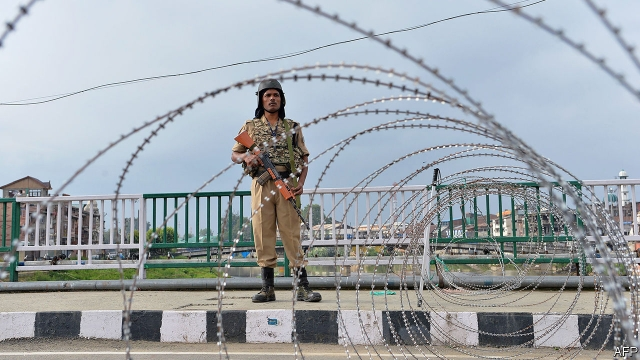

###### State of disgrace

# India’s judges are ignoring the government’s abuses in Kashmir 

 

> print-edition iconPrint edition | Asia | Oct 5th 2019 

TWO MONTHS ago Narendra Modi, India’s prime minister, boldly scrapped seven decades of legal precedent. Voiding Jammu & Kashmir’s semi-autonomous status, his government abolished its legislature, sliced the state in two and demoted the new parts to “union territories”, subject to direct rule by the national government in Delhi. The move prompted cheers in much of India, and fury in the former state. It also, inevitably, raised pressing constitutional questions. 

But pressing to whom? The 7m people of the Kashmir valley certainly feel some urgency. Since August 5th this overwhelmingly Muslim slice of the state has been under virtual siege, painfully squeezed between some 500,000 itchy-fingered Indian troops and a few hundred armed militants. Wielding draconian anti-terror laws, the government has arrested hundreds, not for any crime but to prevent protests. It has also restricted movement into, out of and around the state and imposed a total block on mobile phones and the internet. Militants and their supporters are enforcing their own blockade in response, forcing schools, shops and markets to close in an open-ended protest strike. “It is suffocating and unbearable,” says a Kashmiri civil servant who is opting to stay with relatives in Delhi. “Young people especially are going crazy, with nothing to do except dream of revenge.” 

To the Supreme Court, however, none of this seems particularly urgent. When it met in late August to consider a batch of petitions challenging the constitutionality of Mr Modi’s moves, it gave the government a month to reply. When the judges took the matter up again on October 1st, the government’s lawyers received not even a tap on the wrist for failing to prepare a response. Instead, the judges graciously yielded more time. The next scheduled hearing is now set for mid-November, which is to say, two weeks after the Jammu & Kashmir Reorganisation Act is due to come into force, on October 31st. 

With equal unconcern, another bench of the Supreme Court on the same day postponed—for the seventh time in one case—an even bigger batch of petitions regarding unfair imprisonment and suspension of communications. It has shunted petitions for habeas corpus—which in legal theory are urgent matters—back to the high court in Jammu & Kashmir, in full knowledge that it has been swamped by more than 250 such protests against illegal detention, yet has only two judges to hear them all. The reason why the state’s top court is so cripplingly undermanned, with eight of its 17 judgeships vacant, is that the Supreme Court has for months neglected to ratify any new appointments for the state. (Lawyers in Kashmir are also on strike, to protest arbitrary arrests.) 

The Supreme Court has at times stood up to the government, through rulings that expanded the public right to information, for instance, or strengthened ordinary citizens’ right to privacy. Legal experts concur, however, that this record has notably darkened in recent years. Gautam Bhatia, a lawyer who writes on legal issues, describes one of the Supreme Court’s recently favoured tactics as a “doctrine of constitutional evasion”. Rather than rule against Mr Modi’s government, the top court has repeatedly waffled just long enough for matters to resolve themselves in its favour. 

In the midst of a general election last April, for example, the court declined to hear a case challenging the legality of electoral bonds, an instrument devised by Mr Modi’s government that allows for unlimited, anonymous donations to political parties. It argued that there was no time before the election results, ignoring the fact that it had already sat on the docket for a year. In the case of Aadhaar, a national biometric identification scheme, the Supreme Court waited five years to pronounce that it should be scaled back, by which time more than 1bn people had been enrolled. It took two years to rule that Mr Modi’s government had overstepped its powers by interfering in the local politics of Delhi, by which time the opposition party that runs the city had been bullied and harassed into near irrelevance. 

But the court is not always so sleepy. In at least one case that raises obvious questions about infringements of rights, the top judges have been more aggressive than the government. It was the Supreme Court that ordered the state of Assam to update a “register of citizens”. In a clear reversal of the presumption of innocence, the ruling forced all 33m residents of the state, many of them poor and illiterate, to furnish decades-worth of official documents proving their citizenship. The fate of some 1.9m who failed to show the right papers is unclear, but the state government is busy building internment camps. Mr Modi’s government now wishes to expand this hunt for interlopers to the entire country. “What it resembles more”, writes Mr Bhatia of the Supreme Court, “is a branch of the executive, enabling and facilitating the executive, instead of checking and balancing it, and reviewing its actions for compliance with fundamental rights.” 

One of the pleas before the Supreme Court, for example, questions Mr Modi’s sleight-of-hand in having Jammu & Kashmir’s governor, whom he appointed, act as a surrogate for the state’s legislature, which Mr Modi suspended, in giving assent to the state’s demotion to a territory, as required by law. The central government, the petition explains, used “a temporary situation meant to hold the field until the return of the elected government, to accomplish a fundamental, permanent and irreversible alteration of the status of the state of Jammu & Kashmir without the concurrence, consultation or recommendation of the people of that state.” Such dodges work only with the connivance of the courts. ■ 

