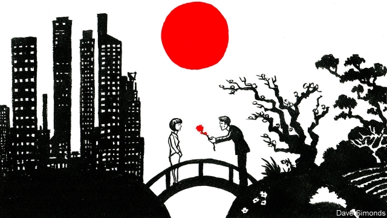

###### Brides for bumpkins

# Japan’s state-owned version of Tinder 

 

> print-edition iconPrint edition | Asia | Oct 3rd 2019 

EVEN AFTER years of attending match-making parties, a professional in Tokyo explains, she has not found any suitable marriage prospects. “I’m tired of going to these events and not meeting anyone,” she gripes. So she has decided to expand her pool of prospective partners by looking for love outside the capital. To that end she has filled out an online profile detailing her name, job, hobbies and even weight on a match-making site that pairs up single urbanites with people from rural areas. 

Match-making services that promote iju konkatsu, meaning “migration spouse-hunting”, are increasingly common in Japan. They are typically operated by an unlikely marriage-broker: local governments. In Akita, a prefecture near the northern tip of Japan’s main island, the local government has long managed an online match-making service to link up local lonely-hearts. It claims to have successfully coupled up more than 1,350 Akita residents since it launched nine years ago. It recently began offering a similar service to introduce residents to people living outside the prefecture and is optimistic about its prospects. “By using the konkatsu site, we hope that more people from outside will marry someone from Akita to come and live here,” says Rumiko Saito of the Akita Marriage Support Centre. 

Along with online matching services, municipalities across Japan host parties to help singles mingle. They also organise subsidised group tours in rural prefectures, in which half the participants are locals and the other half from cities, to encourage urbanites to marry and move to the countryside. Hundreds of singletons participate in these tours every year. 

The rural bureaucrats are playing cupid in the hopes of stemming emigration. The population is shrinking in 40 of Japan’s 47 prefectures. Young people move from the countryside to cities to go to university or look for a job. As a result, the dating pool in rural areas is becoming ever tinier—a situation that encourages even more young people to move away. The same singletons keep showing up at all the local konkatsu events; there is little prospect of meeting new people. “The size of the rural konkatsu market is small; it’s nearly non-existent,” says Koki Goto of the Japan Konkatsu Support Association. 

The difficulty of finding true love in the countryside is compounded by a gender mismatch. In 80% of prefectures with declining populations, young women are more likely than men to relocate to cities. This means that whereas there are more single women than men in big cities like Tokyo, bachelors outnumber spinsters in rural areas. Many men in the countryside are “left behind”, laments a government official in Akita. 

So much for the theory. Most iju konkatsu schemes are quite new, making it hard to assess whether they work in practice. Only a handful of urban-rural couples have tied the knot using Akita’s match-making system. The professional in Tokyo has not yet met the one either. But she is willing to try anything that might improve her chances of doing so.■ 

