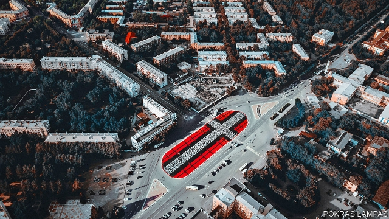

###### Back to black

# A tribute to the Russian avant-garde sets off a storm 

 

> print-edition iconPrint edition | Books and arts | Oct 3rd 2019 

THE INDUSTRIAL zone outside Yekaterinburg, a city of 1.5m on the edge of Siberia, has seen better days. On pavements where Soviet workers once tramped to shifts at the Uralmash heavy-machinery plant, babushkas now lay out their wares: apples, mushrooms, smoked fish. Although the area has recovered from the organised crime that plagued it in the 1990s—earning the city the sobriquet, the Chicago of the Urals—most of the buildings on First Five-Year Plan Square in the centre of the district stand empty or underused. 

The square is an unlikely place for a clash between contemporary artists and Orthodox believers. But this summer it staged a drama involving accusations of blasphemy, threats of bloodshed and an intervention by the security services. The conflict was ignited by a piece of street art inspired by the Russian avant-garde of a century ago. Unusually for a divided country and bellicose times, the combatants eventually resolved their dispute. 

“Pokras is a very peaceful guy, he never meant to provoke,” says Andrei Kolokolov, co-founder of Yekaterinburg’s annual graffiti festival, which this year invited Pokras Lampas, an up-and-coming artist, to make a work in the square. He chose to create a giant “Suprematist Cross” (pictured), which took its shape from an existing tiled pattern on the intersection and its inspiration from Kazimir Malevich. In 1915 Malevich inaugurated a new era of abstract art with his “Black Square”, an entirely black work on a white canvas described by Tatyana Tolstaya, a modern Russian writer, as “an uncrossable line that demarcated the chasm between old art and new art, between a man and his shadow.” He founded the Suprematist movement, which declared the supremacy of feeling over the representation of objects. The cross was among its principal motifs. 

Pokras’s cross in Yekaterinburg was a supersized tribute to the movement. “The history of the area is very close to the Russian avant-garde,” reasons the artist (whose real name is Arseny Pyzhenkov), pointing to the Constructivist architecture of the industrial zone. Over three days in July, with the help of 50 volunteers, he covered the 6,700-square-metre (72,000-square-foot) site with a red, white and black cross, using his personal calligraphy to weave in a quote from Malevich: “I have untied the knots of wisdom and freed the consciousness of colour…We, the Suprematists, throw the path open to you.” 

That path was blocked two weeks later, when workmen arrived and poured a rectangle of asphalt across the centre of the piece. To some, the dark blob in the middle of the work might have seemed a homage to the original “Black Square”; in reality, the city authorities had ordered a new road crossing and forgotten to cancel it when the artwork was commissioned. Either way, the botch made national news, and brought the work to the attention of a small but vocal group of Orthodox believers, who considered the design blasphemous. “Suddenly everyone is talking about how Yekaterinburg is this awful town that doesn’t understand contemporary art, we pour asphalt on it,” recalls Oksana Ivanova, an energetic employee at a local religious museum. Ms Ivanova says she understands it perfectly; but she objected to the cross. 

Opting to speak her opponents’ language, she called for a performance-art “happening” on the square, in which activists chanted and waved banners. “With post-modernism it’s all a game, nothing means anything,” she says. “Everyone makes a chopped salad from whatever they want, from any sphere, including the religious.” A viral video shows the situation escalating. “I can make an art-object too,” one participant threatened. “I’ll smear [the square] with the blood of these satanists, there’s your art object.” Ms Ivanova was briefly detained for organising an unsanctioned demonstration. In a reversal of their habitual bias in favour of traditionalists, security-service agents offered the festival team their support to deal with the threats. Local officials stepped in to mediate. 

Conflict between Russian conservatives and liberals is common. In Yekaterinburg thousands of people took to the streets this spring to protest against plans to build a church over a popular park, eventually leading authorities to find a new location for the building. Two years ago, in the same city, an activist drove a minibus laden with gas canisters into a cinema that was set to screen “Mathilde”, a controversial film based on the love affair between a ballerina and Nikolai II (the last tsar, who was killed with his family in Yekaterinburg and is now an Orthodox saint). 

Artists who confront the devout have typically fared badly. The church is close to the state, providing President Vladimir Putin with a spiritual foundation for his defence of “traditional Russian values” in the face of the supposedly decadent West. After Pussy Riot performed their anti-Putin “Punk Prayer” in the Cathedral of Christ the Saviour in Moscow in 2012, three members of the collective were imprisoned for hooliganism. The case led to the introduction of a law that made “offending religious sensibilities” a crime. But as far back as 2003 organisers of an exhibition called “Caution: Religion” were convicted of inciting hatred, after the show drew protests from believers. In the years since, the head of a regional opera house was sacked after the church took against one of his productions of Wagner, exhibitions have been attacked and theatres picketed. 

Such stand-offs rarely end in compromise. But in the case of the “Suprematist Cross”, both sides were determined to hear the other out. “I want to create art that unites people,” says Pokras. After talks with his opponents, he has agreed to break up the cross into three rectangles, shrugging off criticism from fellow artists who say he is violating the integrity of the work: “If I can bring people together by adding two lines, it means more to me than making a point.” He even called Ms Ivanova while she was being held by the police to express solidarity, for which she says she is grateful. “Of course many people are post-modernist,” she acknowledges. “We understand that.” 

Mr Kolokolov thinks the whole episode has engendered a sense of “catharsis”—as long as Pokras can find space in his schedule to adapt the work before winter covers the square with ice and snow. But the festival organiser takes a sober view of whether the case could serve as a model for dialogue in an increasingly polarised society. “I hope so,” Mr Kolokolov says. “I doubt it.” ■ 

