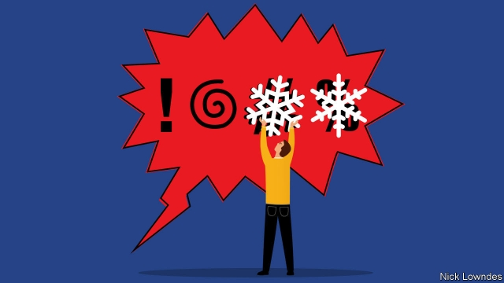

###### Johnson

# The polarisation of politics has led to a new lexicon of insults 

 

> print-edition iconPrint edition | Books and arts | Oct 3rd 2019 

THINK OF THE most taboo insult that is possible in English. Chances are you have one of just a few words in mind. Now consider the following anecdote. In 2016 a defendant in an English courtroom told the judge, Patricia Lynch, that she was “a cunt”. To which the judge, on the record, thought fit to reply: “You’re a bit of a cunt yourself.” 

Supposedly the 20-megaton nuke of swear words, still considered by some people unacceptable at any time, the C-word does not pack the blast it once did. Samantha Bee, an American comedian, used it on her news show to refer to Ivanka Trump, the president’s daughter, inciting only a short-lived controversy. Numerous British television presenters have mistakenly substituted it, on air, for the surname of Jeremy Hunt, who was for a time culture secretary. (Anticipating the “c” in “culture” may have been responsible for early slips of this type, but they mysteriously continued after Mr Hunt became health secretary.) None of the presenters has been disciplined. 

The words that shock have changed. An English law of 1606 forbade profane references on stage to God, Jesus Christ and the Holy Ghost. Today such imprecations cause barely a batted eyelash (even if high-profile cases of perceived blasphemy still rile the devout in places such as Russia). Later, words related to sex and the body were the most likely to offend. The word “bloody” set off a gale of laughter at the London premiere of George Bernard Shaw’s “Pygmalion” in 1914. Now it is hardly worth remarking upon. 

The vocabulary that causes offence today would puzzle those who roared at “bloody”. Consider an insult that occupied the British press for several days in December 2018. Jeremy Corbyn, the leader of the Labour opposition, seemed to mouth “stupid woman” as Theresa May, then the prime minister, spoke from the dispatch box. Mr Corbyn was forced to deny he had said those words. He is “opposed to the use of sexist and misogynist language in any form”; what he had actually said was “stupid people”. 

Mrs May’s successor now stands accused of misogyny on the front bench. As Mr Corbyn was speaking in early September, Boris Johnson, now prime minister, yelled, “You great big girl’s blouse!” On the same day Mr Johnson also used the word “shit” (he was quoting a Labour politician’s reference to that party’s economic policy as “shit or bust”, meaning “all or nothing”). Once, the earthy Anglo-Saxon word would never have fallen from the mouth of a prime minister in Parliament. Yet “big girl’s blouse” dominated the coverage. 

A watershed moment has arrived: traditional taboo words, pertaining to the body and excrement, no longer have the punch of group-based insults related to sex, disabilities and other such qualities, about which Western societies are increasingly sensitive. (Race-based gibes have been anathema for a while.) 

The evolution of insults is the subject of Philip Gooden’s new book, “Bad Words”. He recounts in one neat reversal the turn in the history of invective. The Sun, a British tabloid, was once in the habit of outing gay people, and even publicly defended its use of “poof” in doing so (because, the paper argued, its readers used the word, too). How times change. After abandoning the practice of outing in 1998, in 2018 the paper led a campaign to track down a bus-driver who called a reality-show star a “poofter”. What it once considered lighthearted banter is now verboten homophobia. 

Not everyone is happy with this modulation in the unacceptable. Some think it is a humourless and thin-skinned world that can’t handle a risqué dig now and again. Those purported stalwarts of robust free speech have inaugurated a new catalogue of insults: the “snowflake” who can’t take the heat; the “libtard” who can’t think beyond progressive dogma; the “social-justice warrior”, once a term applied by left-leaning types to themselves, now appropriated as a smear. 

Such people consider themselves “redpilled”, named after the red pill in “The Matrix” that allows characters to see the world as it truly is. When Hillary Clinton, running for president, unwisely referred to some Americans as “deplorables”, some of her critics embraced that term as a badge of honour—an ironic stance meant to contrast with their supposedly po-faced adversaries. 

In a less buttoned-up age, some venerable slurs are in decline. Less happily, they are being superseded by tags based on identity politics. “Deplorables” versus “snowflakes”: in place of the old neuroses, the new lexicon of insults captures worrying divisions. 

