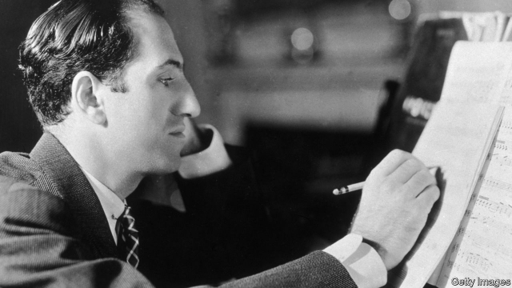

###### Rise up singing

# The short, brilliant life of George Gershwin 

 

> print-edition iconPrint edition | Books and arts | Oct 3rd 2019 

Summertime: George Gershwin’s Life in Music. By Richard Crawford.W.W. Norton; 594 pages; $39.95 and £28. 

AFTER LISTENING to an early performance of “Porgy and Bess”, George Gershwin exclaimed that the music was so beautiful he could hardly believe he had written it. Generations of listeners have swooned, too. “Summertime”, the opera’s best-known aria, is a sultry blend of blues, folk and jazz that is said to have been recorded around 25,000 times. 

Born in Brooklyn in 1898, Gershwin was an innovator who used rhythm, harmony and melody to irresistible effect. He believed that jazz was the “spontaneous expression” of modern American life and became a household name in 1924 with “Rhapsody in Blue”. A virtuoso pianist, he performed the premiere of the jazz-inspired work, which he saw as a “musical kaleidoscope of America—of our vast melting pot, of our unduplicated national pep, of our blues, our metropolitan madness”. 

Richard Crawford of the University of Michigan has written extensively about American music and is an enthusiastic Gershwin fan. In his new biography of the composer, Mr Crawford explains that “Rhapsody in Blue” opens not with “a melody but a surprise: a reedy smear borrowed from the comic realm of jazz novelty.” 

The author offers many such evocative descriptions in his scholarly account of Gershwin’s tragically short life. The works are covered in exhaustive detail, with in-depth analysis, plots and character summaries (the book is also peppered with notations and terminology that might confuse non-specialist readers). Some important cultural history, however, is missing. There is little discussion, for example, of the racial debates surrounding “Porgy and Bess”, which is set in a fictional black neighbourhood in South Carolina. 

Other biographies have depicted Gershwin, who was an avid art collector, as a thoughtless egotist, but Mr Crawford is a judge of music, not character. Still, he offers a glimpse of his subject’s personal life, which included glittering parties and romances with socialites and musicians. He alludes to Gershwin’s aversion to commitment and his loneliness, and explores his relationship with his older brother, the lyricist Ira Gershwin, a vital collaborator on many works (including “Porgy”). 

And he briefly covers Gershwin’s childhood and early musical studies. His parents were unmusical Russian-Jewish immigrants who ran various businesses with mixed success. An interesting chapter explores the music-publishing district known as Tin Pan Alley and its influence on the composer, who left school at 15 to become a song-seller there, baffling his peers with talk of the “artistic mission of popular music”. There are lively anecdotes from his career, such as the humiliation during a youthful gig at a vaudeville club when a resident comic jeered that he should become a truck driver instead of a pianist. 

That was a rare failure. The few dissenters in Gershwin’s lifetime included composers such as Aaron Copland and Roger Sessions, who unfairly deemed his music unserious. Gershwin often collaborated with luminaries including Fred and Adele Astaire, who had an unrequited crush on him. The actress Ethel Merman described her first encounter with him as like “meeting God”. He died of a brain tumour at 38. 

A critic said he had taken “the simple emotion of longing and let it surge through his music,” making real “what a hundred before him had falsified.” That emotional honesty still bewitches listeners. ■ 

