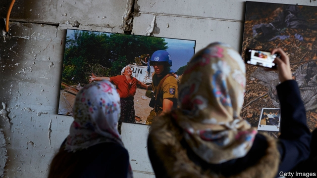

###### A pocket of war

# Two Bosnian authors revisit the horror of the 1990s 

 

> print-edition iconPrint edition | Books and arts | Oct 3rd 2019 

The Last Refuge. By Hasan Nuhanovic. Translated by Mirjana Evtov and Alison Sluiter. Peter Owen; 320 pages; $24.95 and £14.99. 

Under Pressure. By Faruk Sehic. Translated by Mirza Puric. Istros Books; 166 pages; $16.95 and £9.99. 

THE CHRONICLES of Bosnia’s suffering in the 1990s that have reached Western readers have mostly been written by outsiders or exiles. Now the wartime stories of two Bosnian authors, Faruk Sehic and Hasan Nuhanovic, have arrived in translation. Their experiences—and their books—are radically different from one another’s. 

When the war broke out in 1992 Mr Nuhanovic was a mechanical-engineering student in Sarajevo; Mr Sehic was studying to be a vet in Zagreb. Because his family did not flee in time, Mr Nuhanovic ended up in Srebrenica, the Bosniak (Bosnian Muslim) enclave that was besieged by Serb forces; eventually he became a translator for the UN. For his part, Mr Sehic signed up to fight, and led a group of 130 soldiers in his native Bihac area, which was also surrounded by Serbs. 

Mr Sehic revisits that experience in “Under Pressure”, a book of powerful semi-autobiographical vignettes, mostly (but not only) from the conflict. The narrator and his comrades drink copiously, take drugs, have sex and loot if the opportunity arises. Most of their fighting is done in a war within the war: in the “Bihac pocket”, Bosniaks not only fended off the Serbs but battled a cultish, Serb-backed Bosniak splinter force led by a man who had previously run a huge agricultural concern. 

The tales that Mr Sehic tells are graphic. When the narrator’s outfit seizes a trench, they find a still-warm corpse. In his wallet is a passport-sized photo of the dead man: “He had a receding hairline. Large, melancholy eyes. With the sharp edge of the photograph I floss bits of apple from between my teeth.” As the narrator pops pills, throws punches and succumbs to post-traumatic stress, his heart skips “like a series of short bursts of machinegun fire”—as does Mr Sehic’s writing. 

Whereas Mr Sehic is now an established poet and novelist, Mr Nuhanovic is an activist. He made legal history when he successfully sued the Dutch government because its contingent of UN troops had handed over his family to Bosnian Serb forces, who murdered them when Srebrenica fell in 1995. But “The Last Refuge” is not directly about that massacre of some 8,000 Bosniaks. Instead it is a grimly fascinating account of how, after first fleeing to his father’s ancestral village, Mr Nuhanovic’s family made it to Srebrenica, and of everyday life there. That sounds mundane. It is not. The narrative is crammed with details that only someone who lived through that hell could know. By filling in one piece of the jigsaw, the book will—like the memoirs of Holocaust survivors—help future readers understand the bigger picture. 

Mr Nuhanovic recounts other stories besides his own. In stark contrast to Mr Sehic’s debauches, hundreds of starving Bosniaks, led by small numbers of armed men, raid surrounding Serb villages for food. At Kravica on Orthodox Christmas Day in 1993, one explains, they found a feast laid out ready to eat. There was shelling and shooting outside the house, and the roof was on fire. But, the man says, “all of us started attacking the cake with our fingers. I was stuffing myself with whipped cream like a madman.” Later, when NATO planes began dropping food and a massive pallet smashed through the roof of a home, the (unhurt) inhabitants “didn’t mind at all.” After all, “mending a roof was much easier than finding food to feed your family.” 

Today, despite the conclusions of two international courts, Serb politicians vie to deny that an act of genocide took place in Srebrenica. For Bosniaks, meanwhile, Srebrenica continues to grow in importance as a symbol of resistance and steadfastness under attack. Mr Nuhanovic’s gripping, beautifully translated book may help counter the denials; but as important in its way is his frank acknowledgment of the impact of war. As the fighting ground on, he writes, some of the compatriots trapped alongside him remained committed to defending Bosnia. But most thought: “Take Srebrenica, take everything, just let me get out of here.” If only they could have been certain of not being killed, tortured or sent to detention camps, large numbers would have surrendered, Mr Nuhanovic says. Alas, “of that they could not be sure.” ■ 

