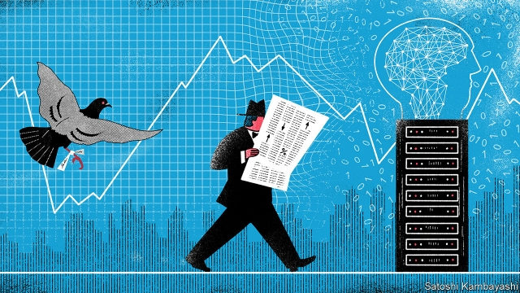
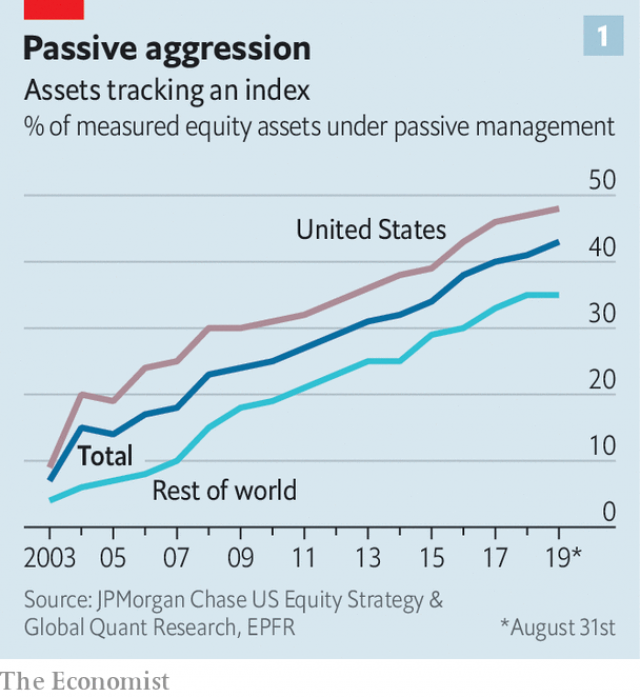
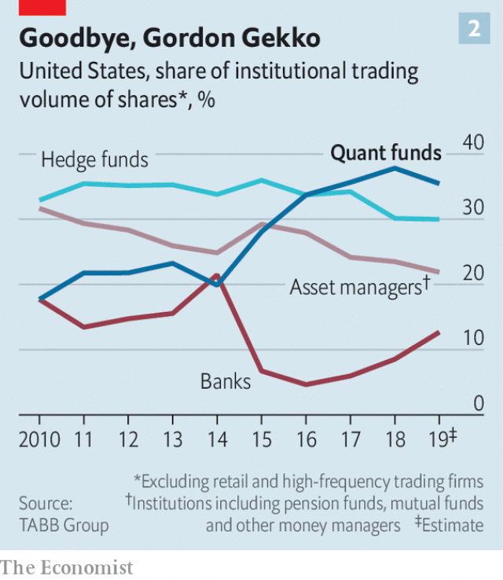
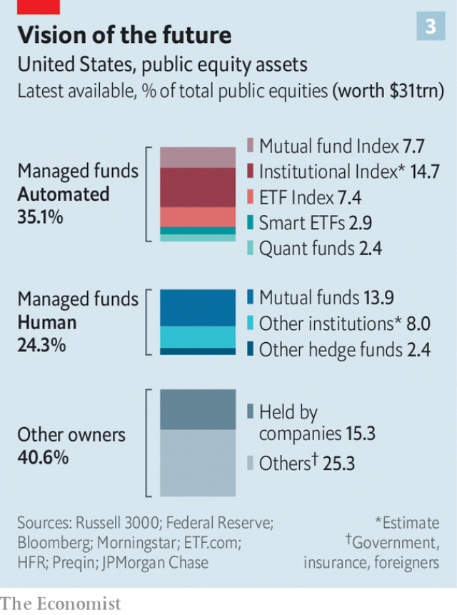
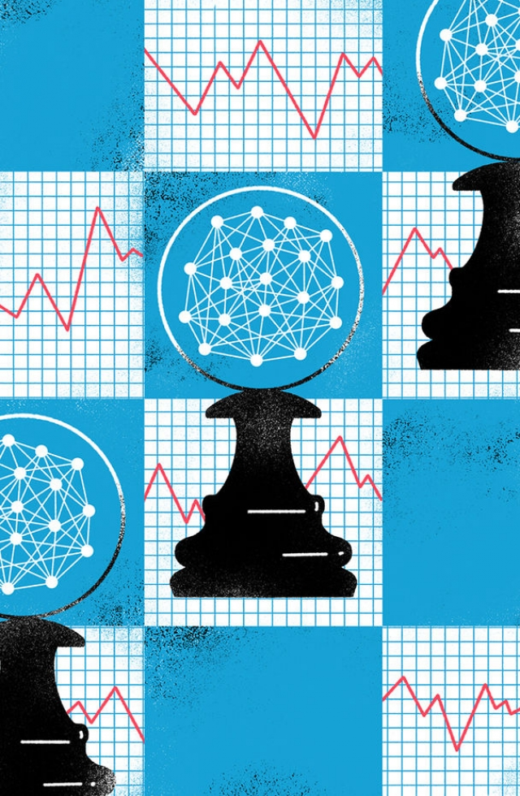

###### March of the machines

# The stockmarket is now run by computers, algorithms and passive managers 

 

> print-edition iconPrint edition | Briefing | Oct 5th 2019 

FIFTY YEARS ago investing was a distinctly human affair. “People would have to take each other out, and dealers would entertain fund managers, and no one would know what the prices were,” says Ray Dalio, who worked on the trading floor of the New York Stock Exchange (NYSE) in the early 1970s before founding Bridgewater Associates, now the world’s largest hedge fund. Technology was basic. Kenneth Jacobs, the boss of Lazard, an investment bank, remembers using a pocket calculator to analyse figures gleaned from company reports. His older colleagues used slide rules. Even by the 1980s “reading the Wall Street Journal on your way into work, a television on the trading floor and a ticker tape” offered a significant information advantage, recalls one investor. 

Since then the role humans play in trading has diminished rapidly. In their place have come computers, algorithms and passive managers—institutions which offer an index fund that holds a basket of shares to match the return of the stockmarket, or sectors of it, rather than trying to beat it (see chart 1). On September 13th a widely watched barometer published by Morningstar, a research firm, reported that last month, for the first time, the pot of passive equity assets it measures, at $4.3trn, exceeded that run by humans. 

 

The rise of financial robotisation is not only changing the speed and makeup of the stockmarket. It also raises questions about the function of markets, the impact of markets on the wider economy, how companies are governed and financial stability. 

Investors have always used different kinds of technology to glean market-moving information before their competitors. Early investors in the Dutch East India Company sought out newsletters about the fortunes of ships around the Cape of Good Hope before they arrived in the Netherlands. The Rothschilds supposedly owe much of their fortune to a carrier pigeon that brought news of the French defeat at the Battle of Waterloo faster than ships. 

During the era of red braces and slide rules, today’s technological advances started to creep in. Machines took the easier (and loudest) jobs first. In the 1970s floor traders bellowing to each other in an exchange started to be replaced by electronic execution, which made it easier for everyone to gather data on prices and volume. That, in turn, improved execution by creating greater certainty about price. 

In portfolio management, algorithms have also been around for decades. In 1975 Jack Bogle founded Vanguard, which created the first index fund, thus automating the simplest possible portfolio allocation. In the 1980s and 1990s fancier automated products emerged, such as quantitative hedge funds, known as “quant” funds, and exchange-traded funds (ETFs), respectively. Some ETFs track indices, but others obey more sophisticated investment rules by automating decisions long championed by humans, such as buying so-called value stocks; which look cheap compared with the company’s assets. Since their inception many of the quant funds have designed algorithms that can scour market data, hunting for stocks with other appealing, human-chosen traits, known in the jargon as “factors”. 

The idea of factors came from two economists, Eugene Fama and Kenneth French, and was put into practice by Cliff Asness, a student of Mr Fama, who in 1998 founded AQR Capital Management, an investment firm that runs one of the world’s largest hedge funds. Quant funds like AQR program algorithms to choose stocks based on factors that were arrived at by economic theory and borne out by data analysis, such as momentum (recent price rises) or yield (paying high dividends). Initially only a few money-managers had the technology to crunch the numbers. Now everybody does. 

Increasingly, the strategies of “rules-based” machine-run investors—those using algorithms to execute portfolio decisions—are changing. Some quant funds, like Bridgewater, use algorithms to perform data analysis, but call on humans to select trades. However, many quant funds, such as Two Sigma and Renaissance Technologies, are pushing automation even further, by using machine learning and artificial intelligence (AI) to enable the machines to pick which stocks to buy and sell. 

This raises the prospect of the computers taking over human investors’ final task: analysing information in order to design investment strategies. If so, that could lead to a better understanding of how markets work, and what companies are worth. 

The execution of orders on the stockmarket is now dominated by algorithmic traders. Fewer trades are conducted on the rowdy floor of the NYSE and more on quietly purring computer servers in New Jersey. According to Deutsche Bank, 90% of equity-futures trades and 80% of cash-equity trades are executed by algorithms without any human input. Equity-derivative markets are also dominated by electronic execution according to Larry Tabb of the Tabb Group, a research firm. 

Each day around 7bn shares worth $320bn change hands on America’s stockmarket. Much of that volume is high-frequency trading, in which stocks are flipped at speed in order to capture fleeting gains. High-frequency traders, acting as middlemen, are involved in half of the daily trading volumes. Even excluding traders, though, and looking just at investors, rules-based investors now make the majority of trades. 

 

Three years ago quant funds became the largest source of institutional trading volume in the American stockmarket (see chart 2). They account for 36% of institutional volume so far this year, up from just 18% in 2010, according to the Tabb Group. Just 10% of institutional trading is done by traditional equity fund managers, says Dubravko Lakos-Bujas of JPMorgan Chase. 

Machines are increasingly buying to hold, too. The total value of American public equities is $31tn, as measured by the Russell 3000, an index. The three types of computer-managed funds—index funds, ETFs and quant funds—run around 35% of this (see chart 3). Human managers, such as traditional hedge funds and other mutual funds, manage just 24%. (The rest, some 40%, is harder to measure and consists of other kinds of owners, such as companies which hold lots of their own shares.) 

 

Of the $18trn to $19trn of managed assets accounted for, most are looked after by machines. Index funds manage half of that pot, around $9trn. Bernstein, a research firm, says other quantitative equity managers look after another 10-15%, roughly $2trn. The remaining 35-40%, worth $7 to $8trn, is overseen by humans. 

A prism by which to see the progress of algorithmic investing is hedge funds. Four of the world’s five largest—Bridgewater, AQR, Two Sigma and Renaissance—were founded specifically to use quantitative methods. The sole exception, Man Group, a British hedge fund, bought Numeric, a quantitative equity manager based in Boston, in 2014. More than half of Man Group’s assets under management are now run quantitatively. A decade ago a quarter of total hedge-fund assets under management were in quant funds; now it is 30%, according to HFR, a research group. This figure probably understates the shift given that traditional funds, like Point72, have adopted a partly quantitative approach. 

The result is that the stockmarket is now extremely efficient. The new robo-markets bring much lower costs. Passive funds charge 0.03-0.09% of assets under management each year. Active managers often charge 20 times as much. Hedge funds, which use leverage and derivatives to try to boost returns further, take 20% of returns on top as a performance fee. 

The lower cost of executing a trade means that new information about a company is instantly reflected in its price. According to Mr Dalio “order execution is phenomenally better.” Commissions for trading shares at exchanges are tiny: $0.0001 per share for both buyer and seller, according to academics at Chicago University. Rock-bottom fees are being passed on, too. On October 1st Charles Schwab, a leading consumer brokerage site, and TD Ameritrade, a rival, both announced that they will cut trading fees to zero. 

Cheaper fees have added to liquidity—which determines how much a trader can buy or sell before he moves the price of a share. More liquidity means a lower spread between the price a trader can buy a share and the price he can sell one. 

But many critics argue that this is misleading, as the liquidity provided by high-frequency traders is unreliable compared with that provided by banks. It disappears in crises, the argument goes. A recent paper published by Citadel Securities, a trading firm, refutes this view. It shows that the spread for executing a small trade—of, say $10,000—in a single company’s stock has fallen dramatically over the past decade and is consistently low. Those for larger trades, of up to $10m, have, at worst, remained the same and in most cases improved. 

The machines’ market dominance is sure to extend further. The strategy of factors that humans devised when technology was more basic is now widely available through ETFs. Some ETFs seek out stocks with more than one factor. Others follow a “risk parity strategy”, an approach pioneered by Mr Dalio which balances the volatility of assets in different classes. Each added level of complexity leaves less for human stockpickers to do. “Thirty years ago the best fund manager was the one with the best intuition,” says David Siegel, co-chairman of Two Sigma. Now those who take a “scientific approach”, using machines, data and AI, can have an edge. 

To understand the coming developments in the market, chess offers an instructive example. In 1997 Deep Blue, an IBM supercomputer, beat Garry Kasparov, the reigning world champion. It was a triumph of machine over man—up to a point. Deep Blue had been programmed using rules written by human players. It played in a human style, but better and more quickly than any human could. 

Jump to 2017, when Google unveiled AlphaZero, a computer that had been given the rules of chess and then taught itself how to play. It took four hours of training to be able to beat Stockfish, the best chess machine programmed with human tactics. Intriguingly, AlphaZero made what looked like blunders to human eyes. For example, in the middlegame it sacrificed a bishop for a strategic advantage that became clear only much later. 

Quant funds can be divided into two groups: those like Stockfish, which use machines to mimic human strategies; and those like AlphaZero, which create strategies themselves. For 30 years quantitative investing started with a hypothesis, says a quant investor. Investors would test it against historical data and make a judgment as to whether it would continue to be useful. Now the order has been reversed. “We start with the data and look for a hypothesis,” he says. 

Humans are not out of the picture entirely. Their role is to pick and choose which data to feed into the machine. “You have to tell the algorithm what data to look at,” says the same investor. “If you apply a machine-learning algorithm to too large a dataset often it tends to revert to a very simple strategy, like momentum.” 

But just as AlphaZero found strategies that looked distinctly inhuman, Mr Jacobs of Lazard says AI-driven algorithmic investing often identifies factors that humans have not. The human minders may seek to understand what the machine has spotted to find new “explainable” factors. Such new factors will eventually join the current ones. But for a time they will give an advantage to those who hold them. 

Many are cautious. Bryan Kelly of Yale University, who is AQR’s head of machine learning, says the firm has found purely machine-derived factors that appeared to outperform for a while. “But in the end they turned out to be spurious.” He says combining machine learning with economic theory works better. 

Others are outright sceptics—among them Mr Dalio. In chess, he points out, the rules stay the same. Markets, by contrast, evolve, not least because people learn, and what they learn becomes incorporated in prices. “If somebody discovers what you’ve discovered, not only is it worthless, but it becomes over-discounted, and it will produce losses. There is no guarantee that strategies that worked before will work again,” he says. A machine-learning strategy that does not employ human logic is “bound to blow up eventually if it’s not accompanied by deep understanding.” 

Nor are the available data as useful as might initially be thought. Traditional hedge-fund managers now analyse all sorts of data to inform their stockpicking decisions: from credit-card records to satellite images of inventories to flight charters for private jets. But this proliferation of data does not necessarily allow machines to take over the central job of discovering new investment factors. 

The reason is that by the standards of AI applications the relevant datasets are tiny. “What determines the amount of data that you really have to work from is the size of the thing that you’re trying to forecast,” says Mr Kelly. For investors in the stockmarket that might be monthly returns, for which there are several decades’ worth of data—just a few hundred data-points. That is nothing compared with the gigabytes of data used to train algorithms to recognise faces or drive cars. 

 

An oft-heard complaint about machine-driven investing takes quite the opposite tack. It is not a swizz, say these critics—far from it. It is terrifying. One fear is that these algorithms might prompt more frequent and sudden shocks to share prices. Of particular concern are “flash crashes”. In 2010 more than 5% was wiped off the value of the S&P 500 in a matter of minutes. In 2014 bond prices rallied sharply by more than 5%, again in a matter of minutes. In both cases markets had mostly normalised by the end of the day, but the shallowness of liquidity provided by high-frequency traders was blamed by the regulators as possibly exacerbating the moves. Anxieties that the machine takeover has made markets unmanageably volatile reached a frenzy last December, as prices plummeted on little news, and during the summer as they gyrated wildly. 

In 1987 so-called program trading, which sold stocks during a market dip, contributed to the Black Monday rout, when the Dow Jones index fell by 22% in a single day. But the problem then was “herding”—money managers clustering around a single strategy. Today greater variety exists, with different investment funds using varying data sources, time horizons and strategies. Algorithmic trading has been made a scapegoat, argues Michael Mendelson of AQR. “When markets fall, investors have to explain that loss. And when they don’t understand, they blame a computer.” Machines might even calm markets, he thinks. “Computers do not panic.” 

Another gripe is that traditional asset managers can no longer compete. “Public markets are becoming winner-takes-all,” complains one of the world’s largest asset managers. “I don’t think we can even come close to competing in this game,” he says. Philippe Jabre, who launched his hotly anticipated eponymous fund, Jabre Capital, in 2007, said that computerised models had “imperceptibly replaced” traditional actors in his final letter to clients as he closed some funds last December. 

And there remains a genuine fear: what happens if quant funds fulfil the promises of their wildest boosters? Stockmarkets are central to modern economies. They match companies in need of cash with investors, and signal how well companies are doing. How they operate has big implications for financial stability and corporate governance. It is therefore significant that algorithms untethered from human decision-making are starting to call the shots. 

The prospect of gaining an edge from machine-derived factors will entice other money managers to pile in. It is natural to be fearful of the consequences, for it is a leap into the unknown. But the more accurate and efficient markets are, the better both investors and companies are served. If history is a guide, any new trading advantage will first benefit just a few. But the market is relentless. The source of that advantage will become public, and copied. And something new will be understood, not just about the stockmarket, but about the world that it reflects. ■ 

