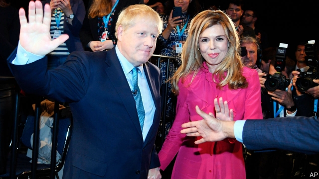
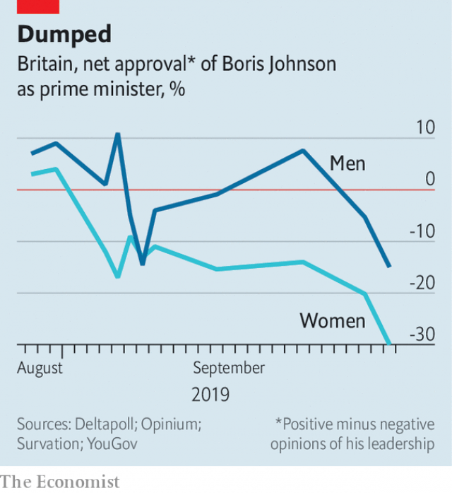

###### Sex and politics

# Boris Johnson is not such a ladies’ man in electoral terms 

 

> print-edition iconPrint edition | Britain | Oct 3rd 2019 

BORIS JOHNSON arrived at the Conservative Party’s annual conference in Manchester expecting questions on Brexit and how to fund his copious spending pledges. Instead the prime minister spent much of his trip denying that he groped a journalist at a dinner party two decades ago. 

Charlotte Edwardes, now of the Sunday Times, said Mr Johnson squeezed her upper thigh under the table at a drunken lunch at the Spectator, which he edited at the time. The prime minister also faced more questions about how Jennifer Arcuri, an alleged former lover, was able to secure £126,000 ($155,000) in grants while he was mayor of London. Both Mr Johnson and Ms Arcuri have denied any impropriety. 

Unfortunately for the prime minister, his problems with women go well beyond these two cases. Female voters have doubts about him. On the surface, the latest polls show men and women are about equally likely to vote Conservative. But when the questions turn to Mr Johnson himself, big gaps emerge (see chart). Among men, Mr Johnson has an approval rating of minus 15, according to YouGov, a pollster. Among women it drops to minus 30. 

 

After Mr Johnson’s suspension of Parliament was judged unlawful by the Supreme Court last month, men were almost evenly split on whether he should resign, with 49% in favour and 48% against, in polls by Survation. Yet among women, 53% thought he should quit, whereas only 36% wanted him to fight on. Mr Johnson’s Brexit strategy may also leave women voters cold. Although there was no real gender split in the referendum result, women are in general more cautious about the terms of departure, being less gung-ho about no-deal and less likely to support ruses such as suspending Parliament. 

Political parties fall over themselves to woo female voters. In 1997 Labour talked of “Worcester woman”, an imagined median voter who lived in the marginal Midlands seat. By 2010 she had evolved into “Asda mum”, matriarch of the hard-working families whom all parties scrapped over. Women are more likely to be undecided going into elections and make up their minds close to election day, points out Rosie Campbell of Kings College London, in “Sex, Lies and Politics”, a recent book. 

Historically, women were more likely than men to vote Conservative. But under Tony Blair and Gordon Brown, Labour whittled away the Tories’ lead among women until it barely existed. It was David Cameron’s success in regaining a clear lead among women at the 2015 general election that helped the Conservatives to their only majority since 1992. Two years later this trend reversed, when Labour won the popular vote among women (but lost overall). 

Some Tories are unbothered. One MP hails the Conservatives’ new image as “the macho party”. At the party’s conference this week, where Mr Johnson went down a storm with members, the most notable demographic gap was not age but gender. Whereas the number of young men strolling around in smart blue suits felt higher than in previous years, there was still a dearth of women. In a typical fringe event, bald blokes outnumbered women. 

The Tories have some cause to be bullish. Women may mistrust Mr Johnson, but they still prefer him to Jeremy Corbyn, Labour’s leader. Mr Johnson has a 25-point lead over Mr Corbyn when men are asked to pick who they would prefer as prime minister, according to Opinium. With women, the lead drops to a still-comfortable 18. 

Women tend to favour higher public spending, particularly on health and education, whereas men are more moved by promises of tax cuts, according to Ms Campbell. Given the government’s recent expensive promises, the Tories may yet win over wavering women. But the run of scandals around the prime minister will make that task harder. ■ 

