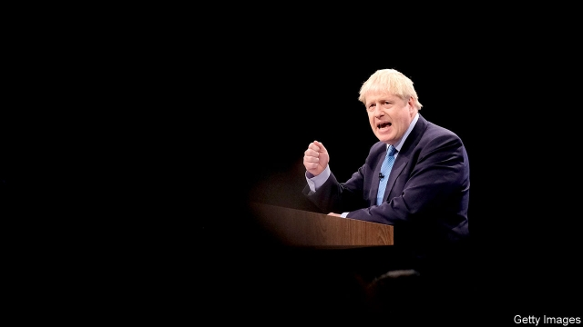

###### The Conservative Party conference

# Boris Johnson makes the EU an offer it can refuse 

 

> print-edition iconPrint edition | Britain | Oct 3rd 2019 

FOR WEEKS the European Union has complained that, even as the October 31st deadline for Britain to leave drew nearer, Boris Johnson’s new government was failing to offer clear proposals to amend Theresa May’s failed Brexit deal. All Mr Johnson would say was that the hated backstop, an arrangement to avert a hard border in Ireland by keeping the United Kingdom in a customs union, had to go. This week, after a tub-thumping party conference speech in Manchester under the slogan “Get Brexit done”, Mr Johnson at last put forward his plan. Yet despite his labelling it a “fair and reasonable compromise”, it got a cool reception from the EU, which sees it as a breach of promises, not the basis for a new deal. 

As expected, Mr Johnson’s proposal would keep Northern Ireland under the EU’s agri-food regulatory regime. He now wants to expand this to cover manufactured goods as well. But Great Britain would opt out of the rules, implying checks on goods moving between Northern Ireland and the mainland. And the plan would apply for only four years after the transition period ends in 2021, at which point the Northern Irish Assembly would decide whether to remain aligned with the EU or adopt British rules. Meanwhile, the whole UK would leave the customs union. This implies customs checks between Northern Ireland and the south—though Mr Johnson insists these could be automated and, when necessary, conducted away from the border. He also wants Northern Ireland out of the EU’s value-added-tax regime. 

The plan was welcomed by Tory Brexiteers and, more importantly, by the Northern Irish Democratic Unionist Party, which supports the Tories in Parliament. Yet it has little appeal in Brussels or, critically, Dublin. EU governments see it as a big step back from undertakings given by Mrs May in December 2017 to maintain an open, frictionless border in Ireland, preserve the all-island economy and avoid new customs or border controls anywhere on the island. They are unhappy about the proposed unilateral four-year time limit. And they do not believe that promises to use new technology, exemptions for small businesses and a system of trusted traders would be enough to avoid physical controls at or near the border. 

British ministers were out in force this week selling the new plan as what one called a “landing zone” that could satisfy all sides. Mr Johnson suggested that, just as he had compromised, so it was now the EU’s turn. Some in Brussels were relieved that he had not said it was his final, “take it or leave it” offer, as initial reports had suggested. A few even hoped it might be tweaked to include alignment on customs as well as on regulations, or to revert to a Northern Ireland-only backstop. Yet the signals from Downing Street suggest that the prime minister sees little scope for more compromise on his side. 

His sales pitch to the EU ahead of the crucial European Council summit on October 17th-18th rests on two arguments. The first is that only a deal close to his can ever pass in Parliament. For evidence, he cites the Brady amendment, a version of Mrs May’s Brexit deal minus the backstop, which MPs voted for in January. The second is that, if the EU is unwilling to accept his plan, he will have no alternative but to leave with no deal on October 31st. And although that may be bad for Britain, it will also hurt the EU, especially Ireland. 

Yet in Brussels neither argument seems convincing. The EU knows that Mr Johnson has no parliamentary majority. He cannot rely even on his own Tory MPs, since some hardliners prefer no-deal to anything else. This means he needs at least some Labour backing to pass any deal. And although there are Labour MPs who share the Tories’ desire to “get Brexit done”, and many are nervous about no-deal, few will want to rescue a prime minister whom they mistrust as a populist popinjay. 

As for no-deal, everyone is aware of Mr Johnson’s repeated promises to take Britain out of the EU on October 31st, “do or die”. His ministers loyally repeated this pledge in Manchester. Mr Johnson himself argued forcefully against any further dither or delay. Yet Brussels also understands the terms of the Benn act that was passed by Parliament last month. This requires the prime minister to seek the agreement of the EU to a three-month extension of the deadline if, by October 19th, he has neither secured a deal nor won parliamentary approval for a no-deal Brexit. 

Mr Johnson says he will obey the law, but he also insists that Britain will leave the EU on October 31st, whatever happens. These two positions are clearly in conflict. Hence a favourite parlour game at the Tory conference: to hunt for loopholes in what Mr Johnson likes to call the “Surrender Act”. Some suggest he might formally ask for an extension but secretly tell Brussels he does not want one. Or he could invite other EU governments to refuse an extension, so as to exert more pressure on MPs to accept a deal. He might invoke an emergency under the Civil Contingencies Act, to suspend the law. Some ministers claimed there was a secret wheeze to get round the Benn act, but that it was confidential. 

Yet one of the act’s authors, Dominic Grieve, a former Tory attorney-general, insists its drafting is legally watertight. He characterises the suggested tricks to try to get round it as “far-fetched and reputationally catastrophic”. He and his supporters, who have a majority in Parliament, are ready to legislate again if need be. They would go to court at the slightest hint that Mr Johnson might flout their law. Some even talk of passing a “humble address” to invite the queen to sack her prime minister in such circumstances. 

Any extension of the October 31st deadline would be a humiliation for Mr Johnson, which is why some suggest he should resign instead. Yet there could be ways to turn matters to his advantage. One idea is to attach a confirmatory referendum to some version of a Brexit deal, which might win over a majority of MPs. But the prime minister is averse to the notion of a second vote. He would prefer a general election which, after being forced against his will to request an extension, he could fight under the banner of backing the people who voted to leave the EU against an establishment determined to stand in their way. 

The obstacle to this is the 2011 Fixed-term Parliaments Act. This requires a two-thirds majority of MPs to vote in favour of any early dissolution of Parliament. The effect has been to give the Labour opposition a veto over the prime minister’s repeated calls for an early general election. The irony that it was a Conservative-led government, under David Cameron, that passed this particular piece of legislation is surely not lost on Mr Johnson. ■ 

