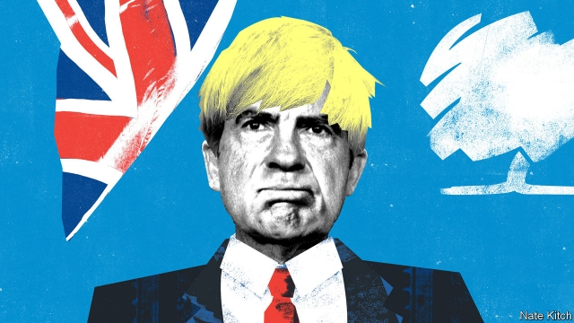

###### Bagehot

# Boris Johnson: Britain’s Richard Nixon 

 

> print-edition iconPrint edition | Britain | Oct 3rd 2019 

THE MAN who this week fulfilled his lifelong dream of addressing the Conservative Party’s annual conference as prime minister is routinely compared to Donald Trump. They both have crazy hair. They were both born in New York. They both have the ability to send their supporters into paroxysms of delight. But a more intriguing comparison is with the original architect of the Republican Party’s populist turn, Richard Nixon. 

This might sound far-fetched. In terms of personality, the two men could hardly be more different. Nixon was a pessimist who liked to brood alone with a bottle of whisky, whereas Mr Johnson is a gregarious optimist. Yet when it comes to their wider political personalities and strategies, the similarities are striking. 

Nixon is remembered today as a hardline conservative. He made his reputation as a communist-baiting member of the House un-American Activities Committee and destroyed his reputation as president with the Watergate burglaries and the White House tapes of his ranting against the elites. Yet for much of the time he governed as a liberal. He pioneered a wide range of liberal policies: affirmative action, with the Philadelphia Plan; environmentalism, with the Clean Air Act; and workplace regulation, with the Occupational Safety and Health Administration. He chose as his chief adviser on domestic policy Daniel Patrick Moynihan, a lion of liberalism. Perhaps most importantly of all, he opened diplomatic relations with China. 

Nixon’s great aim was to fuse conservative and liberal themes, to produce a new governing philosophy. Combine the Democrats’ commitment to big government with the Republicans’ belief in traditional values—and throw in a bit of demagoguery—and he would be invincible. A seminal moment in his intellectual evolution came when Moynihan encouraged him to read Robert Blake’s biography of Disraeli and he came to the conclusion that “Tory men with liberal policies” held the key to progress. 

Mr Johnson represents the same confusion of reactionary and liberal impulses. His journalism is full of dogwhistles about Muslims’ “letterbox” burqas and the like. A Downing Street spokesman has accused prominent Remainers of “colluding” with the European Union. Yet Mr Johnson was also a popular mayor of Britain’s most liberal city, who supported gay rights and amnesty for illegal immigrants. He continues to regard himself as a liberal globalist who opposes the EU because it is a protectionist trading bloc. 

Mr Johnson tries to reconcile these tensions by supporting a combination of big government and old-fashioned patriotism. His mantra is that Britain needs to “get Brexit done” so that it can turn to the real work of lavishing money on hospitals, schools and the police. In private he justifies his bulldog stance as the only thing that can save Britain from a nativist backlash if Brexit does not happen, or a far-left Labour government if austerity is maintained. 

When it came to putting his philosophy into practice, Nixon was dragged relentlessly to the right. He pursued a “Southern strategy” of recruiting into the Republican fold Southern whites who had voted Democrat since the civil war but were alienated by Lyndon Johnson’s Civil Rights Act. This was part of a wider national strategy of recruiting members of the “great silent majority”, alienated by those “limousine liberals” who were soft on crime and friendly with foreign powers. He surrounded himself with hardmen who understood that making omelettes meant breaking eggs. He foamed with contempt for establishment types such as businessmen (“those farts”) and university professors (“those assholes”), and unleashed his vice-president, Spiro Agnew, to denounce the “nattering nabobs of negativism”. He lived in fear that he would be outmanoeuvred on the right by George Wallace, who preached a purer version of his anti-establishment backlash. 

The same is happening with Mr Johnson. He intends to pursue a northern strategy in the next election, targeting pro-Brexit seats in the historically Labour-voting Midlands and north, to make up for the loss of pro-Remain seats in Scotland and the south-east. This is part of a wider national strategy of appealing to voters who are tired of being condescended to by metropolitan elites. He has deployed inflammatory rhetoric about Parliament’s “Surrender Act” to stop a no-deal Brexit. He has surrounded himself with hardmen such as his chief adviser, Dominic Cummings, who seems willing to do whatever it takes to make Brexit happen, and Sir Lynton Crosby, a master of the political dark arts. His establishment-bashing has extended to normally pro-Tory groups such as company bosses (“fuck business”) and even to the institution of Parliament itself. Completing the Nixon analogy, Mr Johnson has his own George Wallace to worry about in the shape of Nigel Farage and his Brexit Party. 

Nixon’s strategy destroyed the man himself but revolutionised his party. By the early 2000s the Republicans were a big-government party with a Southern president, George W. Bush, and a Southern House majority leader, Tom DeLay. In 2016 Mr Trump won the presidency with votes from the Republican South and from blue-collar workers in swing states. The fate of Mr Johnson and his Nixon-like strategy is still to be written. He may be the shortest-serving prime minister in history. There is even talk of prosecuting him. The northern strategy will be harder to pull off than the Southern strategy: Mr Johnson is an Eton-educated Tory trying to appeal to working-class voters, whereas Nixon was a self-made Californian; the north is scarred by its industrial past whereas the sunbelt was rising. But if he can pull off a remarkable election victory by offering certainty—or the illusion of certainty—while his opponents offer dither and delay, the result would be a long-term change in the nature of the Conservative Party, just as far-reaching as the one that Nixon began in the Republicans. Then Britain really would be in with a chance of producing its own Donald Trump. ■ 

