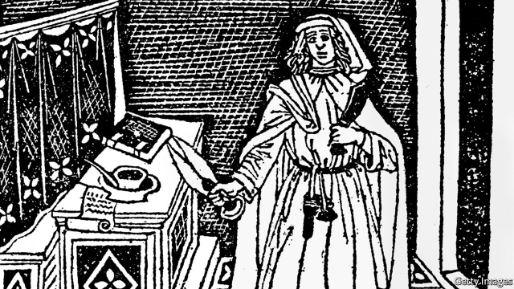

###### Cut from the same cloth

# British and Italian guilds mark a centuries-old European trade 

 

> print-edition iconPrint edition | Britain | Oct 3rd 2019 

IN AN ELEGANT palazzo on the banks of the river Arno on September 26th, Ian Gardner unfolded a “half-yard” (46cm square) of serge to show his Italian hosts. Their predecessors, he told them, gave it its name: perpetuana. Woven from the wool of hardy sheep from the west of England, perpetuana was so called because of its almost endless durability. 

Mr Gardner, a retired fashion retailer, is Master of Exeter’s Incorporation of Weavers, Fullers and Shearmen, one of the last craft guilds outside London. With just weeks before Brexit and the loss of preferential trading terms between Britain and the European Union, Mr Gardner and a party of his members were in Florence to commemorate a pan-European trade in cloth that helped lay the foundations of Western civilisation. 

Starting in the 15th century, galleys from Florence, having delivered embroidered cloth to Sluis on the Dutch coast, would dock at Southampton and Dartmouth to take on bales of wool and perpetuana. The cloth was further processed and embellished in Florence before re-embarcation for sale across Europe. The Florentines with whom the English traded had their own professional association, the Arte di Calimala, which was subsumed in the 18th century into the Camera di Commercio. Last week’s modest ceremony, one of several events to mark the 400th anniversary of the Exeter Incorporation’s royal charter, was held at the Camera’s headquarters. 

All sides benefited handsomely from the triangular wool trade. By the 18th century, Exeter was one of Britain’s richest cities. Among the many by-products of the trade was Barings Bank, brought down by a rogue trader only in 1995. In Florence the cloth trade helped enrich the Medici family and finance the Italian Renaissance, creating a link between the sample of beige cloth unfurled last week and the masterpieces hanging in the Uffizi gallery a few hundred metres away. 

The Incorporation’s activities today are largely ceremonial and charitable. Its members no longer have to be in the textiles business. Like other Britons, said its unofficial historian, Simon Whewell, they divide more or less evenly on Brexit. But Remainers seemed to be in the majority among those visiting Florence. “I think it’s a terrible mistake,” said Roger Persey, a farmer, as he stood with a glass of Italian wine at an open-air reception atop the Camera’s headquarters. 

Mr Whewell called it “just bizarre”. But, taking the long view, he was moderately sanguine. “Over the centuries, we’ve been through plagues and wars yet trade has always found a way around barriers,” he said. “It’s a bit like water flowing downhill.”■ 

