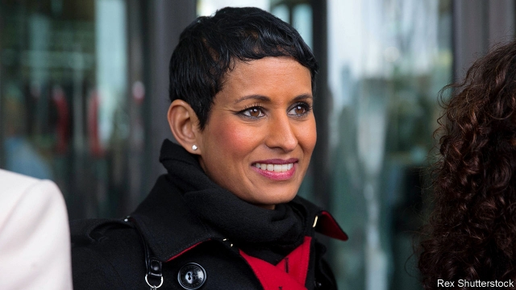

###### Any answers?

# Everyone agrees the BBC should be impartial. But what does that mean? 

 

> print-edition iconPrint edition | Britain | Oct 3rd 2019 

TELEVISION CRITICS as improbable as Jeremy Corbyn, the Labour leader, and Sajid Javid, the chancellor, have been chewing over a row about race and impartiality at the BBC. It began on September 25th when Naga Munchetty, a breakfast-show presenter, was rebuked by a BBC tribunal for speaking on air of her fury at Donald Trump’s insistence that four non-white congresswomen should “go back” to where they came from. Tony Hall, the corporation’s director-general, defended the tribunal’s ruling, only to overturn it after five days of criticism. The affair was covered live, not least by the BBC’s own reporters. 

All British broadcasters are bound by rules on impartiality. But the BBC in particular, funded as it is by a tax on viewers, is regarded as “public property”, says Sir Peter Bazalgette, an ex-BBC man who is now chairman of ITV, a commercial rival. This makes such disputes tricky territory for the corporation. Its 3,000-word impartiality guidelines distinguish between issues that are merely “controversial” and those that are “major matters”. “Advice on whether a subject is ‘controversial’ is available from Editorial Policy,” they state. 

It has not been impartial on every hot topic. John Ryley, now head of Sky News, remembers a grandee telling him, as a trainee at BBC News in the late 1980s, that impartiality applied universally. Was the corporation therefore impartial on apartheid, he asked? “He said, ‘Of course we’re not.’ So things aren’t quite as binary as he suggested.” The rules do not require giving anti-Semites airtime. Nor need facts be “balanced” by those who do not believe them. Fran Unsworth, director of news, reminded staff last year that reports on climate change need not feature “deniers”, “in the same way you would not have someone denying that Manchester United won 2-0 last Saturday. The referee has spoken.” 

But the rules are clear that viewers should not be able to discern journalists’ views on political issues. John Simpson, a foreign correspondent, and Andrew Neil, a presenter, have got into hot water for sounding off on Twitter. Some journalists think Ms Munchetty’s remarks fell into this category. She appeared uncomfortable as her co-presenter, Dan Walker, prompted her to comment. “I’m not here to give my opinion,” she said, after doing just that. 

Others argue that racism is so beyond the pale that these rules do not apply. Sir Peter argues that, since society deems racism unacceptable, it must be acceptable for a presenter to say so. “This is a question of asserting public morality, not impartiality,” he says, “as it would be with child abuse, theft or terrorism.” The BBC’s initial ruling reflected both viewpoints, endorsing Ms Munchetty’s decision to say that Mr Trump’s phrase was “embedded in racism”, but criticising her for saying she was “absolutely furious” with the president. 

The spread of identity politics will make such decisions trickier. Some broadcasters reckon journalists’ “lived experience” adds insight to their reporting. One cites Frank Gardner, the BBC’s security correspondent, who spoke of his frustration over long waits on empty planes to be helped to the ground in his wheelchair. It is absurd, they argue, that a presenter can criticise racist language but not its speaker. 

In such circumstances, impartiality can seem robotic or even offensive. Yet editors will continue to defend it. “We have a lot of youngsters in our newsroom who see the world slightly differently,” says Mr Ryley, 57. “They say, ‘Why can’t we say this? It is what I believe.’ But I think you should be able to articulate that being impartial is good for the brand. By being impartial, people will trust us.” ■ 

