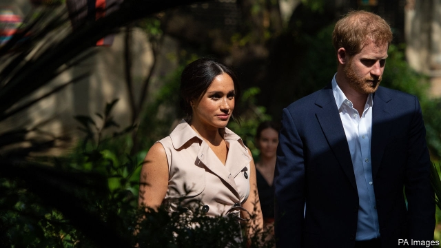

###### Duke it out

# Prince Harry accuses the press of hounding Meghan as it did Diana 

 

> print-edition iconPrint edition | Britain | Oct 3rd 2019 

TRUE TO FORM, Britain’s tabloid newspapers have been revelling in the Duke and Duchess of Sussex’s ten-day tour of southern Africa, which came to an end on October 2nd. The flattering headlines—“Meg me smile”, “Royals Duchy Feely in Africa” and “Tutu cute for words” (after baby Archie high-fived Archbishop Desmond Tutu)—came thick and fast, alongside pictures of Meghan meeting young fans. “She stunned in a cream midi shirt dress and statement heels,” gushed a typical account. 

But the real stunner came from Prince Harry. The day before the tour’s end he launched an attack on the very same tabloids, accusing them of waging a “ruthless campaign” against Meghan that threatened to repeat the tragedy of his mother’s death. Princess Diana died in a car crash in 1997, aged 36, after being pursued by paparazzi. As for Meghan, “I have been a silent witness to her private suffering for too long,” Harry wrote. 

Royal-watchers agree that the couple have had a bad run of stories since their wedding last year. Being skewered over the £2.4m ($3m) of taxpayer funds spent renovating their house particularly rankled. But the timing of Harry’s statement, during their successful African tour, was unwise, says Dickie Arbiter, a former press secretary for the queen. It is thought that the statement took the press office at Buckingham Palace by surprise. 

First among the accused newspapers is the Mail on Sunday, which Meghan is suing for copyright infringement, misuse of private information and violating data-protection law. In February the 1.2m-circulation tabloid published excerpts from a handwritten letter to her estranged father, Thomas Markle. Her letter asked him to stop talking to the media. But the reason the missive was known about was that Meghan’s close friends had talked about it to People, an American celebrity magazine. Mr Markle then shared the letter with the Mail. 

The Sussexes might go all the way to court, and win. English law decrees that the author of a letter retains ownership of its content, regardless of who possesses the piece of paper. Harry also charges the Mail on Sunday with selecting from the missive to mislead readers. The paper says it stands by its story and that it will defend the case “vigorously”. 

What worries tabloids more than the copyright issue is that Meghan might win on privacy grounds. That would be important for all papers, “because every two-bob celebrity would use that to assert privacy rights against us,” says one newspaper editor. Britain has no clear privacy law, so precedent matters. 

Not that the press is overly cowed by Harry’s broadside. Editors say the Sussexes are operating outside the royal tradition of “never complain, never explain”, and could be reined in. The case may end up being settled out of court. Meghan once played a paralegal in the courtroom drama “Suits”, quips one newspaper executive, “but does she want to appear on the stand in real life?”■ 

