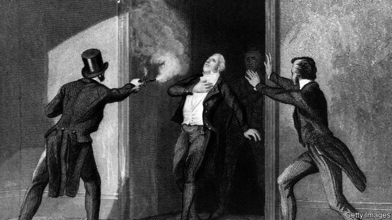
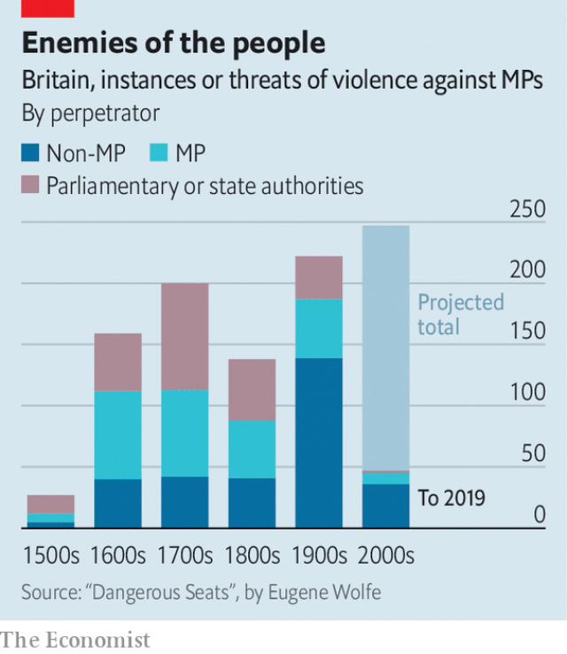

###### Fighting talk

# The threat to MPs from the public is greater than ever 

 

> print-edition iconPrint edition | Britain | Oct 3rd 2019 

THAT THE punch allegedly thrown by a Conservative MP at his party’s conference in Manchester this week made headlines is a sign of how rare that sort of thing has become. Until the 19th century, parliamentarians were a rowdy bunch, challenging each other to duels over matters including the pronunciation of a Greek word, whether a window should be open or shut, and an insult to a dog. It is only since the dawn of the 20th century that physical fights among MPs have declined, in part because violence came to be associated less with aristocratic honour than with the lower classes. 

Yet just as the danger to MPs from each other, and from state authorities, began to recede, a growing threat emerged from another source: the people in whose name they governed. Between the 17th and 19th centuries, a quarter of all incidents of violence or threatened use of force against MPs involved members of the public. In the 20th century that jumped to nearly two-thirds. Over the past 19 years the proportion stands at three-quarters, according to data gathered by Eugene Wolfe, the author of “Dangerous Seats”, a new book on parliamentary violence in Britain (see chart). Until the 19th century it was typically angry mobs that set upon politicians. Since the 20th, violence has tended to come from individuals or organised groups. 

The first such campaign was organised by the suffragettes, who knocked politicians’ hats off, attacked them with whips and hatchets, and threw bricks into Downing Street. Measured by the number of attacks on parliamentarians, rather than by their severity, the suffragettes were more active even than Irish republicans. 

 

Two parallel trends contributed to the rise of these “outsider” attacks on MPs. The first was the rise of constituency surgeries, which exposed politicians to their electorate more frequently and intimately than in the past. The second was the use of violence as a tactic to attract media attention to a cause—what the suffragettes started, Fathers4Justice and other fringe groups have carried on. “The irony,” says Mr Wolfe, is that “people are less tolerant of violence than they used to be, but they make an exception for politicians.” 

Much of this has been relatively harmless: eggs, flour bombs, custard pies and chocolate éclairs are the weapons of choice, along with, more recently, milkshakes. By and large, politicians have taken it in their stride. “Obviously not one of my fans,” said Ed Miliband, then the leader of the opposition, after getting egged in 2012. 

That changed in 2016 after the murder of Jo Cox, a Labour MP, by a far-right fanatic, days before the Brexit referendum. Her killing caused politicians to rethink their approach to online threats. Opposition MPs have called on Boris Johnson, the prime minister, to stop using words such as “surrender” and “betrayal” in relation to Brexit, arguing that it puts them at risk. Mr Johnson has dismissed this as “humbug”. 

Women and ethnic minorities suffer “the lion’s share of the abuse”, Eric Hepburn, head of parliamentary security, has said. Social media have made it easier to send violent threats. “The amount of abuse has definitely gone up,” Adrian Usher of the Metropolitan Police told a parliamentary committee in April, adding that it was unclear whether there was more abuse in society at large, or a greater willingness to abuse MPs. The answer, if current trends are any indication, is probably both. ■ 

