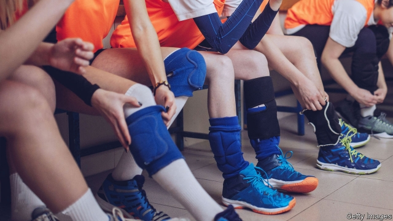

###### A new gender agenda

# Transgender rules for English schools face a backlash from women 

 

> print-edition iconPrint edition | Britain | Oct 3rd 2019 

THE ONGOING struggle within Western civilisation over who is a boy and who is a girl took another small twist in September with the leak of new guidelines for English and Welsh schools regarding transgender pupils. The draft rules, drawn up by the Equality and Human Rights Commission (EHRC), which enforces non-discrimination laws, are expected to be sent to schools this month. But after the Scottish government cancelled similar guidelines in June, activists in England have launched a campaign to halt the EHRC’s new guidance, saying that it would put girls at risk. 

Under the new framework, schools would be advised and sometimes required to open up areas of school life that have until now been separated by sex to those who identify with that gender. So a male child who identifies as a girl could be allowed to use girls’ changing rooms, or be admitted to an all-girls school. The guidelines mean that, on school trips, trans pupils could lawfully be placed in a bedroom with a child of the opposite sex. 

Trans-rights groups say new, inclusive guidance is necessary. Stonewall, one such lobby, says it is “vital all schools take active steps to create inclusive environments for trans pupils.” Mermaids, a support group for transgender children, opposes any delay to the new guidelines: “Organisations have been working for years to build a constructive source of information on best practice for schools,” it says. 

Yet some women’s organisations argue that the new guidelines uphold trans people’s rights at the expense of those of girls. The legislation that the EHRC is bound to uphold is the Equality Act of 2010. Seven of the act’s “protected characteristics” apply in schools: sex, religion, sexual orientation, race, disability, pregnancy and gender reassignment. Schools must weigh up how any policy affects people in those groups—for instance, how building works affect the disabled, or how food in a cafeteria might suit Muslim or Jewish children. 

Nicola Williams of Fair Play for Women, a rights group, says that whereas transgender children’s interests are consistently protected in the EHRC’s guidelines, the rights of girls are not given equal weight. “It must be made explicit that sex and gender identity are different,” she says. “It is especially important for girls to be able to recognise and name the male sex, otherwise the right to assert their boundaries is taken away.” If a girl feels uncomfortable that a male child who identifies as a girl is using the girls’ changing room, the new guidance says that the girl who feels awkward, not the trans child, should go and change elsewhere. “We need to be sympathetic to kids with gender dysphoria but without impinging on the rights of other children,” says Tanya Carter of the Safe Schools Alliance, another rights group. “There are horrendous safeguarding issues around these guidelines.” 

Another criticism concerns procedure. The EHRC said in 2017 that it would draw up new guidelines in partnership with two trans-rights groups. Yet organisations advocating for girls’ rights say there has been almost no consultation with them. “They only seem to be listening to the trans lobby groups,” says Ms Carter. The EHRC insists that it has consulted with women’s groups. 

The guidelines are due to be released amid a steep, unexplained increase in the number of children identifying as transgender. The Gender Identity Development Service (GIDS), the NHS’s only clinic for young transgender people, says the number of children referred there has risen more than 30-fold in the past decade, reaching 2,590 in 2018-19. Some were as young as three. 

Marcus Evans, a governor of the NHS trust under which GIDS operates, resigned in February over concerns that its “affirmative” model, which the EHRC also espouses, can lead too quickly to the prescription of puberty blockers and cross-sex hormones. He wants the process to slow down. “A high number of kids with autism and mental-health issues, as well as kids who may just be gay, are now identifying as trans, as if they believe this identity will solve their difficulties,” he says. 

Parliament’s Women and Equalities committee published a report in July proposing that future EHRC guidance on sex and gender should be approved by MPs. The EHRC reiterates that the recently leaked guidelines were still in draft form. But critics are having none of it. Ms Carter warns: “This is complete regulatory capture.” ■ 

