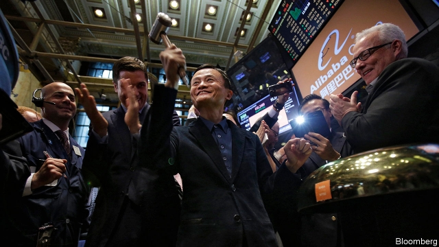
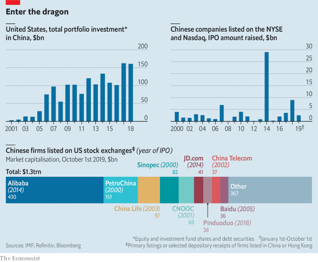

###### Lock stocks and bar all

# Banning American investments in Chinese firms is mooted. Again 

 

> print-edition iconPrint edition | Business | Oct 3rd 2019 

LAST MONTH Steve Bannon, President Donald Trump’s former chief strategist, spoke of “the Frankenstein monster” America had to “destroy”. “Our capital”, he said, had created it. He has long desired to rid American stockmarkets of Chinese firms and to force investors to dump mainland-listed stocks. On September 27th Bloomberg reported that Mr Trump had “given the green light” to the idea. Share prices of American-listed Chinese companies slid. 

Such firms have raised over $70bn by selling shares in America since 2000, reckons Refinitiv, a data provider (see chart). The total market value of 300 or so of them is $860bn—$1.3trn if you include some depositary receipts of firms with primary listings in China or Hong Kong. This year 24 new ones have floated—an exception to the economic war Mr Trump has waged against China. That it may no longer be one unnerved investors. 

American regulators are frustrated by China’s reluctance to disclose some financial records of its companies (it says they are state secrets). In June lawmakers in Washington introduced a bill allowing any Chinese firm that refused to hand over its audit papers to be delisted. According to Reuters, Nasdaq is tightening its rules to make it harder for smaller Chinese companies to float on the exchange. Matthew Doull of Wedbush Securities, an investment firm, says that some Chinese firms are “seriously wondering” about a Plan B (Hong Kong’s exchange, for many). 

 

It is unclear how a mass delisting—let alone removal of Chinese stocks from American-run global stock indices that many investment funds track—would work. Americans hold $160bn of assets on mainland exchanges. This week Ray Dalio, founder of Bridgewater Associates, the world’s biggest hedge fund, wrote on LinkedIn that the Trump administration’s murmurings made him wonder if it was “inching toward bigger moves”. Mr Trump could use emergency powers to enact these, he speculated. 

Mr Doull says delistings would be “nuts”. American exchanges encourage them to behave like Western peers. Shunning thriving Chinese firms may hurt the returns of America’s pension and mutual funds. The White House has denied the Bloomberg report. Peter Navarro, its Sinophobic trade adviser, called it “fake news”. That is not how China took it. Global Times, a state tabloid, said it was “another smoke bomb” ahead of trade talks on October 10th. Beijing warned that “even attempting a decoupling” would unleash “financial-market turmoil”. That would be a real monstrosity.■ 

