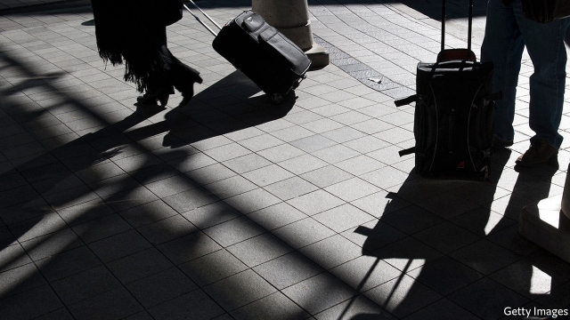

###### Headed your way

# Crowdshipping is the next stop for the sharing economy 

 

> print-edition iconPrint edition | Business | Oct 3rd 2019 

CARPOOLING APPS to connect passengers with drivers going the same way are old hat. Now “crowdshipping” services are doing the same with parcels, allowing senders to “plug into” road traffic as if it were a utility, says Marc Gorlin, boss of Roadie, a startup based in Atlanta. Drivers get a tip; the middlemen take a cut. Firms like Mr Gorlin’s are proliferating. Rappi operates in 57 cities in Latin America. A Filipino firm, Jojo, does so in Manila, the capital, and a nearby province. 

Many of the senders are companies. Amazon’s quick and cheap deliveries are forcing others to up their game, says Ravi Shanker of Morgan Stanley, a bank. Corporate fleets and logistics giants like FedEx will dominate long-haul routes. But by tapping into people’s movements, firms can withstand spikes in demand—floral bouquets on Mother’s Day, say—and save money on the “last mile”, often the costliest leg of a parcel’s journey. 

Four-fifths of Roadie’s revenue comes from retailers such as Macy’s, Walmart or Home Depot (which has invested in Mr Gorlin’s firm). Airlines are another big client. Nearly half of Delta’s mishandled bags are delivered by travellers who use Roadie’s app to see if suitcases need dropping off along their drive home. The carrier’s head of cargo, Gareth Joyce, says this has cut costs, speeded up deliveries and boosted customer satisfaction. Alaska Airlines, Southwest and United also use Roadie to return lost luggage. 

Other crowdshipping startups are eyeing free space inside travellers’ suitcases. PiggyBee, based near Brussels, and Grabr, with offices in Moscow, New York and San Francisco, operate worldwide, linking consumers desirous of products only available—or cheaper—overseas with international passengers headed their way. 

The buyer pays the product price, and any relevant taxes and duties, into an escrow account managed by the app, plus a tip to make it worth the transporter’s while. The transporter buys the item and receives the reimbursement and tip on delivery. The apps discourage transporters from pretending a purchase is for personal use to avoid customs duties. But as David Vuylsteke, boss of PiggyBee, acknowledges, “since we’re under the radar, no one cares.”■ 

