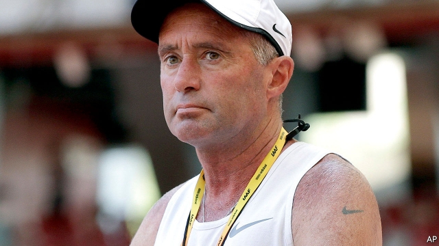

###### Don’t do it

# Nike is embroiled in a doping scandal 

 

> print-edition iconPrint edition | Business | Oct 5th 2019 

“IT DOESN’T MATTER how many people hate your brand as long as enough people love it.” So declared Phil Knight earlier this year in a lecture at Stanford Business School. Companies cannot remain neutral on issues of conscience, even if it means losing some customers. “You have to take a stand on something,” insisted Mr Knight, as Nike, the sportswear firm he dreamed up while studying at Stanford in the 1960s, had done by supporting Colin Kaepernick, an American footballer who refused to stand during the pre-game national anthem in protest against racial injustice. 

Woke stuff—and lucrative to boot, if Nike’s financial performance is anything to go by. The company’s revenues rose by 7% in the three months to August, year on year, to $10.7bn. Profits were up by a quarter, as, so far this year, is the share price. 

Ironic, then, that Nike must now fend off accusations of distinctly unwoke behaviour. In May it was shamed into undoing a policy of slashing pay for female athletes it sponsors when they get pregnant. An earlier scandal over allegations of sexual harassment and abuse of female workers led to the dismissal of nearly a dozen male executives. And this week Nike has been embroiled in an ugly doping affair, which dragged its share price down by 3%. 

 

On September 30th America’s anti-doping watchdog found Alberto Salazar, a star running coach who counts Olympic gold medallists as clients, and Jeffrey Brown, a physician, guilty of “orchestrating and facilitating prohibited doping conduct” and banned both from athletics for four years. Mr Salazar ran the Nike Oregon Project, a programme for elite athletes; he has a Nike swoosh tattooed on his arm. 

Nike denies wrongdoing. Mr Salazar and Dr Brown are expected to appeal against the ruling. In a message to employees this week, Nike’s current boss, Mark Parker, reportedly wrote that the idea of doping runners “makes me sick”. Yet emails between him, Mr Salazar and Dr Brown, reported by the Wall Street Journal, seem to suggest he was aware of their tests. A Nike spokesman told the newspaper that at the time the coach was “concerned that Nike runners could be sabotaged by someone rubbing testosterone cream on them”. Mr Parker called the news reports “highly misleading”. Perhaps. But Mr Knight’s dictum may yet come back to bite the company he created.■ 

