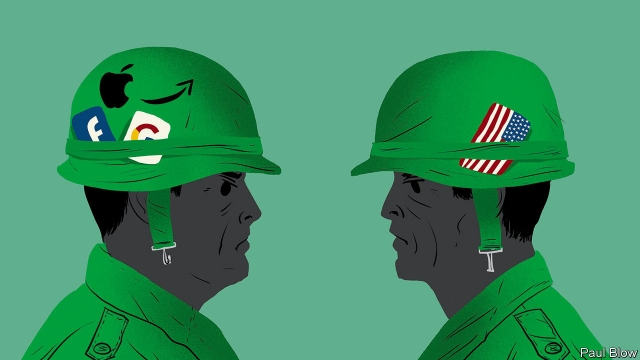

###### The tech offensive

# Silicon Valley and the state gird for war 

 

> print-edition iconPrint edition | Business | Oct 3rd 2019 

THE BILL, proposed in America’s Senate, reads like a coding manual for software developers. “Infinite scroll”, which makes social-media apps display more content as users swipe up, would be prohibited, as would automatic playlists for videos. Social networks would need to show how much time users spend on them and set a default limit of 30 minutes a day. 

Parents of teenagers mustn’t get their hopes up: the Social Media Addiction Reduction Technology (SMART) Act is unlikely to become law. But the fact that it exists—and was put forward by a Republican senator, Josh Hawley of Missouri—shows how quickly the tide has turned in Washington against big technology firms. After decades of letting them do more or less as they please, the state is ready to strike back. Voters are on board: one recent survey found that two Americans in three support breaking the companies up. 

Big Tech is worried. Its bosses, once infrequent visitors to the Beltway, have become a regular fixture. Last month Mark Zuckerberg spent a week there, meeting President Donald Trump and lawmakers. On October 1st a recording surfaced of Facebook’s boss describing the plans of Elizabeth Warren, a left-wing Democratic presidential hopeful, to break up his firm and others as an “existential” threat. Google’s parent company, Alphabet, has recruited as its top lobbyist a former chief of staff to a Republican senator. Wall Street wants to know what all this means for the business models of America’s biggest companies. Microsoft, Apple, Amazon and Alphabet are the world’s four most valuable listed firms. Add Facebook, which is the sixth, and they are worth a combined $4.3trn. 

Tech bulls can argue, with justification, that all the frenzied activity amounts to little more than exercises, with the odd warning shot. Some tech firms’ share prices have been dented by the trade war. None, as yet, has been badly hurt by the techlash at home. Even so, the contours of a battle plan against the industry are emerging. It has two prongs. Officials are using existing laws to pursue the companies, particularly over anticompetitive behaviour. And politicians are drafting new legislation. Neither is yet an all-out assault. Both portend a prolonged pitched battle. 

Start with the investigations. The Department of Justice (DoJ), the Federal Trade Commission (FTC) and the House antitrust subcommittee have all launched inquiries. In a sign that Alphabet’s new pointman will be busy, a congressional committee sent the company a 17-page letter last month demanding a decade’s worth of emails between senior executives on a range of matters and, on September 9th, 48 state attorneys-general launched an antitrust probe into the company. Any day the attorney-general, William Barr, is expected to announce an investigation into Facebook. 

Most of these efforts so far amount to fishing expeditions. Their precise scope has yet to be determined. Even the division of labour between the investigators is unclear. Although they reportedly agreed to one in June, the DoJ and the FTC have yet to decide which tech titans each will go after, as became apparent when senators quizzed Makan Delrahim, who heads the DoJ’s antitrust division, and the FTC’s chairman, Joe Simons, on September 17th. 

Even if the FTC and the DoJ argue for radical measures such as break-ups, and convince lower courts, most federal appeals-court judges (not to mention the conservative majority on the Supreme Court) are reluctant antitrust enforcers, steeped in old teachings of the University of Chicago, which urge that companies be left alone so long as they do not harm consumers. 

Still, the general line of attack is clear. Amazon, Apple and Google are being taken to task over their chokehold on e-commerce, app stores and search engines, respectively. Google and Facebook face scrutiny over online advertising, which they dominate. The giants will have to show that buying startups like CTRL-Labs (which develops brain-computer interfaces and has just been acquired by Facebook) is not simply a way to neutralise rivals. 

It is a similar story on Capitol Hill. Bills to regulate tech have mushroomed. Mr Hawley alone has introduced half a dozen since joining the Senate in January. Besides the addictiveness of tech, they cover children’s privacy, online gaming and content moderation. Some have Democrat co-authors. One, nicknamed the DASHBOARD Act (don’t ask), would require online platforms to disclose the value of data they collect on users; Mark Warner, a former venture capitalist, helped write it. Another, backed by Richard Blumenthal and Ed Markey, would ban video games from letting players (including under-age ones) pay a fee and receive random awards, which looks an awful lot like gambling. 

With the possible exception of a federal privacy bill, which tech firms are promoting before a strict California state law enters into force in January and becomes de facto law of the land, most existing proposals may not get far. Impeachment proceedings against Mr Trump will distract lawmakers for months. If elected next year, a President Warren may not be able to ram her ideas through what is likely to remain a Republican-controlled Senate. 

But Big Tech will be under fire whoever wins the presidency. Agencies and politicians are “on a steep learning curve”, says another lobbyist. The FTC has a dedicated “tech task force” and two activist commissioners. One, Rohit Chopra, cut his teeth at the Consumer Financial Protection Bureau, where he led efforts to reform America’s student-loan system. The House has hired Lina Khan, author of an influential paper on Amazon’s power, as counsel. 

Trustbusters and lawmakers are also gathering intelligence. Besides the missive to Google, the antitrust subcommittee has sent requests for information to Amazon, Apple, Facebook and dozens of other firms. Oracle, a software-maker and old foe of Google’s, got one from Texas’s attorney-general. Snap, a social-media firm, is said to keep a dossier documenting Facebook’s anticompetitive actions, which it is sure to share with regulators and Congress. 

Think-tanks which get pots of money from Big Tech are no longer the main resource available to its opponents. Less conflicted brain trusts backed by diverse donors, such as the Electronic Privacy Information Centre, which used to specialise in consumer-data protection, or Public Knowledge, once focused on media regulation, now study antitrust, too. Tim Wu of Columbia Law School and others have devised a legal strategy to make Facebook spin off Instagram and WhatsApp. In September a report from the Booth School of Business at the University of Chicago, of all places, called for vigorous merger control and a “digital authority” to oversee online competition. Republicans, who are friendlier to big business but accuse tech platforms (without evidence) of discriminating against right-leaning content, have set up the Internet Accountability Project. 

Big Tech is not standing still. Its lobbyists will try to disarm radical proposals. It has squadrons of lawyers on hand. Firms are adapting in anticipation of rules to come. Facebook, Google and others plan to make it easier for users to move their data between services. Neither Silicon Valley nor Washington is bracing for a Blitz. Rather, prepare for a grinding war of attrition. ■ 

