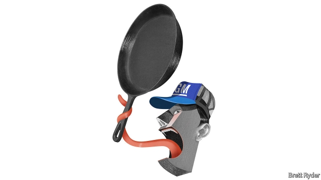

###### Schumpeter

# The GM strike is an anachronism 

 

> print-edition iconPrint edition | Business | Oct 3rd 2019 

IN THE MIDST of the first-ever strike by General Motors workers in Flint, Michigan, in 1936, an advocate for the carmaker called the firm “a big family of 250,000 people” in which strikes were alien. Homer Martin, then-president of the United Auto Workers (UAW), retorted with a phrase sizzling with the class consciousness of the era. GM, he said, was “the kind of family where father eats the bacon, mother eats the gravy and the kids can lick the skillet”. 

Once again, GM’s family values are under attack. A strike of 46,000-odd workers demanding better treatment, now into its third week, is the company’s longest since 1970. Some see it as a sign of a long-overdue rebalancing of American capitalism. Public support for unions in America is among the highest in half a century, according to Gallup, a pollster. Last year more Americans took part in strikes and lockouts than in any year since 1986. Low unemployment has increased the clout of workers after a precipitous fall in their share of national income since the 1990s. Terry Dittes, the UAW official heading the GM strike, told the New Yorker that with corporate profits and executive salaries in America at an all-time high, “there’s something bigger brewing here.” 

Yet if the GM strike shows anything, it is how America’s economy has transformed since the days when industrial firms and blue-collar unions called the shots. That past was at times glorious. The 1936 strike in Flint led to the unionisation of GM. The Treaty of Detroit in 1950, between the UAW and GM, offered full medical benefits to workers. But in time unions and industry started to drag each other down. The unions’ victories made carmakers less competitive. As two sociologists write in a new book, “Wrecked”, the carmakers responded to organised labour by moving away from Detroit, lest strikers turn it into a choke point. That weakened the unions’ bargaining power—but also the carmakers’ productivity by pushing them away from innovation clusters. Meanwhile, America’s economy has become tech-centric, making 20th-century industrial relations look like a relic. As such, the battle between GM and the UAW may be one of the last gasps of a form of collective bargaining that seems obsolete in the 21st century. 

The strike itself is mostly about pay and health care. Pay, historically a big bone of contention, is the easier part to settle. Since its bankruptcy and bail-out in the financial crisis of 2008-09, GM has become Detroit’s most profitable car company, with earnings last year of $8bn. Workers, who made sacrifices in the lean years, receive a share of those profits. They think they deserve a bigger one. The UAW says that Mary Barra, the firm’s boss, makes 281 times as much as an average GM worker. GM probably has enough dosh to offer them a pay rise that would narrow this gap, which many people, not just the UAW, find outrageous. 

Health-care costs are a bigger headache for GM. Its workers pay just 4% of their medical costs, a pittance by the standards of corporate America. Like other carmakers, GM is desperate for them to foot more of the bill, which is swelling as workers age and American health care grows pricier. The same rising costs mean that many workers would struggle to pay for treatments out of pocket. But not all Americans will sympathise. The UAW’s battle on behalf of a blue-collar aristocracy, many of whom earn around $30 an hour, loses emotional appeal compared with McDonald’s burger-flippers fighting for a $15 minimum wage or Uber drivers demanding the barest of benefits. (It doesn’t help that several UAW bigwigs have of late been convicted for corruption.) 

For all its profits, GM is in a precarious state, too. Last year Ms Barra, a company lifer, unveiled a $6bn-a-year savings drive. It involved shedding up to 14,000 jobs and shutting factories in North America to focus on making high-margin SUVs and trucks, as well as developing electric vehicles and self-driving cars. She sees disruption barrelling down the freeway from rival carmakers but also tech firms investing in autonomous vehicles. To stop GM from becoming the next Studebaker, she is determined to curb the firm’s reliance on old factories and wants to be able to shift output up and down as needed by hiring temporary workers. That requires relations with the union to be more flexible than they have ever been, says Patrick Anderson of Anderson Economic Group, a Michigan-based consultancy. GM’s very vulnerability over the future of the vehicle reduces the union’s leverage. 

Across America, private-sector unions are struggling. Membership has fallen from 30% in the 1950s to just 11%. Among private firms it is less than 7%. Tech firms are non-unionised. Industrial concentration has made things worse. Workers’ threats to flee to a competitor are less credible when there are fewer rival employers. 

Some in the Democratic Party hope to revive the fortunes of the traditional union. But it seems more likely that new forces are at work in the relation between capital and labour. Employees of big firms are “self-organising” via social media, often around issues alien to union bosses of old. One group, United for Respect, has successfully badgered Walmart, America’s biggest private employer, into changing its pregnancy policies and offering more family-friendly schedules—areas that male-dominated unions ignore—as well as better pay. Another, Coworker.org, enables people to press their employers on issues ranging from parental leave to climate change through online petitions. Last year Google was persuaded to drop out of a lucrative tender to provide the Pentagon with artificial-intelligence software after moral objections from its coddled coders. 

Such “bursts of expression”, as Andrea Dehlendorf, co-head of United for Respect calls them, may one day become what strikes were in the 20th century—the norm. Unions should take note. So should companies, which can be skewered over an expanding gamut of gripes. Tired of licking the skillet, workers are finding new ways to brandish it. ■ 

