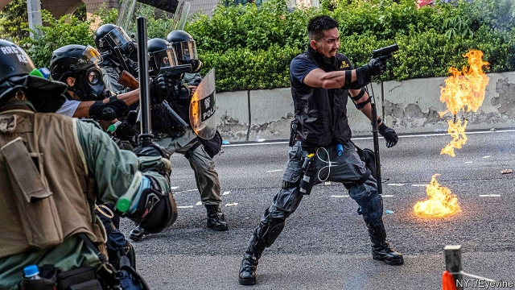

###### Crashing the party

# Tensions mount in Hong Kong after the shooting of a protester 

 

> print-edition iconPrint edition | China | Oct 3rd 2019 

OCTOBER 1ST, the 70th anniversary of the founding of the People’s Republic of China, was never likely to be joyous in Hong Kong. For over four months the city had been in increasingly violent revolt, with protesters demanding full democracy and denouncing the Communist Party’s interference in the territory’s liberal way of life. They said they would mark the country’s national day as a “day of mourning”. Indeed, it proved a dark one. 

Across the territory, protesters marched, lit fires (sometimes of Chinese flags) and displayed placards referring to “ChiNazis”. They also goaded the police, who responded fiercely. More than 100 people were taken hospital, including two who were in a critical condition. One was an 18-year-old student, Tsang Chi-kin, who is said to be “stable”. He was shot in the chest by an officer using a pistol at close range. It was the first casualty involving live ammunition since the unrest began, and has inflamed passions. On October 2nd peaceful demonstrations against the shooting descended into violence, with protesters vandalising shops and stations. 

Police had warned that officers feared having to shoot people in order to protect themselves. In this case videos showed protesters viciously attacking a policeman on the ground before a colleague ran towards the group and fired at Mr Tsang (a different incident is pictured). The police have defended the shooting as “reasonable and legal”. But for a force that prides itself on its restraint, it marks a dangerous escalation. The officer who used the gun also carried non-lethal weapons. 

It will certainly complicate the local government’s efforts to defuse the unrest, which was triggered in June its attempt to introduce a bill allowing criminal suspects to be extradited to mainland China. Hong Kong’s chief executive, Carrie Lam, has promised to withdraw the bill. But protesters have other demands, including an investigation into police conduct. In September the government promised an inquiry, but demonstrators say the body that would conduct this is pro-police. 

Mrs Lam, in Beijing for the national-day festivities, had tried to avert trouble by toning down official celebrations in Hong Kong. A grand fireworks display was cancelled. The police also refused an application by protesters for a large march on Hong Kong island. But such measures were in vain. Tens of thousands of people staged a march anyway. Afterwards scattered riots broke out across the territory. Five police were hospitalised, including one with third-degree burns, allegedly caused by corrosive fluid thrown by rioters. 

Early in the summer there was much speculation that the mainland authorities were mulling using troops to crush the unrest. Officials have since tried to downplay this possibility. In September Song Ru’an, a senior Chinese diplomat in Hong Kong, expressed confidence in the local government’s ability to restore calm. Nevertheless, Reuters news agency has reported a recent surge in the number of Chinese troops stationed in the territory, from about 3,000-5,000 to around 10,000-12,000. Police groups and Communist Party-controlled media in Hong Kong have urged the use of a colonial-era emergency law to quell the unrest, which would allow sweeping curbs on civil liberties. 

Mrs Lam, having earlier expressed reluctance to do this, may be changing her mind. The South China Morning Post, a local newspaper, said she was preparing to invoke the emergency bill to ban the wearing of masks at protests. But Mrs Lam still wants to show that she is sensitive to protesters’ grievances. On October 1st Matthew Cheung, Mrs Lam’s deputy, referred to “society’s deep-seated problems” such as a shortage of affordable homes. Pro-government politicians in Hong Kong and the mainland’s press have criticised the city’s property tycoons, shaming them into offering up land for public housing. 

Officials have even hinted that political reform might still be possible. In September Mr Song said the central government’s most recent electoral-reform package, published in 2014, was still on the table. That deal stopped far short of promising full democracy. It sparked weeks of sit-ins on busy streets and was rejected by lawmakers. But on September 28th Hong Kong’s government promised to “take forward constitutional development”. 

Nonetheless, tensions will remain high. The Legislative Council, in recess since July, is due to reconvene on October 16th. Shortly afterwards Mrs Lam must outline her priorities for the coming year. Then on November 24th Hong Kongers go to the polls to elect local councillors. Further protests could erupt if the government attempts to bar candidates who are deemed to lean towards Hong Kong’s independence from China, as it did during elections to the legislature in 2016 and 2018. More imminently, October 7th is Chung Yeung, a holiday when families sweep the graves of their ancestors. Protesters may see it as another chance to mourn for their city. ■ 

