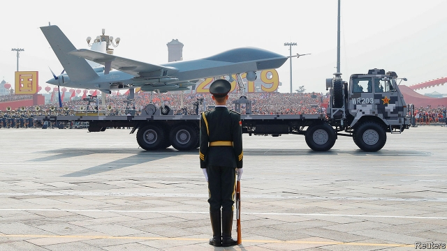

###### Xi’s big parade

# To mark 70 years of Communist rule, China shows off new weapons 

 

> print-edition iconPrint edition | China | Oct 3rd 2019 

CHINA HAS held several large military parades, but none as grand or involving such cutting-edge technology as its display in Beijing on October 1st marking 70 years of Communist rule. Fifteen thousand troops goose-stepped through Tiananmen Square, accompanied by 580 pieces of weaponry including missiles, tanks and drones and, overhead, more than 160 fighter jets, bombers and other aircraft. State media said all of the equipment was Chinese-made and that 40% of it had never been shown in public before. 

The missiles stole the show. By some counts, China displayed one-third of its entire inventory of intercontinental ones. The most notable of these, the DF-41, was saved for last. It had never been seen in public previously. Its estimated range of 12,000-15,000km would probably make it China’s first road-mobile missile (ie, one less vulnerable to pre-emptive strikes) that could hit any part of America. It can carry a large number of decoys or, it is rumoured, up to ten warheads—each able to manoeuvre independently after re-entering the atmosphere. The missile’s predecessor, the DF-31, can carry only about three. 

The parade also highlighted China’s ability to strike from the sea by showing off the JL-2 for the first time. This intercontinental missile can be launched from China’s new Jin-class nuclear submarines, of which China has put six into service over the past four years. Each sub can carry a dozen of the missiles. The JL-2 does not have the range of the DF-41. It could “at best attack Seattle” says Owen Cote of the Massachusetts Institute of Technology, because the noisy Jin-class subs would struggle to range beyond the Yellow Sea without being detected. But China is developing new missiles and subs to remedy this. 

There were more exotic projectiles on display, too. China provided a tantalising look at the DF-17, a wedge-shaped hypersonic glider that would be launched and released from a traditional missile. China, America and Russia are all competing to develop such gliders. The DF-17 is designed to fly at the atmosphere’s outer edge at over five times the speed of sound. Whereas ballistic missiles loop up and down in predictable arcs, gliders can fly at lower heights and in more unpredictable ways, making them harder to intercept. The DF-17 could carry nuclear warheads or destroy targets by smashing into them. In April 2018 Michael Griffin, the Pentagon’s research and development chief, said that if China had not already fielded such gliders, it was close to doing so. “We do not have defences against those systems,” he added. 

Also paraded were two new drones, the supersonic wz-8 (pictured) and the stealthy Sharp Sword. Both of these could be used to spot targets for hypersonic and other missiles, note Antoine Bondaz and Stéphane Delory of the Foundation for Strategic Research, a French think-tank. 

For many years, America paid little attention to China’s nuclear forces, focusing largely on Russia. That is changing as China builds farther-flying and nimbler missiles that are harder to spot before launch and pose a more serious threat to American soil. China’s stockpile of nukes remains small—under 300 warheads, compared with America’s 4,000. But in May the head of America’s Defence Intelligence Agency, Lieutenant-General Robert Ashley, predicted that China’s nuclear arsenal would double in size in the next decade. 

Amid an economic slowdown and revolt in Hong Kong, the muscle displayed in Tiananmen may help Mr Xi persuade the public that his “great rejuvenation” of China is still on track. He certainly made clear what America was supposed to read into it. “No force can ever shake the status of China, or stop the Chinese people and nation from marching forward,” he said. ■ 

