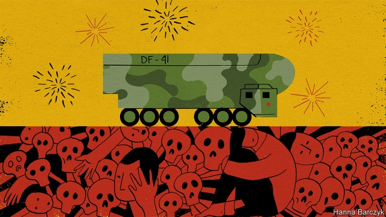

###### Chaguan

# Xi’s embrace of false history and fearsome weapons is worrying 

 

> print-edition iconPrint edition | China | Oct 3rd 2019 

THE MOST revealing moment of the national day parade through Tiananmen Square on October 1st lasted just a few seconds. It came as China’s fearsome new DF-41 nuclear missiles, capable of striking any city in America, neared Chaguan’s press seat on the Avenue of Eternal Peace. Loudspeakers came to life as their camouflaged, many-wheeled carriers growled towards the grand gateway of the Forbidden City where President Xi Jinping and other Chinese leaders waited on a rostrum. Unseen voices explained how the weapons would ensure that China always retains a deterrent capability, thus safeguarding peace. Turning lyrical, the voices compared the missiles to large dragons that can hide in massive mountains or boundless seas before delivering earth-shaking blows. The hand-picked crowd erupted in spontaneous cheers. 

Those cheers reflect two messages conveyed by the parade, which marked 70 years of Communist rule. The first is that China wields such firepower that no country may safely defy it. The second is that China is great again thanks to the Communist Party which is, and has always been, a force for good. 

That second message was pressed home by the civilian half of the parade, which began with open-topped, gold-painted buses carrying red princelings and other descendants of Communist China’s founders and martyrs. One was a grandson of Mao Zedong, squeezed into a general’s uniform. The point was reinforced by marchers dressed as Mao-era farmers, soldiers and workers, dancing and singing in celebration of party-ordained campaigns of the 1950s, 1960s and 1970s to tame nature, mobilise the masses and turn China into an industrial power. Such sanitising of the Mao years is indecent. On balance those were lost decades that left millions of Chinese dead, whether from man-made famines, class warfare or ideological purges. Yet under Mr Xi, the twists, turns and dead-ends of party rule have been tidily woven into a glorious story of national progress. China’s boss has not hidden his motives. He links the Soviet Union’s collapse to the moment that Russian leaders disavowed crimes by Stalin and other Communist leaders. Mr Xi has chosen another course, curtailing the party’s previous, limited tolerance for historical candour. 

Previous parades have nodded to live debates. On national day in 1984 Deng Xiaoping, then China’s leader, said the country’s primary task was to reform the economy to remove obstacles to growth. That parade included busts of leaders purged or sidelined under Mao, and a float from Shekou, a pioneering special economic zone that Deng’s leftist critics called capitalist. 

In elite settings, largely for the benefit of insiders, Mr Xi has repudiated past crimes by ultra-leftists who were deemed by Deng to have deviated from the party line. Honouring revolutionary heroes on the eve of this year’s national day, Mr Xi remembered Zhang Zhixin, a party member executed in 1975 for speaking out against Mao-era excesses, though not before her larynx was cut to stop her calling to fellow inmates as she died. 

No such candour is offered to the masses. The true story of China’s recovery from Maoist ruin was written by hundreds of millions of individual Chinese. They were enabled to raise themselves from poverty through hard work and risk-taking, after Deng pragmatically embraced market forces. Yet in this year’s parade, a vast painting of Deng in a Mao suit was escorted by identically dressed dancers waving fronds of grain, as if he were the skilled boss of a collective farm rather than the man who let peasants grow their own crops, transforming rural lives. Later floats, lauding the Xi era, showed such centrally planned glories as high-speed trains and space rockets. Some of the few visible representatives of private enterprise were delivery drivers on scooters, a low-paid group once praised by Mr Xi for being like diligent bees. In apparent homage to this simile, the parade’s delivery drivers wore yellow and black hats topped with bee antennae, like heroes in a children’s book. As if vanquishing the ghosts of the Tiananmen protests of 1989, students from the city’s universities marched beneath their college flags, hopping with excitement as they saw Mr Xi, through air still heavy with the fumes from parading tanks. 

It is understandable, indeed inevitable, that a wealthier China would seek to become a great military power. What was not inevitable was that Mr Xi would embrace populist, nostalgic, red-flag waving nationalism, while glossing over the party’s terrible mistakes. Traditionally, those urging China to reckon honestly with the past have appealed to rational self-interest. Brave, embattled liberals have called for more open debate about the Great Leap Forward and the Cultural Revolution, to prevent such mistakes from being repeated. That argument feels weak today. Mr Xi is not a revolutionary like Mao, bent on dismantling the party. Rather, he is an authoritarian obsessed with stability, determined to assert the party’s absolute authority. To that end his team is happy to harness Maoist rhetoric, nostalgia for a simpler, less materialist China and the public’s justifiable pride in the endurance of past hardships. Judged cynically, such propaganda is astute domestic politics. Mao-style strongman rule is still a danger, but there is little risk of a return to the mayhem of the Cultural Revolution. 

Other countries may have more to fear from Mr Xi’s embrace of false history. By telling his people that Communist China has never taken a wrong turn, he is stoking an impatient, hair-trigger nationalism in which criticism from abroad equates to hostility. 

China is not the first rising power to seek fearsome weapons. Its people’s patriotism cannot be dismissed as brainwashing. Many are clear-eyed and rational in their love for their country and support for Mr Xi. But heavily armed, self-righteous nationalism can start wars. Both China and the rest of the world would be somewhat safer if party chiefs were to acknowledge their fallibility. That Mr Xi is heading in the other direction should alarm everybody. ■ 

