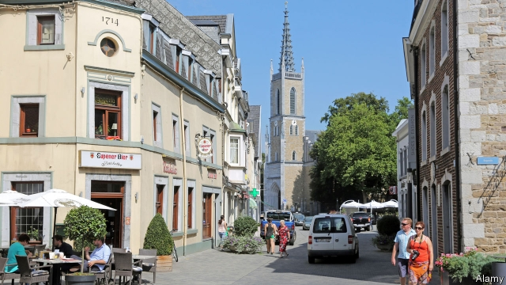

###### Tiny democracy

# A Belgian experiment that Aristotle would have approved of 

 

> print-edition iconPrint edition | Europe | Oct 3rd 2019 

IN A SLEEPY corner of Belgium, a democratic experiment is under way. On September 16th, 24 randomly chosen Germanophones from the country’s eastern fringe took their seats in a Citizens’ Council. They will have the power to tell elected officials which issues matter, and for each such issue to task a Citizens’ Assembly (also chosen at random) with brainstorming ideas on how to solve them. It’s an engaged citizen’s dream come true. 

Belgium’s German-speakers are an often-overlooked minority next to their Francophone and Flemish countrymen. They are few in number—just 76,000 people out of a population of 11m—yet have a distinct identity, shaped by their proximity to Germany, the Netherlands and Luxembourg. Thanks to Belgium’s federal system the community is thought to be the smallest region of the EU with its own legislative powers: a parliament of 25 representatives and a government of four decides on policies related to issues including education, sport, training and child benefits. 

This new system takes democracy one step further. Based on selection by lottery—which Aristotle regarded as real democracy, in contrast to election, which he described as “oligarchy”—it was trialled in 2017 and won enthusiastic reviews from participants, officials and locals. 

Under the “Ostbelgien Model”, the Citizens’ Council and the assemblies it convenes will run in parallel to the existing parliament and will set its legislative agenda. Parliamentarians must consider every proposal that wins support from 80% of the council, and must publicly defend any decision to take a different path. 

Some see the project as a tool that could counter political discontent by involving ordinary folk in decision-making. But for Alexander Miesen, a Belgian senator who initiated the project, the motivation is cosier. “People would like to share their ideas, and they also have a lot of experience in their lives which you can import into parliament. It’s a win-win,” he says. 

Selecting decision-makers by lottery is unusual these days, but not unknown: Ireland randomly selected the members of the Citizens’ Assembly that succeeded in breaking the deadlock on abortion laws. Referendums are a common way of settling important matters in several countries. But in Eupen, the largest town in the German-speaking region, citizens themselves will come up with the topics and policies which parliamentarians then review, rather than expressing consent to ideas proposed by politicians. Traditional decision-makers still have the final say, but “citizens can be sure that their ideas are part of the process,” says Mr Miesen. 

Some in the community’s pocket-sized parliament in the town of Eupen are sceptical. If they are to surrender their agenda-setting powers to the masses, their manifestos seem pointless. And it seems odd that a project to promote citizens’ power was not a grassroots initiative but was instigated from above. The organisers admit that they are delving into the unknown, but for David Van Reybrouck, of G1000, a group promoting the scheme, it is a game-changer. “Small countries are reinventing democracy,” he says. ■ 

